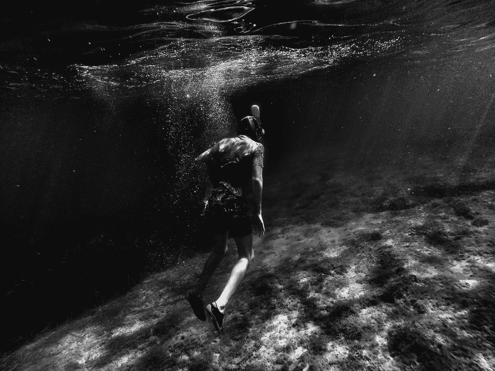
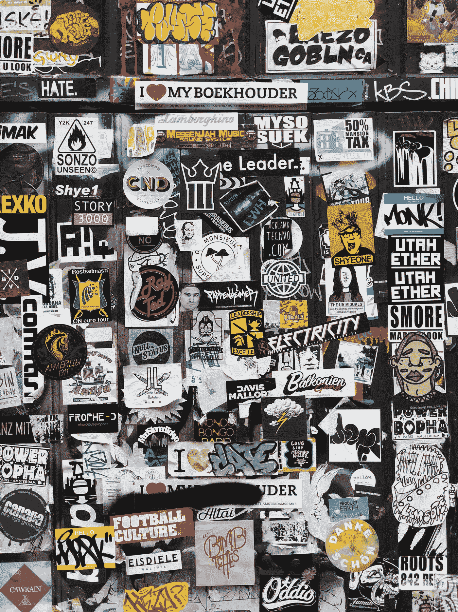
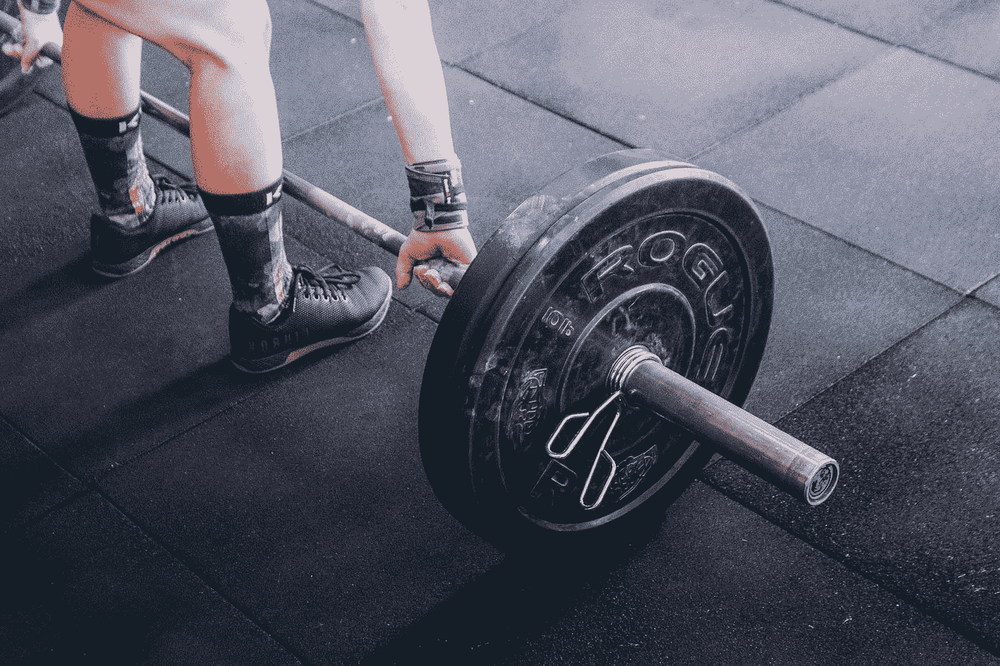
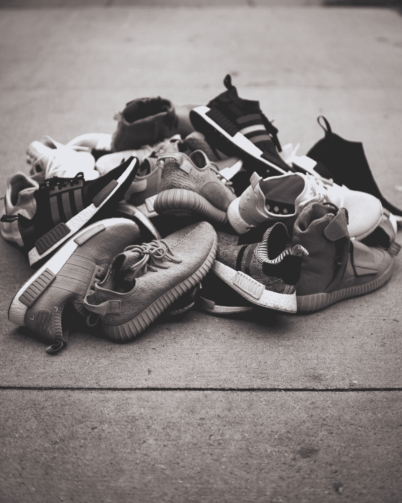
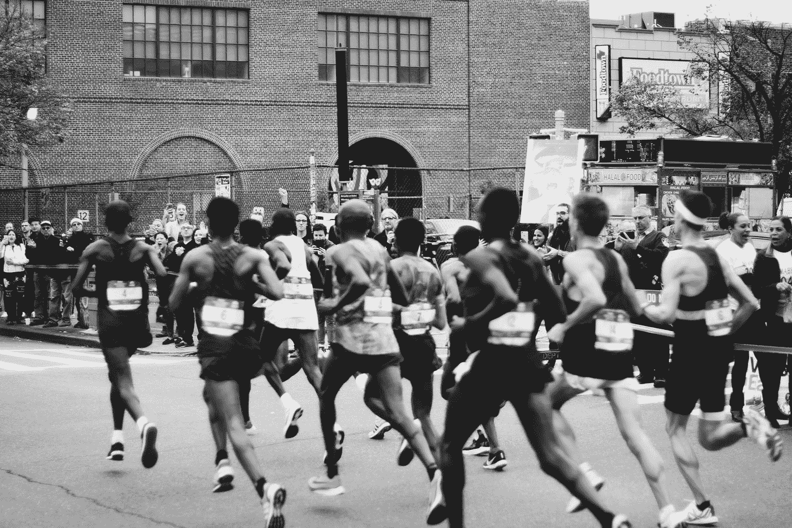

# 什么牌子。为什么是品牌。世卫组织品牌。

> 原文：<https://medium.com/swlh/what-brand-why-brand-who-brand-7c5bf4395e00>

## 通过你的产品给人们的生活带来改变是世界上最伟大的感觉。

“woman jumping on green mountains” by [Peter Conlan](https://unsplash.com/@peterconlan?utm_source=medium&utm_medium=referral) on [Unsplash](https://unsplash.com?utm_source=medium&utm_medium=referral)

这是一个令人兴奋的星期五早晨。我独自一人坐在本加鲁鲁 HSR 布局的一家不错的咖啡店里，带着新的 [Zymrat](https://zymrat.com) 产品样品，它们经过 1367 公里的旅行后到达了。我在等我的团队来参加我们的咖啡店会议，我在想-

> **我和我的团队能做出人们在健身房里穿过的最好的印度服装吗？**

这个问题震动了我内心的产品人，他喊道:“太好了！”。

他提醒我，健身、时尚和电子商务行业的每个人在看过这些产品后都惊叹不已。

我微笑着表示同意，并看着我们的一个跑步球座；我又在想-

> 我们是否有一个定义了我们的目标和意义的标志？

这个问题激怒了我内心的哲学家，他说-

> 你到底在说什么？在最终确定徽标之前，我们经历了无休止的讨论和反复，你不也是其中的一部分吗？甚至在我们让团队接触铅笔之前，我们没有定义我们的目的是什么吗！我们知道，许多人通过健身实现的成年之旅是我们标志背后的主要驱动力。它定义了让我们成为可能的一切。

我微笑，同意，再想。

> **“是不是意味着我们有品牌了？”**

这一次，我内心的创始人出来说——“还没有，儿子。让我们潜得更深。”

“grayscale photography of man swimming underwater” by [Mark Asthoff](https://unsplash.com/@qa9de?utm_source=medium&utm_medium=referral) on [Unsplash](https://unsplash.com?utm_source=medium&utm_medium=referral)

# ***这个大家一直在说的品牌的东西是什么？***

嗯，根据维基百科的定义，**品牌**是一个名称、术语、设计、符号或其他特征，在客户眼中将一个组织或产品与其竞争对手区分开来。

“assorted poster in wall” by [Rohan](https://unsplash.com/@rohanvijay?utm_source=medium&utm_medium=referral) on [Unsplash](https://unsplash.com?utm_source=medium&utm_medium=referral)

但就这样吗？一个名字或者一个 logo 足以定义一个品牌吗？

***绝非偶然。***

除非人们开始见证并相信产品或组织所拥有的精神气质和价值观，否则它不能被称为品牌。

对于真正的品牌来说，一个很好的类比可以来自于那些用自己创造了一个品牌的人，比如加里·维纳查克先生。

> 每个个体都有名字，但不是每个名字都是品牌。

Vaynerchuk 先生是一个品牌，因为人们从他那里获得灵感，向他学习，相信他所说的话，并且通过他创建的数百万美元的企业，他坚持他所说的话。人们会不惜一切和他一起工作，向他学习。

那么什么是品牌呢？

> 品牌是人们引以为豪的名字。

然而，如何将这个名字带到一个人们引以为豪的地方却是另一回事，而且会因产品和人群而异。

# ***但是*为什么*现在要经历所有的麻烦，当你可以继续销售产品的时候？***

因为卖 t 恤是一门艺术，但是卖渴望是一门更伟大的艺术，需要更多。

> orthface 从来没有卖过徒步旅行装备，他们卖的是徒步旅行者的冒险经历。

“person holding barbell” by [Victor Freitas](https://unsplash.com/@victorfreitas?utm_source=medium&utm_medium=referral) on [Unsplash](https://unsplash.com?utm_source=medium&utm_medium=referral)

由于我一直在密切研究印度运动服市场，我将使用它作为一个背景，但我在这里写的是普遍适用的。

为了让您更加信任印度运动服市场，我必须告诉您，这是世界上增长最快的运动服市场，其规模很快将达到 100 亿美元，CAGR 约为 14%。

在印度，t 恤每天都在大量销售，但没有人在打造一个品牌。

有很多选择，它主要是一个客户市场，全年都有打折季，电子商务公司相互竞争。这不是一个品牌的市场。

但事实是，它永远不会是一个品牌的市场。品牌总是通过创造不同的产品、服务和努力来获得成功。

> 你知道为什么我可以肯定地说，没有人在建立品牌——因为我是购买他们产品的顾客。

“adidas sneakers on wooden surface” by [Jairus Gallimore](https://unsplash.com/@jairusgallimore?utm_source=medium&utm_medium=referral) on [Unsplash](https://unsplash.com?utm_source=medium&utm_medium=referral)

即使在 2018 年，如果我必须为我积极的生活方式需求购买一件我可以盲目信任和珍惜的产品，我唯一可以去的地方是国际品牌展厅，花 15000 卢比买一双鞋，花 7000 卢比买一件 t 恤和短裤，因为没有其他选择对印度市场来说同样好且价格合理。

说到积极的生活方式，人们是不会妥协的。一个随机的鞋品牌卖一双 1000 Rs 的鞋永远不会像耐克 Metcon 4 卖 12000 Rs 那样吸引人；如果他们决定给 50%的折扣，这将引起一场骚乱。

如果有一个实体以更好的价格生产同样好或更好的产品，并通过不同的线上和线下渠道 ***让人们感受到它的存在，同时像耐克*** 一样改变人们的生活，并且它是在印度发展起来的，人们将会关注这个品牌。没有人会这么做。句号。

市场迫切需要有人来填补这个价格缺口，以及一个人们喜爱和关心的本土品牌。是的，人们关心品牌并为之奋斗。不相信我？[阅读阿迪达斯和彪马的竞争如何分裂了他们的创始城镇。](https://amp.businessinsider.com/how-puma-and-adidas-rivalry-divided-their-founding-town-for-70-years-2018-10)

# ***那么我们为谁打造品牌呢？***

“grayscale photo of men running on marathon” by [ben stern](https://unsplash.com/@benst287?utm_source=medium&utm_medium=referral) on [Unsplash](https://unsplash.com?utm_source=medium&utm_medium=referral)

> **对人而言。**

一个品牌不能通过展示脸书广告和 Instagram 广告来敦促人们购买产品。它可以通过真正的努力给人们的生活带来改变来建立，不管这种改变有多小。

你可以不考虑渠道，选择 100%在线或离线，或者两者兼而有之，但努力的目标应该是创造价值。

价值的定义随着产品和行业的不同而不同，但有一点是肯定的，那就是仅仅销售产品永远不会产生一个品牌。如果产品很棒，它会被谈论，它会在圈子、社区、团体中被推荐，但它仍然不会是人们引以为豪的事情。要创建一个品牌，公司和与之相关的人需要超越销售，从客户的角度思考，除了产品之外，他们还想要什么，以便在他们的旅程中为他们提供更多帮助。

***创造品牌既容易又难。如果你的焦点在正确的地方，这很容易，但很难，因为焦点需要像剃刀一样锋利。公司的每一句话、每一幅图像和每一次交流都必须有一种能让观众/听众产生共鸣的语言和意图，而且必须有优秀的产品作为后盾。如果意图或产品失败了，品牌就失败了。***

如果你想和我联系，在社交媒体频道上搜索“Ujjawal Asthana ”,然后在那里联系我。我来回应:)

## 这篇文章发表在 [The Startup](https://medium.com/swlh) 上，这是 Medium 最大的创业刊物，有+ 375，985 人关注。

## 在这里订阅接收[我们的头条新闻](http://growthsupply.com/the-startup-newsletter/)。

