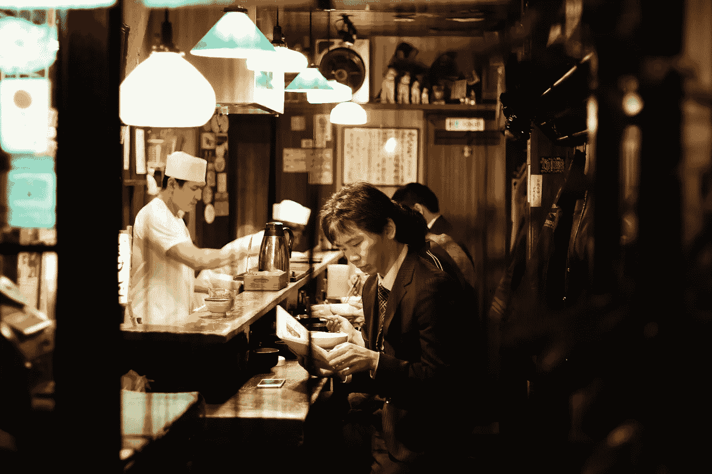

# 关于成功和自信，好吃的寿司能教会我们什么？-似乎很多。

> 原文：<https://medium.com/swlh/what-can-good-sushi-teach-us-about-success-and-confidence-plenty-it-seems-b965bc497b94>

一旦你停止学习，你就开始死亡阿尔伯特·爱因斯坦

T2 成功和自信可以来自不同的来源，我们都知道这一点，有些来源比其他来源更普遍或更持久。我们经常认为“追求更多”会给我们带来更大的满足感——如果我们是世界上最公平、最富有的人，我们的价值感将会飙升，并将永远保持下去。如果没有，我们就会陷入失望和不满的混乱中。

我们认为，也许我们拥有的还不够多，我们需要更多——财富、美貌、他人的嫉妒——来让自己感觉更好。但“更多”仍未能产生持久的快感。为什么这样

***欢迎来到快乐跑步机。***

然而,“更多”和自信之间的这种关系并不令人惊讶。经济学家长期以来一直在研究他们所谓的“T8”*边际效用递减定律* 总的观点是，随着我们增加对一种产品或服务的消费，我们从*每增加一个单位*中获得的满足感就会降低。这条定律适用于生活中的几乎所有事情。原因如下。

当我们得到一件我们渴望已久的东西——比如一只昂贵的手表，我们会立刻变得快乐。我们希望每个人都注意到我们和我们的新事物。我们感觉站在世界之巅，“像是一百万美元。”当我们的情况允许时，我们会随着时间的推移再买一个又一个。

每增加一个，我们的幸福和满足感就会下降。我们觉得自己越来越不特别。

> **所以，*有那么一个时刻，“多”不是更好，多不是多* *而是事实上变少了。“更多”不会让我们自我感觉良好，也不会让我们的自信提高一点点。***

那么，接下来呢？有没有更好的获得持久自尊的方法？**一个好的候选人是一件小事，也恰好是边际效用法则的例外——*知识*** 。知识没有门槛，不容易受到享乐适应的影响，我们从知识中“得到”越多，我们的满足感和益处也不会减少。

例如，磨练我们的技能和成为我们领域的专家不会产生不利的时间效应。知识能让我们做得更好，赢得尊重，同时也让我们为自己感到骄傲。

但这不是为了追逐名声、认可或引起邻居的嫉妒。

**是关于培养我们的手艺。**

这是关于履行我们对自己的义务，尽我们所能做到最好。

# **寿司之梦**

2011 年的 [***美国纪录片***](https://www.youtube.com/watch?v=I1UDS2kgqY8) ***“二郎梦见寿司*** ”以一种强有力的方式传递了这样一种观点，即完善我们的手工艺对于我们作为人类的成长是必要的。小野二郎是一名 86 岁的寿司厨师，也是东京一家三星级米其林餐厅的老板。根据很多人的说法，他是世界上最棒的。

“人们总是渴望做得更多，获得更多，”二郎在电影中说。“即使在我这个年龄，经过多年的工作，我也不认为我已经达到了完美。但是我每天都觉得欣喜若狂…我爱做寿司。这就是日本料理的精神。”

这里肯定有值得学习的东西。

日语单词**“shokunin”**的意思是“工匠”或“工匠”它涉及的不仅仅是工作本身。这是一种致力于持续改进的生活方式。对我们所做的事情和我们自己感到自豪，这是变得更好的动力——无论是在会计、服务客户、教学、抚养孩子还是做寿司方面。

> 不管是什么，努力做好它，Jiro 解释道——不要追求完美(因为它可能会成为一种难以捉摸的困扰),而是每天都过得更好，学习新的东西，一次改进一件事。

变得更好，反过来会增强你的自尊。

**听起来很简单，但是我们到底是如何变得更好甚至最好的呢？**

**练习，**当然在其中起着很大的作用。

或许更容易的是**简单地找到我们真正的使命并追求它**。然后，热爱我们所做的事情的感觉就会自然而然的产生。我们会想要成长和进步。

然而，如果我们不是这个幸运包的一部分，一个更现实的选择将是学会喜欢我们目前所做的事情。

这就是方法。

# **丰田方式**

看起来，当谈到建立自律、献身于我们的工艺以及不断追求自我完善的心态时，我们可以从日本的传统和民族精神中学到很多东西。

[《丰田之道》](https://www.amazon.com/Toyota-Way-Management-Principles-Manufacturer/dp/0071392319/ref=sr_1_1?ie=UTF8&qid=1521983785&sr=8-1&keywords=the+toyota+way)这本书描述了该公司标志性文化所依据的 14 项原则。丰田方式最吸引人的地方在于它的主要思想非常简单:**成功基于两个关键支柱——不断进步和尊重他人。**

日本人称这种改善或变得更好的过程为“改善”

它超越了制造和工作——它实际上可以应用于任何事情——无论是开始锻炼，清理我们的衣柜还是读更多的书。只要今天比昨天多做一点，你就会看到进步。

改善是一种提高我们工艺水平的方式，但也是一种生活方式，一种展望未来、规划未来的方式。这有助于我们建立毅力和对镜子中的人的尊重。

但最终——我们选择的谋生方式通常在我们的自我提升之旅中扮演着最重要的角色。

或者，正如二郎在电影中谦逊地告诉我们的:

> 一旦你决定了你的职业……你就必须让自己沉浸在工作中。你必须爱上你的工作。永远不要抱怨你的工作。你必须献身于掌握你的技能。这是成功的秘诀……也是受人尊敬的关键所在。”

. . .

[【1】](#_ftnref1)为了彻底起见，我想提一下，很少有条款被认为是法律的*例外* n。该法律不适用于成瘾药物、昂贵珠宝、稀有收藏品、知识和创新。金钱介于两者之间——随着人们越来越富有，它的边际效用会降低，但它永远不会降到零。

# 感谢您的阅读！

如果你喜欢这个，请鼓掌帮助我与更多的人分享。你也可以到我的网站[***www.evelynmarinoff.com***](http://www.evelynmarinoff.com/)***查看更多关于成功、自信和自我提升的小贴士和小贴士。或者在 Twitter 上关注我***[***Evelyn _ marin off***](https://twitter.com/Evelyn_Marinoff)***。***

## 这篇文章发表在 [The Startup](https://medium.com/swlh) 上，这是 Medium 最大的创业刊物，有+367，349 人关注。

## 订阅接收[我们的头条](http://growthsupply.com/the-startup-newsletter/)。

