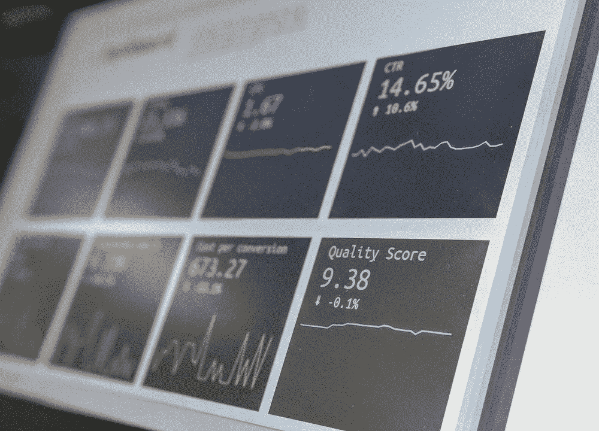
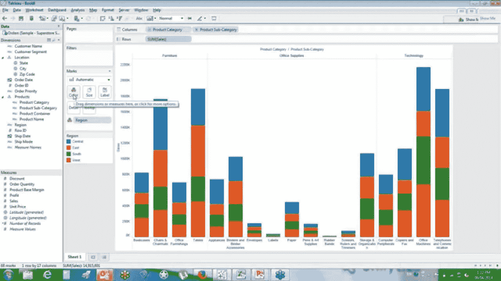

# 我们对营销分析的未来有什么期待？

> 原文：<https://medium.com/swlh/what-can-we-expect-for-the-future-of-marketing-analytics-7dfe1dacc6c4>

# 是时候抛弃你的营销仪表板了。

我的第一个真实、持久的工作爱情故事发生在几年前，当时我第一次使用 Tableau 软件。

我在一家营销/数据机构工作，我们代表客户处理媒体预算。对于每个客户，我们都设置了实时的多数据源仪表板，允许我们通过表格和数据可视化来跟踪他们所有的营销 KPI 和指标。我真的很惊讶——现在仍然如此——这样一个工具的力量。

So beautiful, so easy-to-use

它使我们能够在一个中央平台上收集和轻松处理数据，并对其进行分割、分析趋势和揭示见解，以便做出明智的决策。

但这是 2014 年。

时间已经过去，技术已经发展，现在是时候抛弃你的营销仪表板了。

好吧，也许不是所有的，像 Tableau 这样的工具在很多情况下仍然有用——但是有一个更好的解决方案可以满足营销人员的日常需求。

# **1。作为一名绩效营销人员，你可能正在使用许多仪表盘**

即使你已经将你的跟踪数据整合到一个单一的真实信息来源仪表盘中，你可能仍然会从这个仪表盘跳到所有其他你实际优化营销活动的仪表盘。

Hubspot 引用的 [Winterberry Group 的一份报告强调，“营销人员平均使用超过 12 种不同的工具，一些人使用**超过 31 种工具**来管理活动和数据。”](https://blog.hubspot.com/agency/tools-data-complexity-marketing-technology)

我们能承认这是不可持续的吗？

# **2。这么多的数据，这么多的问题…而这么少的答案**

得益于你可以跟踪和学习的数据粒度，效果营销一直在快速变化。但是，市场营销人员能够接触到的数据数量之多令人震惊。

来自数十个不同媒体渠道、数百个活动、数千个关键词的指标…很难保持跟踪。根据麦肯锡的一份报告,“知识工作者平均有 25%的时间花在搜索和收集信息上。"

当然，你可以组织你的数据来突出关键绩效指标、关键趋势，并添加一个颜色系统/热图/智能数据 viz 来帮助你通读它——这很有效。

最终，即使仪表板让您能够访问所有数据，它仍然让您承担所有的重担。采取数据驱动的决策，要么扩展高效的营销活动，要么尽快修复糟糕的营销活动。

你应该从哪里开始？

# **3。…以及(同样重要的)您应该在哪里停止？**

作为一名性能分析师，很容易被冲昏头脑。总会有另一个 KPI 细分、另一个洞察或另一个趋势值得关注。可能是数据太多了。

谁不喜欢为了分析而分析呢……对吧？

害怕错过关键信息的想法，我们都花了数小时查看数据，创建数据透视表和过度分析，而不是得出结论。

围绕这一点，已经有很多文献写了应对的技巧和诀窍——一位伦敦商学院教授在《福布斯》杂志上给出了他的答案。

# **那么，有什么工具可以让绩效营销人员的生活变得更轻松呢？**

# **1。自动** **优化**

这些解决方案已经存在了一段时间，但技术仍在不断改进，可以为营销人员带来惊人的效果。

基于复杂的机器学习算法，许多工具能够自动优化活动，有时甚至跨平台。一旦营销人员开始调整他们的营销预算，并在多个平台和国家/市场上投入资金，每天分配预算和调整出价就会非常耗时。

一点点的透明有助于内心的平静。

# **2。一站式渠道管理平台**

最近出现了一些工具，使您能够在一个工具中管理多个平台。你可以在脸书、Adwords、苹果搜索广告等网站上创建、修改、优化和暂停广告活动。通过一个独特的控制台。

它让您可以控制广告支出，因为您是这里的负责人，并且自动规则设置可以节省时间。测试新频道时，通用控制台可让您免去学习曲线。

# **3。人工智能驱动的推荐**

营销人员足够幸运，可以从人工智能的直接应用中受益。如果更大的团队可能会投资于内部数据科学团队，那么工具也已经在市场上供中小型团队使用。

一些适用的使用案例包括:

*   结论，而不仅仅是见解:基于历史数据，算法可以提出提高投资回报率的建议
*   异常检测:检测任何可疑变化或模式，以便快速采取纠正措施
*   预测分析:根据之前观察到的模式预测用户行为

# **4。自然语言处理**

斯坦福大学的一个工作组将自然语言处理定义为“允许计算机处理和理解人类语言的算法。”

NLP 将使营销人员能够询问具体的数据点或更复杂的问题，就像他们在谷歌中搜索一样简单。与查询信息类似，营销人员将能够询问软件他们在寻找什么，例如“我如何才能提高我的投资回报率？”或者按需生成复杂的报告，如群组分析、漏斗报告等。

你的软件很快就能告诉你应该如何、在哪里以及为什么查看一个特定的资产，而不是一遍又一遍地查看同一个仪表板，浪费你的时间，

表现不佳的活动和创意问题不会消失，但至少，你不会独自面对它们。

## 这篇文章发表在 [The Startup](https://medium.com/swlh) 上，这是 Medium 最大的创业刊物，有+ 381，862 人关注。

## 订阅接收[我们的头条新闻](http://growthsupply.com/the-startup-newsletter/)。

