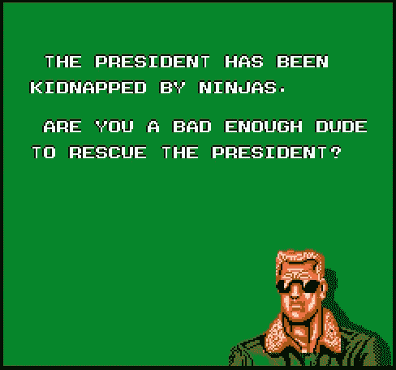
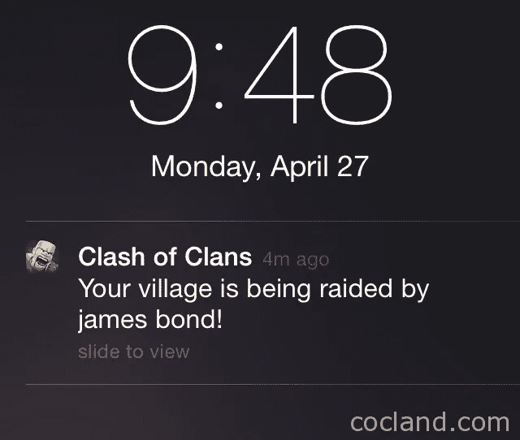
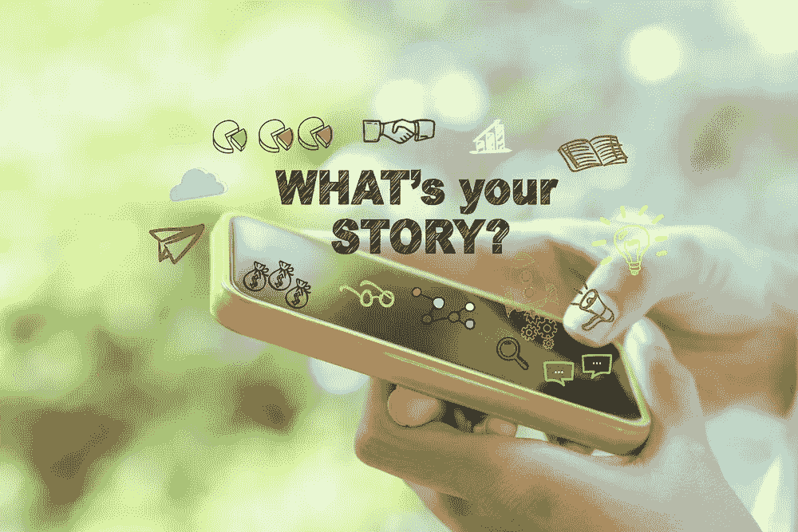
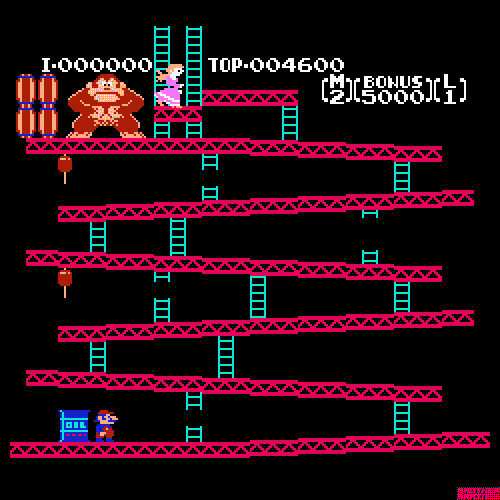

# UX 设计师能从游戏中学到什么？

> 原文：<https://medium.com/swlh/what-can-you-learn-from-gaming-9a486f727da0>

你玩的最后一个游戏是什么？
委屈 2？
《我的世界》？
还是那个老好人已经足够好了？

阿明现在是，将来也永远是毫无疑问的实验前沿。为了用户的利益，大量的创意和技术隐藏在显眼的地方，令人敬畏。但这并不是故事的全部。

博彩重申了 UX 的长期原则，并不断打破旧的原则，让位于新的原则。值得注意的是，这些原则在应用程序环境中更有潜力，在这种环境中，与用户的对话往往是单方面的。这里有一些可以在你的下一个设计中尝试

# 卖“好玩”

“卖梦”的时代肯定已经过去了。当你的大多数受众足够聪明，知道一个应用程序的局限性时，最好向他们推销**“有趣的因素”**，而不是一个深远的梦想。

The “Bad Dudes vs Dragon Ninja” arcade game promised a world of fun in their intro.

作为体验的设计师，它还能让你更清晰地向用户描述他们能期待什么样的体验，并让你站在一个预测用户需求的位置，而不仅仅是假设他们的需求。

picture courtesy - Shutterstock

# #FOMO

没有人比部落冲突、糖果粉碎和许多其他游戏做得更好。这些游戏给了用户一个回来回答问题的理由——如果我不回来会怎么样？我会错过什么？

picture courtesy — cocland.com

创造一个日常习惯可以带来很强的保持率，甚至创造一个更强的理由继续回来。显然，在这种情况下，给予奖励是很重要的，但不要忘了继续征求意见。

> **一个好的故事与用户沟通，一个伟大的故事让用户成为它的主角。**

# 灯光。相机。故事！

*但是大部分功能都没有故事，几乎不存在！但是它是一个 MVP！但是看这颜色多漂亮！*

这样想，你就会制造出无尽的借口来**而不是**讲述你的经历。见鬼，即使是经验丰富的 UX 建筑师也会迷失在用户故事、数据和保持设计卫生之间。这不是任何人的错，但这就是大多数应用程序以这种方式结束的原因。故事是 UX 不可或缺的一部分，仅仅思考故事是不够的，一个好的故事与用户沟通，一个伟大的故事让用户成为它的主角。

我的一个好朋友，去年把我介绍给了巫师世界。我已经玩了三次了，只是为了看看不同的结局。我着迷的原因是这个故事和对未来的预期。但最重要的是，我的回忆价值很大，因为很难忘记一个好故事。许多伟大的设计师都非常重视 UX 的这一方面。我的两个观点在于，如果你的经历没有故事，它就像一张漂亮的海报一样好。

# 一点一点地砌

我参加的一个研讨会的一位资深人士表示，教练标记已经发展成为一个可发现的用户界面，这在许多应用程序中显而易见。为了让它更有吸引力，我们可以从游戏中学习如何在应用程序的前几分钟吸引用户，通过一步一步的任务让玩家逐渐专注于我们的故事。

> 这也是一个很好的学习方法，人们在清晰的视觉或听觉帮助下学习得更快，而不仅仅是辅助文本。

请记住，我们不会将它们重定向到任何地方，只是让用户知道有一个选项可以打开灯，然后让它们开着。我个人喜欢角色通常向我们介绍特定游戏的方式。这对于第一次使用的用户来说也是一种非常有效的增加互动的方法。此外，在游戏的压轴戏中，他们会给玩家大量的奖励，让他感觉自己像个百万富翁！

courtesy shutterstock

# 微观互动

游戏中的每一次奖励或失败都会有一个小动画来迎接，这是理所当然的。它不仅为用户提供了肯定，而且还将他们的注意力集中到了我们希望他们注意的地方。只要应用这个小原则，即每个用户的行为都可以并且应该给予反馈以肯定，就可以在体验中产生巨大的差异。它们也是最容易吸引用户注意力的方式。

UI by [Mayank Dhingra](https://medium.com/u/10038c95b72?source=post_page-----9a486f727da0--------------------------------) for GDate

游戏机制起作用是因为它们是自我解释和直观的。他们可以让“目标”很难达到，而不会让用户感到沮丧/厌烦。它们比我们手中的设备存在的时间要长得多。看看任何一个街机游戏，一个街机游戏的互动水平是鼓舞人心的，值得进一步研究。我已经有动力在我的下一个设计中使用这些知识。

courtesy giphy

祝你度过精彩的一周。

干杯