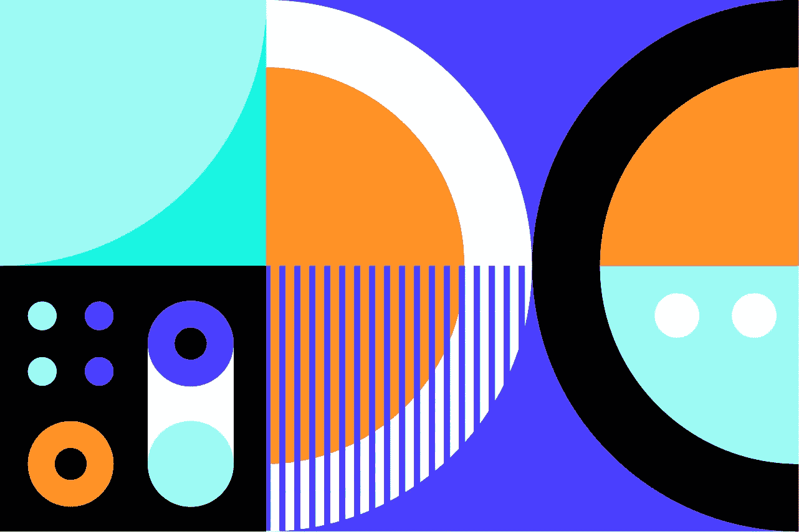

# 惊人的客户创意的秘密:带来你自己的过程。

> 原文：<https://medium.com/swlh/what-clients-buy-when-they-buy-design-a50e9701839e>

[weareinhouse.com](http://weareinhouse.com)

## 客户购买设计时会买什么

最近，我去一个班级演讲，在一长串紧张的项目中筋疲力尽后，我变得很调皮。我没有采用企业家自传/鼓励性建议的标准组合，而是直接进入了 AMA 式的问答环节:“我经营一家[创意工作室](http://weareinhouse.com)，你想知道什么？”

奇怪的事情发生了:从基本的创造性分歧到管理盈利能力，每个问题的答案都是过程。

*   “当客户不喜欢你的工作时，你会怎么做？”过程
*   “你的客户来自哪里？”过程
*   "你怎么知道一个项目要开多少账单/安排多长时间？"你猜对了。

现在，我远不是一个过程女王。我喜欢认为自己是过程转换者；一把锋利的混沌布偶。学生们提出的一些问题的答案并不总是最先想到的(参见“筋疲力尽”)。一些我必须挖掘出来的东西，掸掉灰尘，我发现自己在想为什么我不再做那件事了。

> 最重要的一点是:如果你想成为专业人士，经营一家企业，拥有良好而富有成效的关系，做出伟大的作品，你需要停止认为客户只是雇你来做设计。

一个筋疲力尽的菜鸟和一个经验丰富的成功创意之间的区别在于，经验丰富的创意知道如何带来过程。BYOP，如果你愿意的话。否则，你就准备好成为一个点击鼠标的人，一个盘旋在你肩膀上给你设计指导的客户。客户这样做不是为了折磨新手。他们这样做是因为没有一个清晰的、一致的、结构化的过程，你看起来会很倒霉、失落和不专业。

另一方面，如果你带着一个结构、一个流程和时间表进来，我做这个，你做那个，我们将测量这个东西，并通过检查另一个东西来知道它在工作:你驱动流程。在正确的时间问正确的问题，在正确的时刻进行正确的对话，在目标框架内展示设计。和你一起工作是我的梦想。即使客户不“喜欢”你的工作，如果你忠于目标并能展示事实，他们也会学着喜欢它(在它，你知道，起作用并为他们赚了一大笔钱之后)。)

[weareinhouse.com](http://weareinhouse.com)

那天晚上，当我开车回家时，一半没头没脑地做梦，一半在想到底发生了多少无聊的事情，突然有什么事情发生了。我抢救出来的被埋没的流程片段，是为了回答与我的疲惫有关的关于经营一家创意企业的最基本的问题。我的疲惫与各种各样的延误、返工、误解或其他一些需要花费精力去解决的小事有关，需要精力去回到正轨。

如果我遵循我们自己的流程，所有这些事情都是可以避免的。更重要的是，我*知道*这些小问题是我们在流程中加入某些步骤或安全措施的原因。

事情开始变得很好。项目进展顺利，开发票、付款、纳税、演示、审批……都井井有条。发生的事情是，我变得骄傲自大，不再对过程中的每一步都如此固执己见。团队有点累了？我会让他们跳过客户会议，他们会问是否有问题。客户真的更喜欢打电话讨论详细的意见，而不是按照要求的格式发送书面反馈？我们不要太死板。

几天后，在我有机会确定我们流程中丢失了哪些部分并需要恢复之后，团队聚在一起讨论(显然是通过可听见的呻吟声)。)我们都知道增加或改变流程是最糟糕的。新的过程是令人痛苦的乏味，至少在它成为习惯之前是如此。

[weareinhouse.com](http://weareinhouse.com)

这就是过程的承诺:一旦你做了足够多的次数，它就会变成第二天性。你不再需要低头去看接下来会发生什么。这是我告诉自己在建立下一个平台之前通读前三次会议笔记的小咒语。“很快这将是自动的，而不是乏味的，你将开始思考令人敬畏的创造性的东西”实际上是我告诉自己的。如果你想知道的话。问题是:这完全是假的。

飞行员和外科医生为此都有清单。顺便说一下，这是我在为需要一份清单而生气时告诉自己的另一件事。事实证明，在任何行业，减少步骤都是一个糟糕的想法。

Sign up for the [IH Design Edit](http://weareinhouse.com) for a monthly roundup of what’s good in design etc.

—

## 过程悖论

在我上课捣乱的前一周，一位客户告诉我，我们的流程太死板了。我惊呆了:这是我曾经运行过的更灵活的项目之一。这应该是直截了当的，但在做预定的决定之前，他们很早就想到了一个很小的新东西，想看看，我就让步了。“在问题的范围内，这真的没有意义，但我就做这一次”是我的原话。我想我会给他们看更多的作品，我们会回到正轨。

实际上并不是这样。一旦尝到了看到更多设计选项的滋味，它就在设置限制、贪婪地想看到我们可能想到的一切和分析瘫痪之间摇摆不定。所有这些再加上增加 3-4 次会议，只是因为这是首选的反应方式。

僵化的感觉来自于试图控制项目时遇到的尖锐限制。换句话说:通过变得灵活，我们变得僵硬。

嘘…喜欢你读的书吗？注册 [*我们的时事通讯*](http://bit.ly/YayLetsBeFriends) *，获得每月发送的设计和创意好东西的明细！❤*

## 这篇文章发表在 [The Startup](https://medium.com/swlh) 上，这是 Medium 最大的创业刊物，拥有+ 373，446 名读者。

## 在这里订阅接收[我们的头条新闻](http://growthsupply.com/the-startup-newsletter/)。

