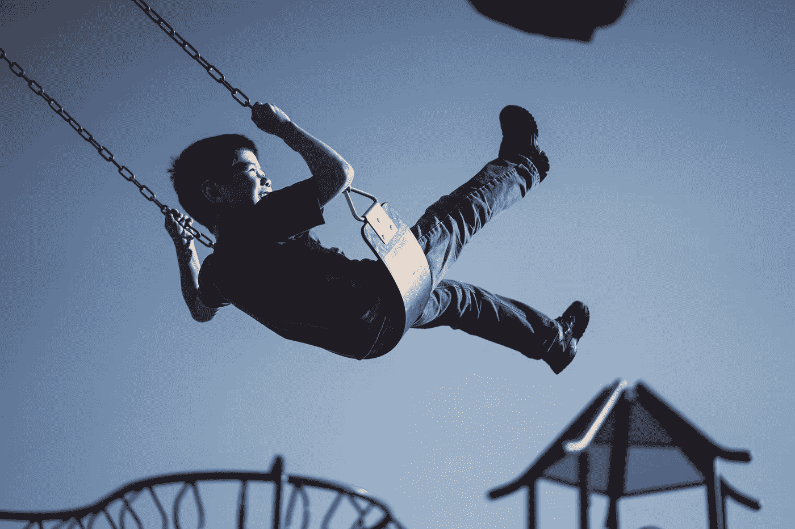

# 是什么消耗了你的思想，控制了你的生活

> 原文：<https://medium.com/swlh/what-consumes-your-mind-controls-your-life-95bd6e92cc75>

十年前，如果有人告诉我要积极思考，我会中断眼神交流，然后走开。每当我发现自己处于困境时，无论是在工作、大学还是社交生活中，我都会心情不好，推开别人。我的整个心态变得黑暗，我只能听到我自己的负面想法。我没有意识到我对自己和周围人造成的伤害。当我意识到的时候，我的生活开始改变。我想改变我的思维方式，更重要的是，改变我的生活方式。

在那十年里，我开始阅读关于自我提升和应对挑战的书籍和博客。从我读到的所有东西中，有一句话让我记忆犹新:

> “什么消耗你的思想，控制你的生活。”

那时我觉得一切都有意义了。我现在知道，我的消极态度和想法引来了更多的消极。我有自我毁灭的倾向，我需要打破这个循环，在生活中适应积极的态度。我做到了。诀窍是放手并原谅自己。这个小小的火花让我整个心态从消极变成了积极。

我发现了积极思考的力量及其改变生活的好处。我认为积极并不是因为它让生活变得更容易。这是因为生活带来的所有困难，使我需要保持积极的态度变得更加重要。

我们都需要一个积极的心态来克服困难，并不断成长，充分发挥我们的潜力。不仅积极思考从我自己的经历中被证明是有效的，而且研究显示积极思考可以在生活中创造真正的价值，帮助建立比微笑持续更长时间的技能。

北卡罗莱纳大学的积极心理学研究员芭芭拉·弗雷德里克森发表了一篇具有里程碑意义的论文*，提供了关于积极思维及其影响的惊人见解。她的工作是她所在领域中被引用次数最多的工作之一，而且在日常生活中非常有用。*

*让我们深入了解她在消极和积极思维方面的工作。*

# *消极思维对你的大脑有什么影响*

**

*每当你发现自己处于困境或面对重大挑战时，你的大脑就会记录下一种负面情绪——在许多情况下，这可能是恐惧、愤怒、悲伤、沮丧或嫉妒。*

*研究人员很早就知道，负面思维会引发负面情绪，这种情绪会让你的大脑做出特定的动作，让你远离挑战。换句话说，负面情绪让你的思维变得狭隘，倾向于逃避、回避、拖延或其他任何让你远离对抗的事情。这是人类在生存模式下本能的一部分。然而，问题是，你的大脑仍然以同样的方式对负面情绪做出反应，关闭外界，限制你在周围看到的选项。*

*例如，当有人侮辱你时，你的愤怒可能会让你无法思考其他事情。或者，你今天有几个截止日期，你把一切都拖到最后一刻，因为你被你的待办事项清单变得有多长而麻痹了。或者，你因为今天没有去健身房而感到沮丧，你所能想到的就是你的意志力有多么薄弱，你没有动力。*

*在每一种情况下，你的思想都集中在负面情绪上——它阻止你看到你周围的其他选项和选择。*

*现在，让我们把这个和积极的想法进行比较！*

# ***积极思考对你的大脑有什么影响***

*当你经历快乐、爱、满足和感激等积极情绪时，你会看到生活中更多的可能性，打开你的心扉，接受更多的选择。积极思考的真正影响是在以后的生活中积累技能。弗雷德里克森称之为“拓宽和建设”理论。*

*这里有几个我们熟悉的简单例子。*

1.  *孩子在外面玩耍奔跑，在树枝上荡秋千(物理技能)；*
2.  *同时，他们和其他孩子一起玩耍，分享玩具，互相交流(社交能力)；*
3.  *此外，他们探索和检查他们周围的世界(创造技能)。*

**

*快乐和爱的积极情绪鼓励孩子们建立在日常生活中有用且有价值的技能。与引发这些技能的情感相比，这些技能持续的时间更长，也许是一生。*

# ***朝正确的方向推了一把***

*让你的头脑充满积极的情绪是很棒的。然而，那些快乐的时刻对于打开你的思维来探索和建立在你生活的其他领域变得如此有价值的技能也是至关重要的。*

*我要求你找到在生活中建立快乐和积极情绪的方法，无论是通过去健身房、冥想、写作、绘画还是其他方式。当你看到过去的经历如何融入未来生活的可能性时，积极情绪和无约束探索的阶段就会出现。从这里开始，你开始发展技能，这些技能日后会成为有用的人才。*

**原载于 2018 年 1 月 17 日*[*ye-chen.com*](https://ye-chen.com/what-consumes-your-mind-controls-your-life/)*。**

**

## *这个故事发表在 [The Startup](https://medium.com/swlh) 上，这是 Medium 最大的创业刊物，有 291，182+人关注。*

## *订阅接收[我们的头条](http://growthsupply.com/the-startup-newsletter/)。*

**