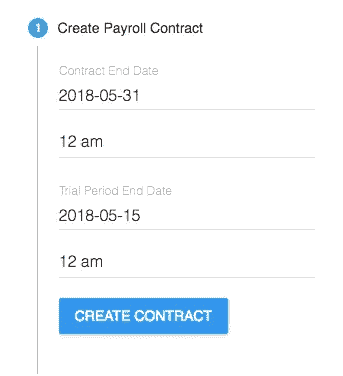
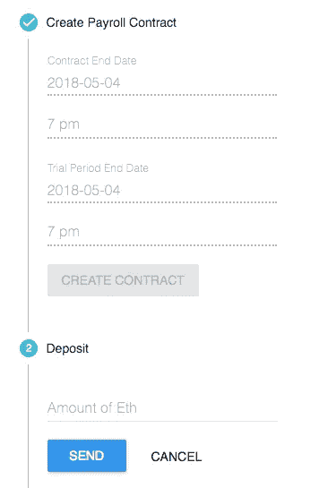
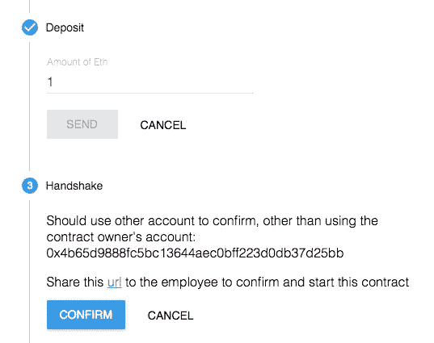
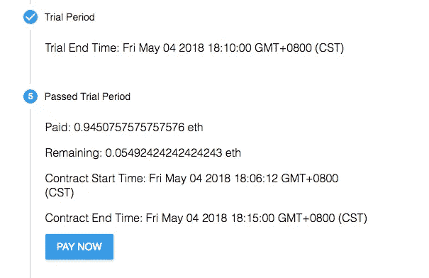
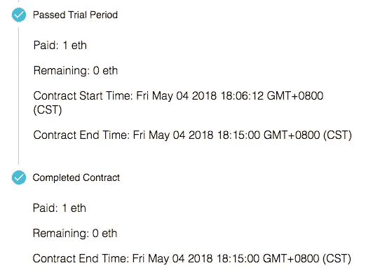

# 区块链能为自由职业者提供什么？

> 原文：<https://medium.com/swlh/what-could-blockchains-offer-to-freelancers-61019a084f80>

自由职业者市场是区块链科技可以帮助改变的令人兴奋的领域之一。想象一下，自由职业者可以独立地与雇主建立智能合同，以加密货币或代币的形式获得奖励，这些代币可以随着时间的推移而归属。

这将从根本上改变人们的合作方式，因为它突破了中间人，使工作关系更加灵活。

这篇文章讨论了如何在自由职业市场中使用区块链技术，随后是一个简单的 Dapp 来展示一个可以由自由职业者和雇主独立管理的智能支付合同。

# 自由职业的趋势

根据就业市场统计，越来越多的人选择逃离朝九晚五的工作，成为自由职业者，渴望更灵活的工作内容，扩大业务网络，发展个人品牌。

他们可以自由地与更喜欢的伙伴一起工作，并且可以更灵活地决定他们想要追求的职业方向。

> 自由市场的核心原则之一是，中央计划委员会永远不可能像工作人员那样高效或有效。
> 
> 自由市场经济最重要的特征是，其中的每个人都能够根据自己的最大利益做出独立的决定

 [## 为什么我们讨厌为大公司工作

medium.com](/@lkanies/why-we-hate-working-for-big-companies-9e6c787a32ac) 

在以去中心化为核心价值的区块链技术时代，自由职业的趋势很可能会加速。

# 自由职业市场

大多数自由职业者的作品都是通过 upwork.com 和 freelancer.com 这样的外包平台获得的。这些平台为雇主发布工作或雇员申请工作提供便利，充当工作信息中心。

这些平台受欢迎的关键原因是它们充当工作合同和资金的中间人。在完成合同后，他们有一套规则来收集和计算雇主和雇员的评分。

这些平台的主要职责是维护和确保雇主和雇员之间的合同。

有一个中间人来执行这项任务是有代价的:

1.尤其是在支付过程中，效率很低。可能需要几天甚至几周的时间才能把钱转到海外银行账户。他们收取费用，并给雇主和雇员都带来了成本。为新客户工作的费用可能高达 20%。

2.中间人在处理合同冲突时可能会有偏见。

3.他们负责评级计算和显示的规则。评级是自由职业者的关键因素，因为这是雇主在雇用时进行评估的内容，需要多年的时间在平台上培养。这些评分数据归平台所有，不能在其他平台之间共享。

> 坏消息是，初创公司、创作者和其他群体越来越难以在不担心集中式平台改变规则、夺走受众和利润的情况下扩大互联网业务。

 [## 为什么权力下放很重要

medium.com](/@cdixon/why-decentralization-matters-5e3f79f7638e) 

# 什么是合同？

让我们回到为什么我们需要一个雇佣合同的问题上来，这些集中的平台促进了雇佣合同的创建。

简而言之，合同:

> 对事实以及何时改变事实达成一致——也就是说，对账本上的内容达成共识，并相信账本是准确的——是市场资本主义的根本基础之一。

 [## 区块链经济:机构密码经济学入门指南

### 克里斯·伯格、辛克莱·戴维森和杰森·波茨来自 RMIT 区块链创新中心，这是世界上第一个社交…

medium.com](/@cryptoeconomics/the-blockchain-economy-a-beginners-guide-to-institutional-cryptoeconomics-64bf2f2beec4) 

像 upwork 或 freelancer 这样的平台基本上是一个记录和维护合同的中央数据库。这些合同依靠可信的中央机构来维护和验证。

通常有两种类型的合同:

> 一份完整的合同规定了在每一种可能的意外情况下会发生什么。
> 
> 一份**不完全**合同允许在出现意外事件的情况下重新协商合同条款。

创建一份**完整的**合同几乎是不可能的，尤其是对于自由职业者这样的小商业活动，因为在一个合同期内考虑所有可能的条件成本太高。

那么，我们如何创建既安全又高效的**不完全**契约？

> 区块链虽然是智能合同，但它降低了与许多不完全合同相关的信息成本和交易成本，从而扩大了经济活动的规模和范围。

区块链的分散共识性和不变性功能使创建的合同具有嵌入式规则，可以自动管理合同中的分类帐数据。

借助区块链技术，现在无需第三方机构即可创建安全的合同。

# 简单的付款合同

为了演示这个概念，让我们尝试实现一个简单的工资契约，它在没有任何第三方机构的情况下自动执行，后端使用 Ethereum solidity 契约，前端使用 React.js。

合同的模式通常是一对一的关系，即雇主和雇员之间的规则。在软件外包领域还有其他的合同模式。众包平台，比如 [TopCoder](http://topcoder.com/) 和 [Kaggle](https://www.kaggle.com/) ，都是一对多关系的模式。他们举行比赛来奖励参与项目的优秀者。

假设我们想创建一个非常基本的支付合同，它基于时间，一对一的模式，具有以下关键要求:

1.雇员需要知道雇主是否有足够的资金来支付合同协议。

2.雇主需要知道雇员是否有能力实现项目的愿景。

3.在试用期内，这两个角色都应该有机会评估他们是否合适。

如果事情进展不顺利，合同会使他们有资格选择终止合同，从而避免潜在的金钱或时间损失。

## 合同规则流程

1.  雇主可以在一分钟内创建一个智能合同，并在合同有效期和试用期内进行配置。

2.一旦雇主将资金存入智能合同，它将进入**握手**阶段，其中有一个包含此合同地址的 URL，与员工共享以查看此合同。

3.通过共享的 URL，员工可以查看合同的期限和可用的存款。一旦确认(签署)合同，合同从试用期开始，在此期间付款请求被禁用。从现在开始，存入的资金只能转到员工的账户地址或者通过解约的方式退还。

4.雇主可以选择解除合同。在**握手**和**试用期**阶段，本合同可解除。如果取消，存入的资金将从合同中提取，放回雇主的钱包账户。

5.试用期过后，员工可以在任何需要的时候要求付款，并根据当前时间和合同期限立即获得报酬。

或者，在试用期后，业主可以授权已完成的合同在合同结束时间前将总付款转移给承包商。这是为了激励承包商更快地交付高质量的工作。

6.当所有的基金存款都支付给员工时，合同将终止。

这是一个简单的演示 Dapp，作为一对一雇佣关系的支付合同。

上面展示的智能合同完全属于雇主和雇员。它不依赖任何第三方机构来保护合同的规则，这些规则是根据合同中的分类帐数据自动执行的。

建立对雇员和雇主都透明的规则是很灵活的。

创建这种智能合同的成本很低。创建契约的惟一要求是一个带有 Metamask 扩展的 web 浏览器来签署事务。

[前端](https://github.com/katat/payment-contract-app)和[固化契约](https://github.com/katat/payment-contract-solidity)的源代码已经发布在 github 上。另外，你可以在本地用源代码或者用[部署的版本](http://katat.me/payment-contract-app)来摆弄它。

**潜在问题:**

通常，支付合同可能会持续很长一段时间，在此期间，加密货币的价格可能会大幅波动，这对于正常的商业实体来说是不可接受的。

幸运的是，市场上已经出现了稳定的硬币。稳定的硬币，如戴，可以在支付合同中作为主要货币使用。

 [## 假人的制造者:傣族马币的简明英语解释

### 总结:

medium.com](/cryptolinks/maker-for-dummies-a-plain-english-explanation-of-the-dai-stablecoin-e4481d79b90) 

另一个值得注意的问题是交易确认的速度。与更容易调整性能的集中式 web 应用程序相比，在以太坊网络中确认交易可能需要很长时间，特别是当供应的气体太低时。

这将给民主行动党的 UX 带来挑战。为了防止 Dapp 用户在确认交易期间感到困惑，非常需要一种设计用户体验的新方法。

 [## Web3 设计原则

### 基于区块链的分布式应用 UX 规则框架(上)

medium.com](/@lyricalpolymath/web3-design-principles-f21db2f240c1) 

# 摘要

上面的简单支付 Dapp 展示了区块链技术可以帮助实现什么样的革命，以及它将如何强大地在自由职业市场中定位自己。

事实上，已经有一些组织从不同的角度为这一领域而努力，如 [Arogan](https://aragon.one/) 、 [Ethlance](http://ethlance.com) 、 [Gitcoin](https://gitcoin.co/) 、 [Bounty Network](http://bounty.network/) 等。

我们仍处于区块链的早期阶段。在这一领域，区块链可以帮助实现许多可能性。它将帮助自由职业者获得更多的自由，从事最符合他们个人兴趣的项目，而不会被锁定在特定的集中平台上。

> 感谢阅读。我将感谢任何评论，请随时分享您的想法。

## 这篇文章发表在《创业公司》杂志上，这是 Medium 最大的创业刊物，有 323，238 人关注。

## 订阅接收[我们的头条新闻](http://growthsupply.com/the-startup-newsletter/)。

