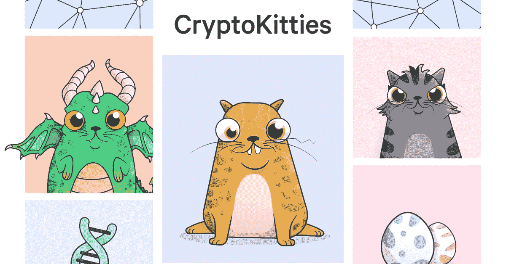

# CryptoKitties 对密码产业的真实看法

> 原文：<https://medium.com/swlh/what-cryptokitties-really-says-about-the-crypto-industry-f252046aac4c>

如果你还没有看过以太坊网络上的一个最新的狂热，那么 [Cryptokitties 正在横扫网络](https://www.cryptokitties.co/)。

类似于分散的电子鸡，Cryptokitties 实际上占用了如此多的速度和数据，以至于减慢了网络速度。

一只普通的小猫大约要 100 美元。

虽然这可能是一种时尚，但这是我们想要谈论的事情，因为这无疑是关于整个行业和人们的一个更大的信息。

# 如果有人想要，人们就会去创造

事实是，有时候最重要的东西是每个人都想要的。

在自由市场中，我们会看到你能想到的任何东西。

虽然 Cryptokitties 似乎是一件荒谬的事情，但人们会为一只小猫支付 100 美元，最贵的一只超过 113，000 美元(目前为 246 以太坊)。

是的，那是一大笔钱。

虽然，当我们看到[中国亿万富翁花 1 亿美元买画的时候](https://www.nytimes.com/2017/05/18/arts/jean-michel-basquiat-painting-is-sold-for-110-million-at-auction.html)，这并没有什么不同。

*人类想要某些市场会创造的东西*

还是那句话，有志者事竟成。

随着这些 Cryptokitties 接管以太坊，实际上降低了它的运行速度——它提出了这个问题:

未来我们会看到什么？

最有可能的是你能想到的分散的和加密网络上的任何东西。

Vitalik Buterin 在对他的角色因为集权而无法加载感到恼火后，创造了以太坊。

我们正处于一场革命之中，而 Cryptokitties 绝不是我们将会看到的最怪异的东西。

你认为我们很快会看到什么？请在下方留言评论。

*感谢阅读，*

*GCA 团队*

*原载于 2017 年 12 月 4 日*[*globalcryptoacademy.com*](https://globalcryptoacademy.com/cryptokitties-really-says-crypto-industry/)*。*

## 这个故事发表在 [The Startup](https://medium.com/swlh) 上，这是 Medium 最大的企业家出版物，拥有 271，813+人。

## 在这里订阅接收[我们的头条新闻](http://growthsupply.com/the-startup-newsletter/)。

