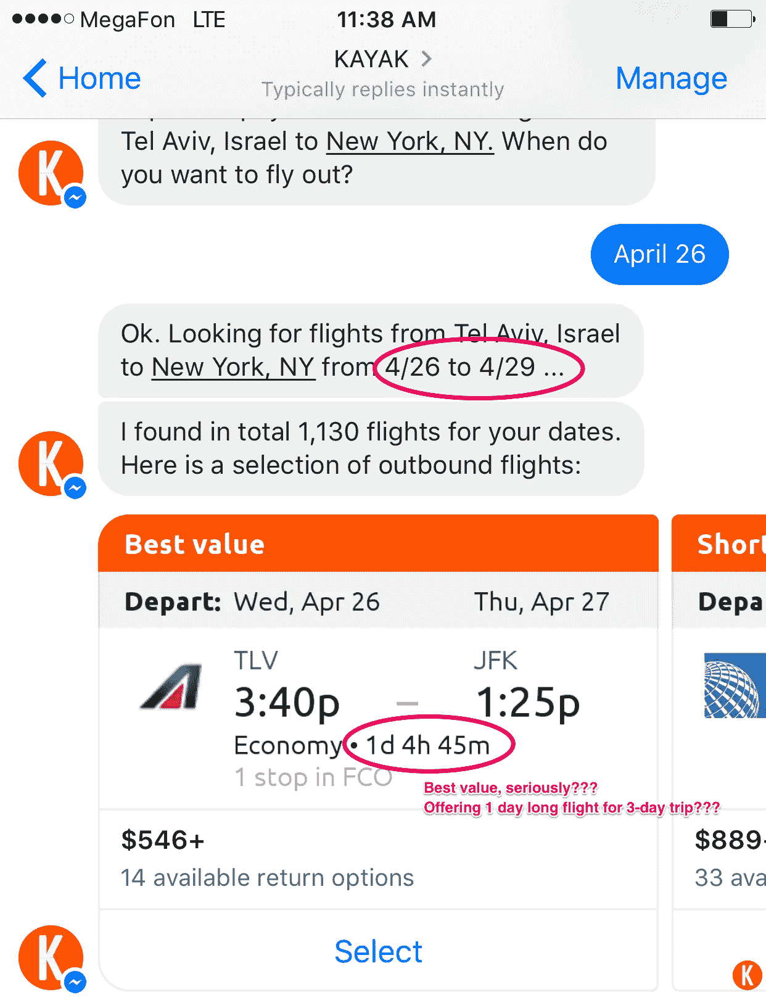
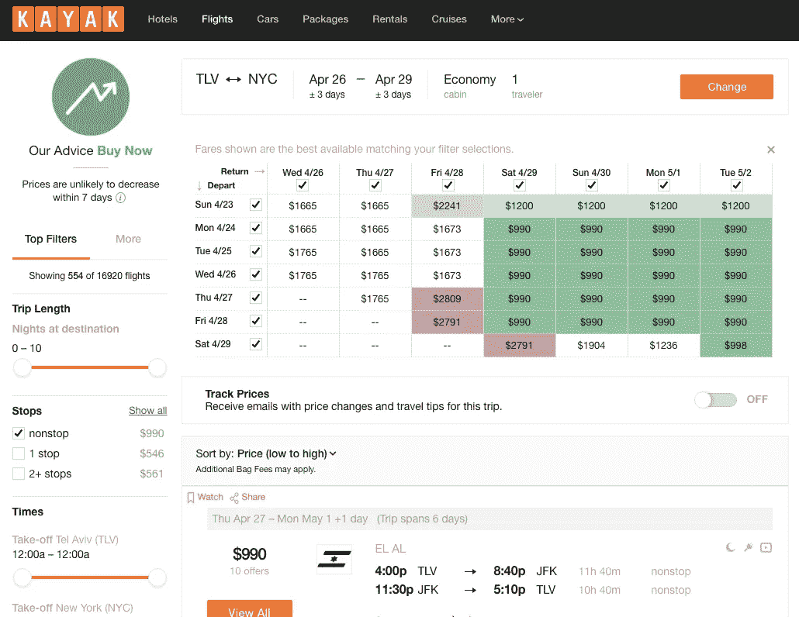
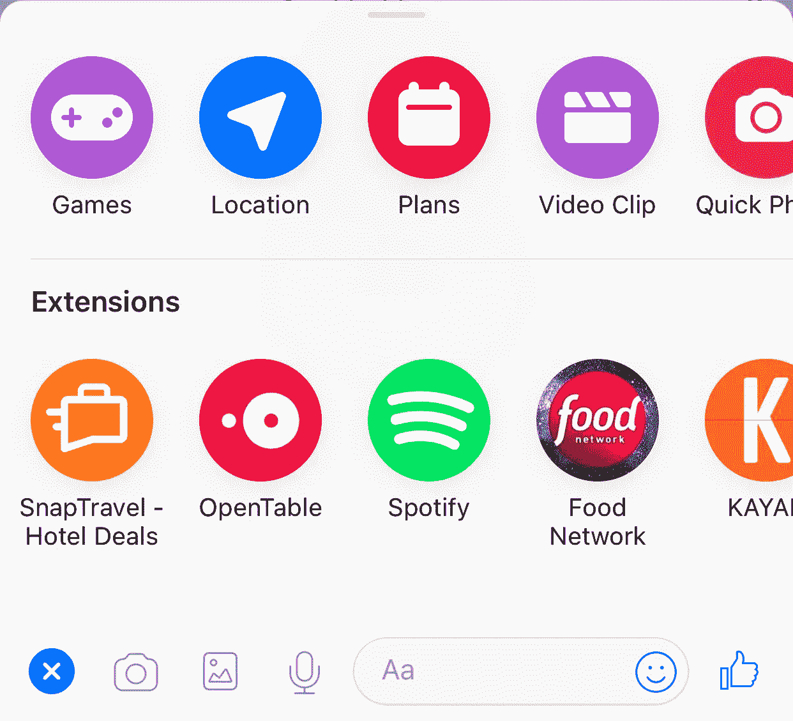

# 在消息平台上，什么定义了一个成功的机器人？

> 原文：<https://medium.com/swlh/what-defines-bot-success-on-messaging-platforms-6cdfa27f5925>

Thinking through “UI-use case” fit before jumping to code is critical for bot success

最近的 F8 会议上，FB 推出了其 Messenger 平台的新功能，试图重新点燃“ [rocky 推出](http://www.theverge.com/2016/4/18/11422278/facebook-messenger-bots-david-marcus-interview)”和缓慢的采用，引发了我对如何让机器人更成功的思考。

如果你看看产品搜索网站上排名前五的[机器人](https://www.producthunt.com/topics/bots?order=most-upvoted)，五分之四将成为构建机器人的平台。围绕机器人的炒作始于 2016 年 FB 推出 Messenger 的机器人构建 API，直到现在才成为现实。

我认为这有几个原因。

首先，围绕自然语言理解的**炒作** (NLU)在语音/文本界面中作为视觉界面的替代品或普遍更好的版本是误导性的，参见 Benedict Evans 的这篇[伟大的文章](http://ben-evans.com/benedictevans/2017/2/22/voice-and-the-uncanny-valley-of-ai)对语音界面的分析。事实上，发短信或聊天并不普遍比看和点击更方便。想一想您必须通过分析多个选项、参数和步骤来做出决定的任何用例，例如，查找未来 3 个月内最便宜的航班，以及哪种类型的 UI 对您个人来说更方便。我们视觉的带宽比我们打字、阅读或听觉的带宽高几个数量级(见莫兰·瑟夫的[数据](http://28oa9i1t08037ue3m1l0i861.wpengine.netdna-cdn.com/wp-content/uploads/2018/04/WBW.png)来自最近蒂姆·厄本的[帖子](http://waitbutwhy.com/2017/04/neuralink.html#part4))。

第二，平台所有者，无论是脸书的 Messenger 还是亚马逊的 Alexa，**有意无意地将机器人定位为开发人员的伟大人工智能工具**。这种定位形成了开发者和用户的期望，即机器人是复杂的代理，能够进行复杂的推理。这种看法自然是由对信使和语音平台固有的机器人 NLU 能力的期望所驱动的。但事实证明，尽管开发人员可以使用所有伟大的工具，如 Wit.ai 或 Api.ai，但聊天环境中人类水平的 NLU 非常难以开发。让机器人具有真正的推理能力甚至更难，这将解释现实生活对话中快速变化的意图。在许多选项和推理都很重要的情况下，当机器人承诺成为自然和方便的商业交易方式时，它们被证明是不切实际的(见下面的 Kayak Messenger 机器人截图)。

此外，在大多数情况下，用户对机器人的体验不如应用程序，在应用程序中，用户界面主要负责选项的清晰视觉表示，而不是依赖于场景。应用程序可能离用户当前的活跃流量有一些额外的点击，但仍然值得切换以更快地做出明智的决定。

毫无疑问，机器人可以在许多复杂的情况下很好地工作，但开发一个引人注目的机器人是非常困难的。例如，Seth Rosenberg 的[帖子](https://news.greylock.com/what-i-learned-from-launching-the-messenger-developer-platform-b6402f2e55bc)，揭示了第一个荷航机器人需要信使团队付出多少努力。任何试图开发具有 NLU 元素的机器人的人都知道，即使是最基本的对话也需要为大量可能的场景开发处理逻辑，即使这样，现实生活中的很大一部分用户行为仍不会被机器人的逻辑所覆盖。这与应用程序开发有很大不同，在应用程序开发中，开发人员不必考虑用户行为的所有可能排列。脸书等人使机器人的创建民主化了很多，用户看到了大量的机器人，但由于机器人逻辑开发的困难，大多数机器人仍然是低质量的产品(理应看不到牵引力)。

最后，即使是好的机器人，它们的**工具**也很可能**非常有限**，把很多功能留给传统应用。这就是为什么更好的机器人，例如 Messenger 上的 [Epytome Stylist](https://epytom.com) ，在一开始就对机器人的功能非常透明，并利用所有可能的平台工具来混合 NLU 和传统的视觉界面。

尽管有局限性和不引人注目的开始，我相信机器人作为一个新的 UI 平台，如果在某些用例中得到利用，将有巨大的潜力来提高各种业务的收入和效率。我想到了两大类。

第一类更面向消费者，涉及机器人自动执行相对简单的操作的情况，这些操作目前需要用户进行多次应用程序切换和点击。我本质上说的是**定义明确的场景的聚合和精简**(“节省点击量”)。想象一下，你正在寻找从 A 点到 b 点的最快/最便宜的方式。你目前的日常工作可能包括在谷歌地图/Waze/Moovit 应用程序中查看可能的路线、交通堵塞和旅行时间估计，然后转到优步和/或 Lyft 查看 eta 和价格，甚至可能会查看 Zip Car 可用性或天气应用程序，以决定如何最好地通勤。最糟糕的是——几乎每次你需要通勤的时候，你都在做同样的事情。一个提供位置信息的单一功能机器人，可以让你的这项任务变得容易得多，只需向你提供前三个选项(最便宜、最快、最方便)，并以“不问问题”的方式执行你的选择。由荷航和信使团队合作打造的首个荷航机器人就属于这一类。

如果你正在做这样的用例——ping 我，也许我们可以投资你的公司。:)

第二类更偏重商业。它是关于**客户和企业之间重复的和相对基本的互动的自动化**(如果它们还没有自动化的话)——预订、支付、常见问题解答检索等。在这里，聚合可以为消费者增加额外的价值，当一个机器人也是跨各种提供者的 UI 聚合器时(例如，购买镇上任何剧院的电影票)，但这不是必须的。许多当前企业机器人的成功案例都属于这一类，具有客户服务功能。

在这一类别中，一个重要的**边缘案例**是当一个机器人只是代替键入谷歌搜索请求或网址，或者只是简单地查看应用程序的主屏幕。

在这种情况下，*与机器人对话*并没有给普通的视觉界面增加多少价值。举个例子，当你可以向金融科技机器人询问账户余额时，它就可以提供所谓的对话银行服务。你的银行应用程序可能是一种更便捷的方式来快速获得你的财务状况并进行交易——只需更少的点击！

支持这种边缘情况的一个论点是，机器人可以保持你当前的对话环境不中断，并节省你的应用程序切换工作。这可能是**扩展**背后的理性——一个从你当前的对话中访问一些服务提供商功能的选项，脸书刚刚在 iMessage 移动后将它添加到 Messenger 中。

在许多情况下，例如 OpenTable，扩展只是在 Messenger shell 中打开来自服务网站的网页。

扩展与对话机器人和 NLU 关系不大，更多的是将传统的用户界面无缝地引入到你的对话中。在某些情况下，邀请第三方参与你的谈话可能会感觉很奇怪，因为这会打断谈话的流程。有时，当涉及内容分享或集体决策时，例如分享一首歌曲或为团队订购外卖，这可能会感觉很自然和方便。

扩展可以“节省点击”,成为对话的自然组成部分。他们可以帮助 Messenger 成为一个更强大的类似微信的生态系统。但是对于扩展来说，一个主要的僵尸工具挑战仍然是真实的——创建无缝的机制来发现相关的僵尸工具是困难的。时间会证明脸书提供的“机器人商店”能否解决这一挑战。我个人很希望看到商店从一个弹出标签演变为一个无缝的对话搜索引擎，类似于信使的提及机制，例如，通过键入“@Spotify”或更广泛的“@Music”将 Spotify 机器人添加到对话中，作为类别中的默认机器人。

尽管我很希望看到通用人工智能和数字推理取得更多进展，但人工智能似乎更有可能继续在“垂直领域”发展——不仅仅是商业垂直领域，还包括视频中的对象识别等技术垂直领域。这意味着，要让 bot/extensions 看到真正的用户采用，开发人员需要 0)仔细考虑 bot 的附加值与传统渠道的对比 1)通过预先明确 bot 的目的、功能和限制来管理用户的期望 2)严格控制 NLU 功能，3)在许多情况下将人工移交纳入 bot 流程。我认为这些条件对于建立信任和真正的扩展至关重要。

很想听听你对信使机器人未来的看法！