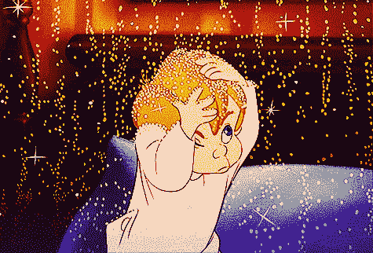

# 公司说他们想要一个 UI/UX 设计师是什么意思？

> 原文：<https://medium.com/swlh/what-do-companies-mean-when-they-say-they-want-a-ui-ux-designer-cab1c7c74a3c>

这是一种非此即彼的选择吗？一个加一点另一个？

就像点一个只有一点点蛋黄酱的三明治？哪个是三明治，哪个是蛋黄酱？

几年前，我和一些同事曾经拿公司看待 UX 的方式开玩笑。有时候，似乎一家公司会雇佣一名 UX 设计师，并希望这能神奇地让他们的产品变得更好。就像他们期望的那样，我们所要做的就是出现并撒上我们的 UX 精灵粉。

我们过去每一步都必须为 UX 而战。到 2000 年代初，公司得到的信息是，如果他们想让自己的产品获得成功，就需要专注于 UX，所以在简历中加入 UX 头衔让我们获得了成功。但之后我们会开始碰壁。

在 UX 成为优先事项之前运行良好的流程现在需要改进。过去从不相互交流的部门突然被要求参加彼此的会议。使软件对用户友好变得臭名昭著，因为编码时间增加了一倍。

幸运的是，新的创业公司现在理解了 UX 的重要性，并在早期阶段将我们纳入其中。我们融入了这个团队，并有希望获得实验、研究和领导的余地。

在我的前一篇文章中，我提出了 UX 设计的定义，它是为特定的观众创造满足特定目标的体验的过程。

这是非常宽泛的，因为它可以适用于任何数量的不同公司、商业模式和受众。让我们看看我们是否能解开一些。在这样做的时候，让我们来谈谈这个用户界面/UX 的事情。

# 我们所说的商业目标是什么意思？

企业有这样的目标:

*   年底前销售 500 万件产品
*   到 10 月达到 100 万活跃用户
*   到 2016 年成为公认的 blahblahblah 领先提供商

这些目标本身与 UX 没有什么关系。UX 关心的是*如何*。

**如何在 10 月前让 100 万人成为活跃用户？为什么会有 500 万人想要购买我们的产品？**我们需要做些什么才能成为业内公认的领导者？****

这些问题的答案可能是:

*   让产品非常受欢迎——这可能意味着在美学上令人愉悦，比任何与之竞争的产品更容易使用，或者更令人愉快。
*   找出并消除现有的阻碍人们注册、购买或信任现有产品可信度的摩擦。
*   识别、设计和构建满足目标市场需求或超越竞争对手的新功能。

# 回答这些问题涉及到公司的所有部门。

达到 100 万活跃用户涉及营销——人们知道我们公司吗？如果我们接触到他们，我们的信息有共鸣吗？ **UX 和市场部可以在这里合作**,围绕市场调查交换意见，确定目标受众，了解他们的角色、特点、需求和欲望。

还是人们对营销内容感兴趣，但在成为用户之前就失去了兴趣？这可能意味着 **UX 与数据分析师**结对——当人们来到我们的网站时，我们知道他们在哪里失去了兴趣吗？是否应该尝试一些转换优化和 AB 测试？

也许我们**与我们的客户服务团队**合作，看看是否有任何主要的冲突点。也许我们可以亲自和有困难的用户谈谈。或者我们可以**做一些可用性研究**。从看到我们的营销到成为用户，看着我们的目标受众使用我们的产品。他们是在没有指导的情况下成功的吗？他们一路上被挂了吗？

如果产品本身的界面引起了摩擦，我们可以**把这些信息带给我们的 UI 设计师**，和他们一起集思广益，设计原型，测试一些替代方案，直到我们解决了问题。

有时候问题不在于 UI，也许是性能问题。一些用户在某些区域会遇到加载缓慢和掉线的问题。 **UX 可能会与工程部**合作，以确定关键路径并对用户流程中的这些部分进行优先排序。

我正在描述一个 UX 专业人士如何通过跟随客户之旅来实现业务目标的过程。希望这开始显示 UX 有多广阔。你有没有注意到几段前 UI 是其中的一部分？

在我们上面假设的例子中，创建一个理想的界面是实现业务目标的许多潜在方法之一。

UI 设计师可能是一个只专注于确保他们设计的界面满足这些目标而不是其他目标的人。

他们可以让团队中的其他人来定义并向他们传达谁是目标受众，他们的特征、行为、技术水平等。他们可以允许产品团队中的其他人让他们知道哪些任务是需要在界面中提升的关键任务。他们可以让平面设计师向他们传达品牌方针和美学目标。

他们可以将所有这些任务委托给其他团队成员**，但仍然有一份全职工作。**

UI 设计需要大量的注意力和技巧。有很多细节要记录，想办法简化。此外，创业公司在迭代和学习的过程中，会不断添加功能和改变关键任务。弄清楚如何适应所有这些，同时仍然创建一个美丽的，令人愉快的，易于使用的界面需要做大量的工作。一般来说，一个好的 UI 设计师越关注界面，界面就会越好。

不过，事情通常不会是这样的。用户界面设计者通常也是至少完成一些其他任务的人——定义用户，识别转换问题，定义关键任务，创建品牌指南，定义新功能，等等。

> 当一个 UI 设计师不得不担心在整体水平上做出的决定时，他怎么能专注于制作最好的界面呢？这需要时间和精力。
> 
> 当一个 UX 设计师也需要专注于设计一个奇妙界面的像素时，他怎么能专注于更大的画面，比如最终用户是谁，他们实际上需要什么？
> 
> 从多年的个人经验来说，这非常困难。最终，这两个领域都会受到影响，因为 UX/用户界面设计师同时被拉向了太多的方向。
> 
> ——Craig Morrison 在[为什么你不应该雇佣一个 UI/UX 设计师](https://www.usertesting.com/blog/2014/11/10/dont-hire-ui-ux-designer/)

我希望公司知道他们招聘的是哪个职位，并且问清楚。当他们说他们想要一个 UI/UX 设计师时，他们是在雇佣一个专注于 UI 的人，这个人可能偶尔会执行更广泛的 UX 任务吗？或者他们正在寻找一个专注于高层次整体 UX 的人，这个人可能偶尔会做一些 UI 设计任务？

为什么用户界面设计师也需要 UX 的技能？为什么我们看不到市场营销/UX 经理职位的广告？还是销售/UX 代表？

作为一家招聘公司，你是否在寻找一个能创造漂亮界面、能在周围撒些 UX 精灵粉并让一切变得更好的人？

或者你希望有人能够深入并与你公司的多个部门合作，创造符合你目标的期望体验，其中一些可能包括美观和易于使用的界面？

我希望这篇文章能帮助公司看到，做好 UX 设计和用户界面设计需要花费大量的时间，而且每一件事情都是非常重要和值得的。是的，初创公司的资源有限，所以在招聘时要进行明智的投资，并确保在填补这些职位时设定清晰而现实的要求。

*我培训和指导产品专业人士，他们希望获得技能和信心，以提升他们的职业生涯，并作为 UX 的领导者建立他们的个人品牌。*

我还为那些希望找到协作方式并将精益流程应用到工作中的团队提供 UX 研讨会。

*了解更多:*[*【sarahharrison.co】*](http://sarahharrison.co)

*发表于* **创业、旅游癖和生活黑客**

-