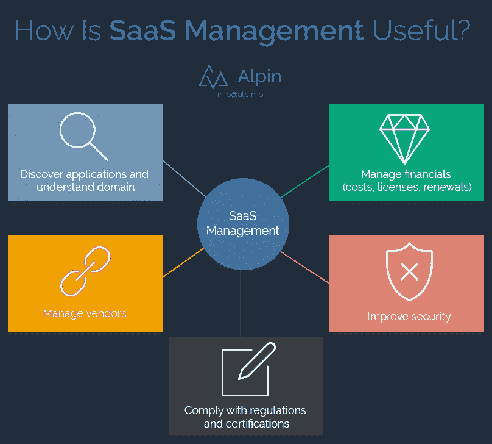
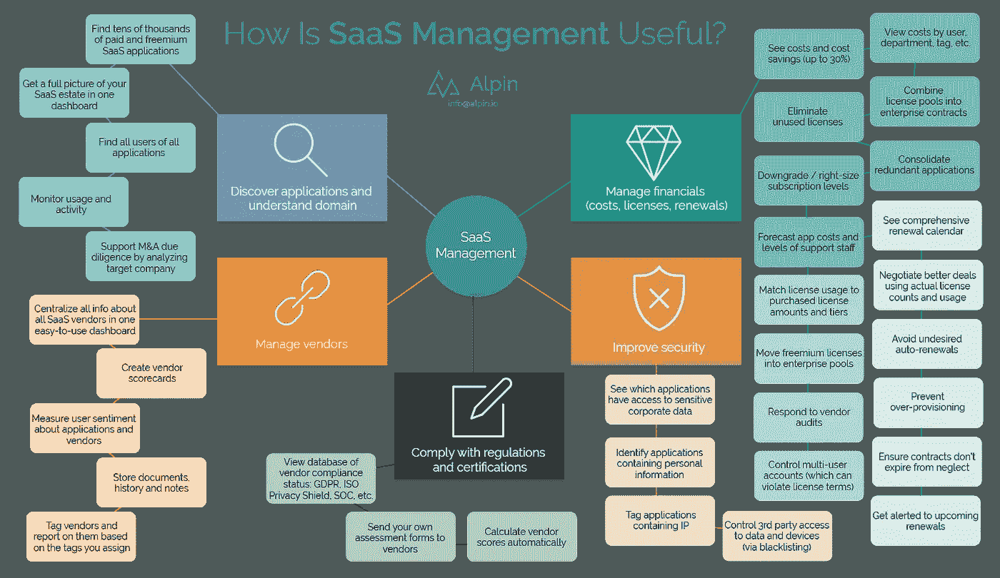

# 如果我开始管理 Saas，我会得到什么？(第 1 部分，共 6 部分)

> 原文：<https://medium.com/swlh/what-do-i-get-if-i-start-managing-saas-62af93714c3d>

*编辑:以下是其他部分的快速链接:*

*2。* [*发现应用，了解领域*](https://alpin.io/blog/saas-shadow-it/)

*3。* [*管理财务(成本、许可证、续订)*](https://alpin.io/blog/saas-financial-optimization/)

*4。* [*提高安全性*](https://alpin.io/blog/saas-improve-security/)

*5。* [*符合法规和认证*](https://alpin.io/blog/saas-compliance-automation/)

6。 [*管理供应商*](https://alpin.io/blog/saas-vendor-management/)

好问题。在 SaS 成本螺旋上升的时代，公司想知道如何控制云软件。

有什么解决办法？

嗯，我们认为 Alpin 至少是解决方案的一部分，而且最有可能的是，它是您所需要的全部。Alpin 所做的被称为很多事情:SaaS 管理。SaaS 优化。山姆找 SaaS。云软件的 ITAM。CASB 建兴。

我们已经尽了最大努力在这里为你列出好处。有很多内容要介绍，所以这是一个多部分系列的第一部分。在这里，我们将快速总结各个方面的优势:

很简单，对吧？那么，为什么我们需要每一个职位呢？这是总结的总结，因为它看起来更像这样:

[*Click here*](https://alpin.io/wp-content/uploads/2018/10/Alpin-benefits-overview-summary-details.png) *to see it in full-size. It’s… a lot. But that’s why we need to do a 6-part series! You’ll find a lot of value in SaaS management.*

我们将在发布时添加该系列每个部分的链接:

1.概述(这篇文章)

2.[发现应用并了解领域](https://alpin.io/blog/saas-shadow-it/)

3.[管理财务(成本、许可证、续订)](https://alpin.io/blog/saas-financial-optimization/)

4.[提高安全性](https://alpin.io/blog/saas-improve-security/)

5.[符合法规和认证](https://alpin.io/blog/saas-compliance-automation/)

6.[管理供应商](https://alpin.io/blog/saas-vendor-management/)

有兴趣探索这个勇敢的 SaaS 管理新世界吗？我们可以做 10 分钟的演示，您将看到 Alpin 如何为您工作。通过发送电子邮件 [info@alpin.io](mailto:info@alpin.io) 开始。

# 你愿意阅读简单的文字而不是图形吗？你很幸运！

# SaaS 管理福利和活动

# 发现应用程序并了解领域

找到数以万计的付费和免费 SaaS 应用

在一个仪表板中全面了解您在 SaaS 的房产

查找所有应用程序的所有用户

监控使用和活动

通过分析目标公司支持 M&A 尽职调查

# 管理财务(成本、许可证、续订)

*削减成本*

查看成本和成本节约(高达 30%)

按用户、部门、标签等查看成本。

消除未使用的许可证

将许可证池整合到企业合同中

降级/调整订阅级别

整合冗余应用

预测应用成本和支持人员水平

对审计做出回应

*许可证合规*

将许可证使用与购买的许可证数量和层级相匹配响应供应商审计

将免费增值许可证转移到企业池中(以确保合规性，并降低“废弃知识产权”的风险)

控制多用户帐户(这可能违反许可条款和公司知识产权准则)

*续约*

查看全面的续订日历

获得即将到来的续订提醒

利用实际许可证数量和使用情况协商更好的交易

避免不必要的自动续订

防止过度供应

确保合同不会因疏忽而到期

# 提高安全性

查看哪些应用程序可以访问敏感的企业数据

标记包含 IP 的应用程序

识别包含个人信息的应用程序

控制第三方对数据和设备的访问(通过黑名单)

发现共享文件和电子邮件中的数据泄露

接收关于违规和漏洞的警报，包括受影响的用户

# 遵守法规和认证

查看供应商与 GDPR、隐私保护、SOC 等的合规状态数据库。

将您自己的评估表发送给供应商

自动计算供应商分数

# 管理供应商

将所有 SaaS 供应商的所有信息集中在一个易于使用的仪表板中

创建供应商记分卡

衡量用户对应用和供应商的看法

存储文档、历史记录和笔记

标记供应商，并根据您指定的标记对其进行报告

有兴趣探索这个勇敢的 SaaS 管理新世界吗？我们可以做 10 分钟的演示，您将看到 Alpin 如何为您工作。通过发送电子邮件 [info@alpin.io](mailto:info@alpin.io) 开始。

## 这篇文章发表在 [The Startup](https://medium.com/swlh) 上，这是 Medium 最大的创业刊物，有+ 376，592 人关注。

## 在这里订阅接收[我们的头条新闻](http://growthsupply.com/the-startup-newsletter/)。

