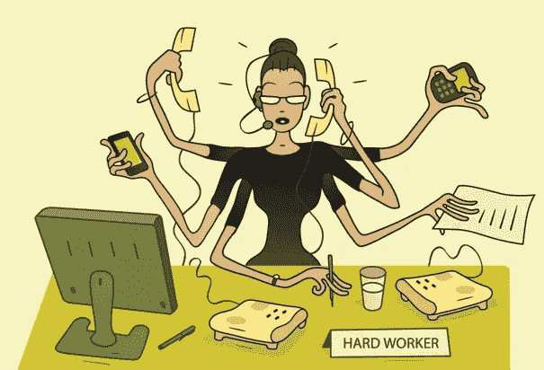
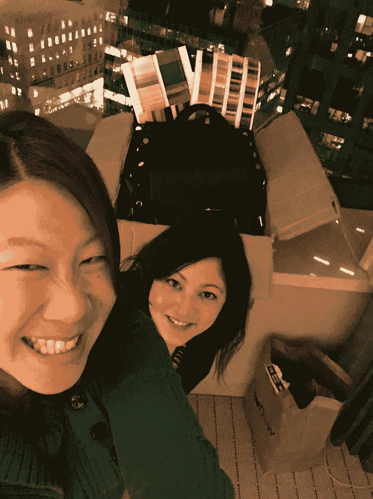

# 你成为企业家后会做什么？

> 原文：<https://medium.com/swlh/what-do-you-do-after-youre-an-entrepreneur-4e912a82cac6>

## 再做一次。

“那么……现在我该怎么办？”这是去年卖掉我的公司 [Bucket](/@JuliaLam/introducing-bucket-beta-e0d267f861a3) 后留给我的问题。在过去的几年里，我把一切都奉献给了公司，致力于用旅行技术解决旅行规划问题。

像其他创业公司一样，我们经历了很多起起落落，很多都发生在同一小时内。创业就像一直被人打脸，你不断站起来，但每次都让你筋疲力尽。

2016 年的开始是艰难的。我们完成了一项收购，但这让我付出了代价。我累了。筋疲力尽。便便了。我想做的只是向某人报告，被那些我不必招募的聪明人包围，并感受到一种稳定感。

你可能会在离开你已经建立的东西后感到有点失落，所以我分享了我的转型之旅——我的方法，我在多个角色和不同公司的曲折探索，以及与我分享的建议——给所有企业家和正在思考下一步的人。希望这能让你的旅程更轻松。

我总是发现，通过与和你处境相同的人聊天，你可以学到很多东西，所以我花了几个月时间追踪前企业家和那些与企业家共事的人，以获得一些建议。

他们是这样说的:

"那你成为企业家后会做什么？"我问我的朋友兼风险投资公司安德森·霍洛维茨基金的合伙人，[康妮·陈](https://www.linkedin.com/in/conniechan/)。“再做一次”她说。

但我累了，连续几年全天候救火。我还没准备好创办另一家公司；我不想。

我是你的模范员工:一个勤奋的员工，一个出色的问题解决者，并且毫无疑问地做你要求的事情。我会成为你有史以来最好的该死的报告！

“你仍然是一个企业家，你只是处于两者之间，”[伊利亚·苏哈尔](https://www.linkedin.com/in/ilyasukhar/)，Matrix Partners 的一个朋友兼合伙人说。但我对此表示怀疑。我可以回到一个结构化的组织，对吗？

“回到你之前做的事情，”我的创业导师兼朋友萨姆·奥迪奥告诉我。对他来说，这就是产品。对我来说，那就是产品营销和市场营销。

我对自己回到一家更成熟的公司所能做出的贡献感到满意——我曾在脸书这样的高增长公司工作过，最初只有 200-2500 人，后来白手起家，从概念、设计、UX、营销、运营、筹资、合作、招聘、领导能力等各个方面都有所建树。

所以我开始寻找机会。我开始在网上寻找职位，然后让朋友给我推荐。

“不要离开创业。“你有，”塞巴斯蒂安·德·哈勒告诉我，他是前 Playfish 首席运营官，现在是 Saildrone 的首席运营官。“但如果你真的想探索，你要找的角色不会在网站上列出来。”

我确实想探索，他说的对。

我在寻找跨越多个类别的高级产品。因此，我开始安排与首席执行官和副总裁的会议，并帮助他们了解我能为公司提供什么价值。

但是这个值到底是多少呢？

这些年来，我什么都做过一点。我是一个很强的多面手，无论我不知道什么，我都非常努力地学习。然而，我并不像一个做了 10 年同样工作的人那样专业。

人们最初把我推向产品，而大多数企业家最终都去了更大的组织。许多大公司将其定位为组织的“迷你 CEO ”,接触公司的各个方面，推动你正在开发的产品的愿景。

但这真的不像是当首席执行官。在更大的公司，这个角色更具战术性，最终你没有最终决定权。你的产品可能会变得很漂亮，或者是一堆糟糕想法的丑陋大杂烩。也许产品副总裁会很棒，但大多数 PM 工作感觉更像项目经理，而不是产品经理。

所以我探索了我的其他技能。我的背景是市场营销，我热爱市场营销。在这一过程中，我还发现自己惊人地擅长合作，找出合适的合作伙伴，帮助他们对我们的共同愿景感到兴奋，并管理好这种关系。

所以我也在那里探险。我找到了一些令我兴奋的产品营销和合作伙伴角色，我经常利用更高的职位进入面试。

在这里，就更困难了。当我与这些公司的首席执行官和副总裁交谈时，他们对让企业家加入 org 有着强烈的热情。一个你可以把他扔进几乎任何情况下，他们都能理解的人。

我越往下走，他们越不了解我能提供的价值。我的简历和他们看到的其他人不一样。我没有“10 年产品营销经验。”相反，我有几年从零开始推出产品的经验和其他技能。

我会收到这样的问题:

*“你能向任何人汇报吗？”*

*“你有过经理吗？”*

*“你能举个例子说明你没有最终决定权的情况，以及你是如何说服人们按照你的方式去做的吗？”*

我的答案是肯定的，肯定的，肯定的！但对他们来说，这比其他任何事情都更令人困惑。

当然，我可以向其他人汇报，但他们必须非常称职——我已经看到太多事情因为管理不善而失败。

我当然有过经理。我在脸书呆了 4 年半，我不是马克·扎克伯格。

当然，我遇到过很多你没有最终决定权的情况。即使作为首席执行官，你也要不断与投资者、团队、合作伙伴等进行谈判。你有控制的错觉，但往往根本无法控制。

可以想象，当我从高层进入正确的组织时，这些对话持续了几个月，大概是这样的:

*高层主管(1-2 个月一次会议)→招聘经理(另外 1-2 个月一次会议)→确定角色(2 周到 1 个月)→招聘人员(2 周- 1 个月一次会议)→第一次筛选(2 周-1 个月一次会议，有时会跳过，因为我已经和招聘经理谈过了)→整个小组(2 周-1 个月一次会议)→录用(2 周-1 个月)*

长话短说，在任何较大的组织中工作都要花好几个月的时间。随着时间的推移，我恢复了精力。如果你曾经见过一个企业家，他们建造是因为他们可以，而且他们非常没有耐心。他们被驱使去学习，去成长，去竭尽全力去解决一个问题。

所以在这中间，我开始修补。我是一个动觉型的学习者，我认为学习任何东西的最好方法就是走进去，把它弄明白。我一直渴望了解更多关于制造实体产品的知识，对于职业女性来说，有些问题我已经搁置了多年，仍然没有找到更好的解决方案。

作为一名职业女性，我觉得我经常不得不在漂亮昂贵但没有任何功能的东西和实用舒适但让我看起来年轻单纯的东西之间做出选择。

所以我开始建立[塔拉&公司](https://www.facebook.com/LoveTaraAndCo/)，为真正的女性重新设计产品。在 6 周内，我招募了一位有着 15 年经验的设计师，并且我们制作了第一个原型。从头再来的肾上腺素是惊人的。

但这一次，我更棒了。我可以在八分之一的时间里做决定，我知道如何区分优先次序，把我的资源放在哪里，以及如何尽可能快地组装和构建。我只受限于一天有多少小时。

最终，我得到了一些让我兴奋的工作机会，但没有一个能与再次建造自己的东西相比。

所以我在这里，再做一次。也许我疯了，也许我只是一个终身创业者。

如果你想了解我们在 Tara&Co 的冒险经历，请点击此处订阅。我们将于 5 月 9 日在 [Indiegogo](https://www.indiegogo.com/#/picks_for_you) 发布我们的第一款产品，这是一款专为忙碌女性设计的时尚敞篷包。

我们还将于 5 月 10 日在旧金山举办发布活动和女性庆典。所以请过来坐坐！

就这样，我留给你们三个想法:

1.  在经历了一次痛苦的经历后，如果可以的话，给自己留点时间。你的能量水平将会恢复，你想要的将会随着时间而进化。
2.  如果你让企业家自行其事太久，他们会创造出一些东西。
3.  拥抱真实的自己。你可能会为了金钱/名誉/稳定/时间/社会压力/朋友/恐惧/爱情而与自我抗争，但最终你会回到同一个地方，只是你可能需要更长的时间才能到达那里。

我已经接受了自己。

那么你成为企业家后会做什么呢？我的回答是，再来一次。

*** ***特别感谢在此过程中抽出时间与我聊天的所有人，包括****】: Adora Cheung、Amitt Mahajan、Andrew“Boz”Bosworth、CeCe Cheng、Christopher Fong、、Connie Chan、Dave Munichiello、Deborah Liu、Eurie Kim、Ilya Sukhar、Ime Archibong、Jeff、Jonathan Ehrlich、Jonathan Heiliger、Jonathan Hsu、Kent Goldman、Mike Vernal、Nate Blecharczyk、Patrick S. Chung、Pete Kooman*

