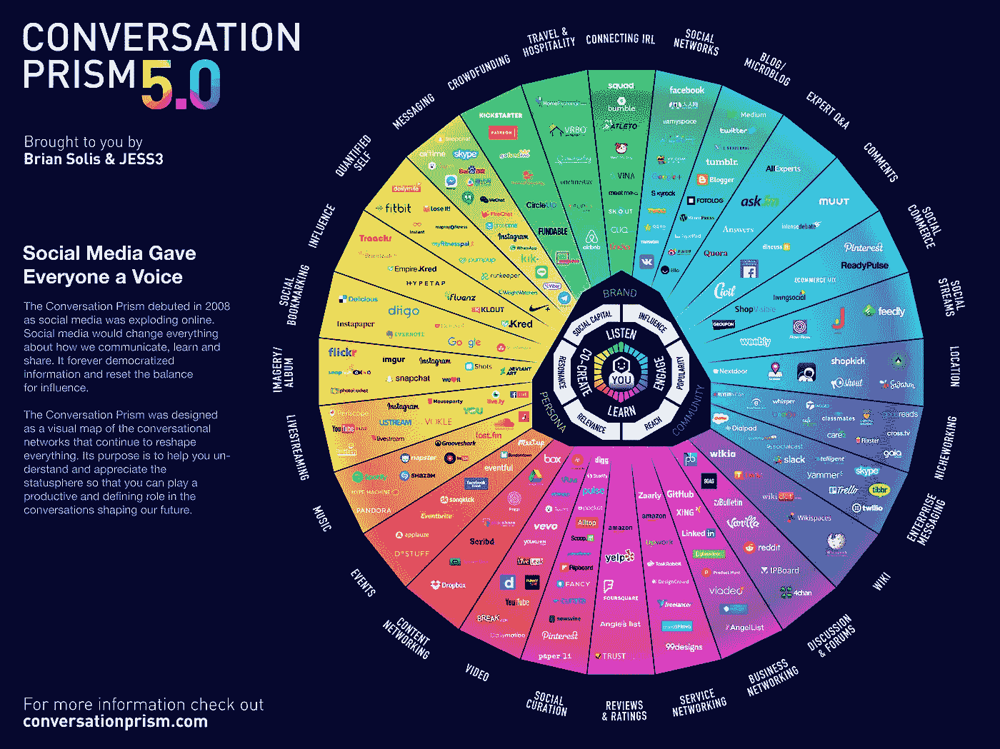

# 在没有社交网络的情况下生活 4 个月，你学到了什么？

> 原文：<https://medium.com/swlh/what-do-you-learn-when-you-live-4-months-without-social-networks-7d0889e6ffa9>

[https://www.afrikaburn.com](https://www.afrikaburn.com)

## 关闭社交媒体:一项激进的生活方式实验

在社交媒体结束时的结果、结论和发现之后，这几周我一直在研究我从四个月的社交媒体断开实验中学到的东西。

当我决定离开社交网络时，刚开始只有一个月。联系了这么多年，这似乎很令人兴奋。为什么退出社交媒体？会失去机会吗？会有什么变化吗？你对这个决定有把握吗？

直到今天，我仍然不确定重返社交网络是否是一次成功的行动。我仍然有许多疑问。脱离社交媒体对我来说是一个巨大的成功。

# 断开与社交媒体的联系:关闭社交媒体——实验

有许多问题，我今天继续阐述。然而，在研究之后，我 100%确信你可以不使用或在社交媒体上生活。这种体验对个人来说是强大的，因为远离心流有助于你愿意接受任何到来的事情。毕竟，我们甚至不需要这个互联世界给我们的一半，并让我们相信它是必不可少的。毕竟，我们不知道我们是谁，我们不知道我们要去哪里，甚至不知道我们要怎么去。那么，我们如何才能知道如何提取噪音的价值，在我们的职业或公司中用作一种推动力呢？

关键是大多数人认为他们做得很好。

假的。

在社交媒体关闭实验和完全脱离社交媒体之后，我正在重新思考一些领域。

*   **沟通**:我看不出为了沟通而沟通有什么意义。事实上，你总是不得不出现，这样就没人会忘记你。我不这么认为。如果你的表现产生了积极的影响，他们就很难记住你。
*   **营销**:最好的方法就是展示我们每天工作的成果。不笨重，不迂腐。当你不再考虑营销，而是专注于吸引你的客户时，奇迹就发生了。你的工作或事业不需要这么多的提升。
*   **消息**:你不必多说。问题不在于吸引，问题只在于展现作品的结果。
*   **内容**:创作内容不是为了取悦，不是为了捕捉，不是为了说服。不满足于打扰、促进、教育或使不舒服。
*   **平台**:同样的平台同样的内容让你甚至我自己都觉得无聊。根据平台的性质分配的资源的新鲜度。
*   **关注者**:如今大多数用户只是阅读推文，几乎不会停留在脸书的帖子上，不会看 Instagram 上的每张照片或视频。当你注意的时候，大多数情况下，并不是你喜欢的人。跟踪那些可能“占用”你时间的人有什么意义？
*   注意力:注意力每天都在减少，我们都变得更有选择性，但是——结合上面的观点——我们仍然不重视事物。我们连接了太多的来源、太多的专业联系人、太多的订阅、页面或影响者。

# 与世隔绝，有社交网络

这是可能的，也不是很难。将自己与整个故事隔离开来的好处是，你可以专注于过自己的生活(而不是别人的)。以高超的技巧发展你的作品。多花点时间在孩子身上。利用资源成长。

这些都不违背人性。你可以不关注任何人，不阅读任何推文，不每小时进入社交网络，没有 WhatsApp，你仍然可以成为一个努力帮助他人的人。

脱离社交媒体并继续使用它们的关键是每周或每两周抽出时间。在这段时间里，你与客户、社区或朋友互动，回答问题，让事情变得更简单。剩下的时间，进入并(专业地)做你完成离开社交网络时不得不做的工作，不要分心或丝毫不要。

根据我自己正在做的事情，我会说些什么:

*   不要读任何推文。
*   不要看任何脸书邮报。
*   跳过 Instagram 时间轴。
*   不要停留在 LinkedIn 的 feed 上。
*   忽略 Snapchat 的搞笑视频。
*   每周登录一次社交网络。
*   由于职业原因，你的工作与数字世界紧密相连。使用一个工作流程 [**就像这个**](https://www.socialmediatoday.com/news/8-tasks-that-define-a-social-media-workflow/460660/) 。
*   只在允许的时间内互动。

社交媒体不是“空闲时间”，而是“失去的时间”你可以考虑脱离社交媒体。

你不适合隐形人。

没有社交网络的社交媒体实验的另一个关键是，它教会你不必在那里，事情不会改变。大多数人都不会想你。然而，决定性的因素来了。一小部分人会想念你。那些是你必须为之工作的人，忽略其他人。

# 与社交媒体的分离教会了我什么？

[https://conversationprism.com](https://conversationprism.com)

断开社交媒体连接时，从社交媒体中获得的六大经验:

# 1.没有人比我自己更好

“对胜利的渴望，对成功的渴望，对发挥你绝对潜力的渴望……这些是开启个人卓越之门的钥匙”——孔子。

当没有人可以比较时，当没有人通过评论给予你认可时。那你就自己动手吧。我已经意识到，除了你的直觉和你生命中最重要的五个人，你不应该听任何人的。

没有社交网络，不知不觉中，你生活在没有认可或重申的状态中，因为没有人会说你说的/做的是好是坏。谁在乎呢。

# 2.寻找更好的我

在社交网络中，每个人都有自己的观点。他们都是各个领域的专家。以这样或那样的方式，你最终会被那些“观点”所感染当你生活在没有社交网络的情况下，你唯一能得到的帮助就是你所寻求的帮助。如果你决定不去寻找它，你将没有资源，也没有噪音来决定你能做什么和不能做什么。你将有机会停止与他人分享，更好地了解自己。

# 3.在沉默中成长

如果你不需要不断地交流你正在做什么，你将要做什么，你已经做了什么，没有人会知道。是的，也许这不是一个很大的好处。除非是因为即使不沟通，也不会停止做。所以，你不会停止成长；只有其余的人不知道。没必要；结果会为你说话(今天或明天)。

阅读书籍、人生经历、实验、商业、项目、教育、成就、失败等。你会学习，你会成长，你会赢，要知道你做这些是为了你自己，而不是为了向世界展示。

# 4.真正的朋友

当你停止与 Facebook Messenger、Whatsapp 或衍生品的联系时，你就会拥有这些。你会开始和人们有更多的个人接触，你会更加珍惜在一起的时光。你会和他们一起做更多的事情，包括家庭。你们会分享更多的经历。

不用说去一个地方的宁静，不用拍餐厅每个角度的十张照片。真的吗？

# 5.你会比以往任何时候都更有存在感

因为你不再生活在“脸书或 Instagram 上 ________ 这一天发生了什么”的国家。你也不会被“在推特上说了什么”或“今天在 YouTube 上的视频会是什么”所困扰。

这些事实意味着你将等待着享受每一天 24 小时中的每一刻。很好的交换，对吧？

# 6.你会和自己建立更健康的关系

拥有零数字承诺将有助于你更接近自己。你会意识到你就是你，如果你想让某件事发生，你必须自己让它发生。同情、同理心和治疗会更健康，因为你不必被压垮才能获得超过 ________ _ 或 _ _ _ _ _ _ _ _。

# 7.我没有失业

不，我没有，即使你 [**像我一样投身于市场营销和数字经济**](https://isragarcia.com/marketer) 。因为如果你必须专业地使用社交网络，那就去吧，去吧，去做吧，产生结果。醒悟不在于专业地使用它们；这是在个人使用它们。如果你对自己诚实，这一点的现实巴掌会很尖。

# 结论社交媒体提供实验

脱离数字世界和社交媒体是丰富多彩的。正是因为当你与一个世界断开时，你与另一个世界连接，这取决于你的生活方式。

我希望我能建议你(以一种不受欢迎的方式)用两到三周的时间来做这种实验，用你的方式 [**关闭**](https://isragarcia.es/social-media-off-experimento) 社交媒体。这将是对这种做法是否奏效的考验。

【*本文首发于*[***【isragarcia.com】***](https://isragarcia.com/social-media-off-experiment)

# *只有当你觉得值得的时候，才让这个故事震撼吧！如果你发现任何有价值的东西，请鼓掌。*

> *Isra Garcia = 55 个客户，44 个企业建议，398 次发言，3.366 篇帖子，24 个项目，6 本书，380 场讲座，6 家公司，16 次冒险，23 次实验，∞失败。到目前为止…*
> 
> *[营销人员](https://isragarcia.com/wp/marketer)。顾问。扬声器。作家。教育家。经理。IG 的负责人。博主。企业家。颠覆性创新。数字化转型。高绩效者和生活方式实验者。*

# *行动号召>>点击[此处](http://feeds.feedburner.com/isragarcia)订阅更多类似的文章！*

**

## *这篇文章发表在 [The Startup](https://medium.com/swlh) 上，这是 Medium 最大的创业刊物，拥有 309，732+读者。*

## *在这里订阅接收[我们的头条新闻](http://growthsupply.com/the-startup-newsletter/)。*

**