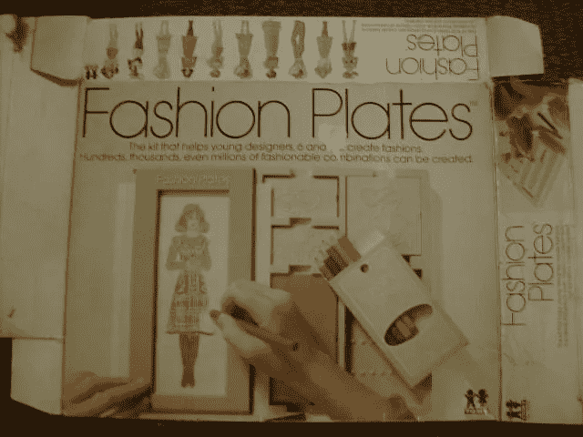
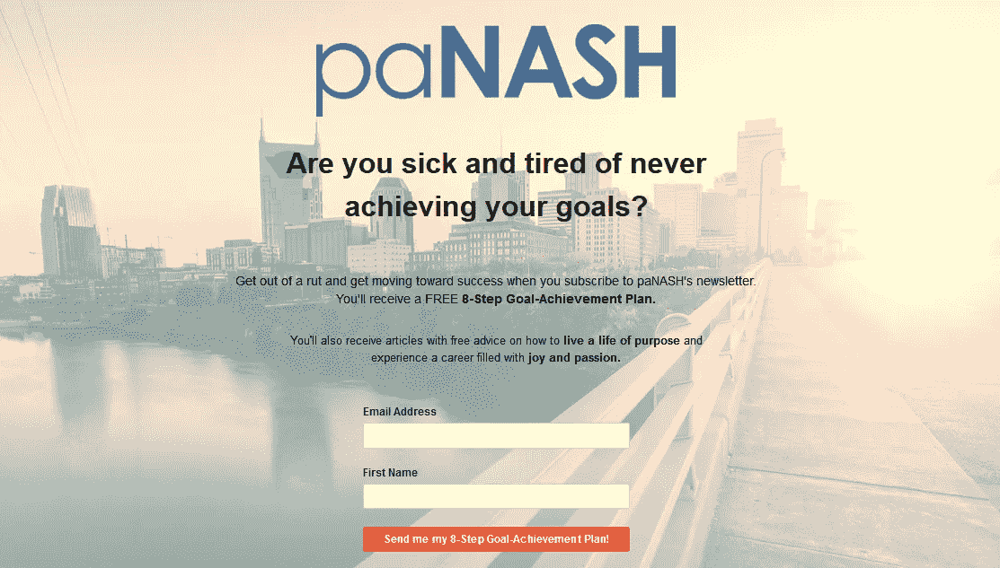

# 你长大后想做什么？

> 原文：<https://medium.com/swlh/what-do-you-want-to-be-when-you-grow-up-c42731fcccfb>

(Image/StockSnap)

这是我们小时候都会遇到的问题。

我自己对这个问题的答案到处都是，而且会经常改变。

在努力回忆我的答案时，我确信我可能在某一天说过以下任何一个:老师、作家、女商人、艺术家等等。

但我清楚地记得唯一一个最确定的是一位时装设计师。那是在有一年圣诞节，我祖母给了我一些时装盘子之后。

我爱我的时尚盘子，享受它们的创意。他们让我想学习如何真正用手勾画服装设计。

## 问问你自己:

> 你长大后想做什么？你还想做什么？

所以当我上高中的时候，我决定花四年时间学习艺术，学习素描。

直到我进入艺术的第一年，在我的艺术老师把我的生活变成地狱之后，我放弃了成为时装设计师(或艺术家)的想法。

她是一个如此刻板的女人，太刻板了以至于不能教任何应该是有创造性的东西。她的教学方法和个性让我再也不想上别的美术课了。

## 问问你自己:

> 在你的生活中，有没有一个人或一段经历如此消极，以至于让你放弃了长大后想要成为的人？这对你有什么影响？

所以接下来我看了看我当时最喜欢的科目……初级西班牙语。我真的很喜欢它，我想一旦我上了大学，我最终会主修外语。

但是接下来是西班牙语二，对我来说真的很难，比我所有成绩都是 A 的西班牙语一难多了。

## 问问你自己:

> 你是否曾经缺乏成为你长大后想成为的人的技能或能力？你是如何转移注意力的？

最后，我发现了心理学…它改变了我的一切。

我发现心理学如此有趣，我对它的理解自然而然就来了。这成了我的激情所在。

## 问问你自己:

> 什么对你来说是自然而然的？你热衷于什么？

但是当我向家人宣布我将学习心理学作为我的大学专业时，他们并不像我一样对此充满热情。

我不断听到，

> “哦，有那样的学位，你怎么赚钱呢？”

我爸爸说我应该主修商业(他的爱好)…因为我会赚更多的钱。

我妈妈说我应该当护士…因为我会赚更多的钱。

甚至我的哥哥也插话说我应该成为一名会计，因为……我会赚更多的钱。

## 问问你自己:

> 有没有人曾经试图阻止你成为你想成为的人？你是如何回应的？

那为什么我不听我家人的话呢？几个原因:

1.  我不能忍受血的位置。我受不了医院的味道。听到人们谈论他们的手术或疾病真的让我毛骨悚然。
2.  我完全厌倦了数学和数字运算。当其他人觉得数字有趣又迷人时，我却不觉得。
3.  当时我对商业不感兴趣。至少还不足以让我在商业课上取得好成绩。
4.  当我学习我感兴趣的东西时，我会取得好成绩。如果我是那个必须上课和做作业的人，这些材料必须让我保持清醒。
5.  对我来说，热爱我所做的事情比赚很多钱更重要。

不要误解我，我理解为什么选择一个报酬丰厚的职业道路比选择一个我爱的职业道路对我父母来说更重要。

他们都出生于 20 世纪 30 年代末，仍然早到足以感受到大萧条的一些长期影响。

他们的父母反复向他们灌输经济安全在另一次萧条中的重要性，所以他们只是做了他们认为对我最好的事情，试图鼓励我进入被认为更有利可图的领域。

我哥哥比我大很多。事实上，他的年龄更接近我爸爸那一代，而不是我这一代。因此，他的心态也是“不管你喜不喜欢，找一份薪水高的工作”(顺便说一句，他在自己安全、稳定的工作中很痛苦)。

## 问问你自己:

> 有什么事情是你热爱的，尽管它可能不会让你赚很多钱？哪个对你更重要？

我坚定了主修心理学(辅修社会学)的决定，所有的心理学课都学得很好，几次上了院长的名单。

直到大三和大四之间的那个夏天，我才知道我想用我的学位做什么。

那年夏天，我在母校担任迎新会的负责人，此前两年我一直在教务长办公室做学生工作者。

我喜欢大学的氛围，喜欢和新生一起工作，并对大学的组织结构有了深刻的理解。

我决定问问我的学生主任，我怎样才能找到像他那样的工作？(这是我第一次进行信息性面试，当时我不知道这叫什么。)

他解释说，我需要一个硕士学位，而且是在我以前不知道的领域。我开始研究高等教育管理和学生人事服务的研究生课程。

## 问问你自己:

> 你是否探索过一条你以前不知道的职业道路？这是什么？你了解到了什么？关于它你还想了解什么？

我发现得越多，就越意识到我的心理学学位是我在研究生院学习的最好基础。

事实上，我在研究生院学到的很多东西只是本科的延伸。

与来自金融和商业等其他专业的研究生不同，我已经熟悉了很多理论和材料。

一旦我决定将高等教育作为职业道路，我仍然必须缩小我想进入的高等教育领域。

我的学位让我准备好面对如此多的可能性。

我可以进入财政援助，住房/住宅生活，希腊生活，招生，定向，职业服务，学术咨询，第一年计划，学生活动，留学，国际学生服务，等等。

## 问问你自己:

> 你是否有时有太多的职业选择或职业兴趣，以至于很难缩小你的选择范围？

根据我最感兴趣的领域，我将选择范围缩小到三个领域:定向项目、大一体验项目和职业服务。

在完成学位的同时，我通过实习、志愿者工作和特殊项目获得了实践经验，从而深入研究了这三个领域。

当我在大学的就业中心做志愿者时，我知道我想帮助学生根据他们自己的兴趣和激情，而不是他们父母的愿望，弄清楚他们“长大后”想做什么。

## 问问你自己:

> 以前的个人经历是否激励你去帮助面临同样经历的人？

获得硕士学位后，我继续在各大学担任大学职业顾问，甚至一度担任职业服务主任。

我也教一些大学水平的课程。

我喜欢我所做的。

我的工作甚至允许我在为我的学生开发与职业相关的项目时发挥我的创造力。

但当我的创造力开始被扼杀时，我决定做一点职业改变，开始自己的形象咨询业务([点击此处](/swlh/how-to-make-the-risk-of-starting-your-own-business-doable-32728221cb61)阅读如何发生的故事)。

 [## 如何让创业的风险变得可行

### 不要放弃你的白日梦(或你的日常工作)

medium.com](/swlh/how-to-make-the-risk-of-starting-your-own-business-doable-32728221cb61) 

## 问问你自己:

> 你是否曾经在职业生涯中感到窒息或精疲力竭，以至于你知道你已经准备好改变了？

我独立做了 8 年的形象顾问，但在那段时间里，我还继续兼职做职业教练。

形象咨询满足了我童年对时尚的兴趣，因为它包括一些服装设计工作。

当我发布我的第一本书时，我甚至成为了一名作家，这是一本关于形象和风格的亚马逊畅销书。

然后，在做了 8 年的形象咨询后，我准备好了另一个职业转变，但也有点回归本源。

我成为了一名独立的职业教练，专注于帮助人们发现和追求他们的激情。

## 问问你自己:

> 你曾经渴望回到你曾经做过的事情吗？

这是一个有趣的故事，我是如何将我的形象咨询业务重新转移到职业教练上的([点击这里](/thrive-global/i-spent-a-year-of-my-life-in-limbo-6276af7a2357)阅读这个故事)。

 [## 我在监狱中度过了一年

### 我是如何从时尚达人变成“激情女郎”的

medium.com](/thrive-global/i-spent-a-year-of-my-life-in-limbo-6276af7a2357) 

我知道我想回去做职业教练，但我对自己有两个要求:

1.  我仍然想为自己工作，所以我避免申请大学就业中心的工作。相反，我重新构建了我的企业使命。
2.  我想和那些经历职业生涯中期转变的人一起工作，专注于帮助他们追求自己的激情和他们长大后曾经想要成为的人。

我的背景和个人经历很好地帮助我实现了这两个目标。

## 问问你自己:

> 你的职业目标是什么？你工作中的“必备”物品是什么？你的背景对你实现目标有什么帮助？

与大多数其他职业教练不同，我不是在另一个行业工作过之后才决定成为职业教练的。职业指导是我整个职业生涯的一部分。

它是由童年的兴趣、天生的天赋和才能以及热情的结合而演变而来的。

一路上经历了一些激动人心的曲折。

我很感激有不止一种方式来追求我的激情。

我也很感激我目前的状况让我能够把我的其他爱好结合起来，比如写作和站起来划桨，还有我作为职业教练的工作。

 [## 结合你的激情来创造机会

theascent.pub](https://theascent.pub/how-to-make-money-stay-in-shape-and-be-creative-28cda20b11d3) 

我喜欢帮助别人找到独特的和创造性的方式来追求和结合他们所有的激情，帮助他们成为他们长大后一直想成为的人。

## 问问你自己:

> 有哪些方法可以让你追求自己的激情？你如何结合你的激情？你接下来会采取什么步骤来这样做？

订阅我的时事通讯，会收到一份免费的 [**8 步目标实现计划**](https://mailchi.mp/6ab6a5e2cf01/achieve-your-goals) ，帮助你开始采取下一步行动，成为你长大后(再次)想成为的人！

Lori Bumgarner 是 paNASH 的老板，这是一家激情和职业指导服务公司，帮助人们摆脱困境，追求自己的激情，找到自己喜欢的工作。欲了解更多信息，请访问[*www.yourpassioninlife.com*](http://www.yourpassioninlife.com)*。*

## 这篇文章发表在 [The Startup](https://medium.com/swlh) 上，这是 Medium 最大的创业刊物，有 326，962+人关注。

## 在这里订阅接收[我们的头条新闻](http://growthsupply.com/the-startup-newsletter/)。

