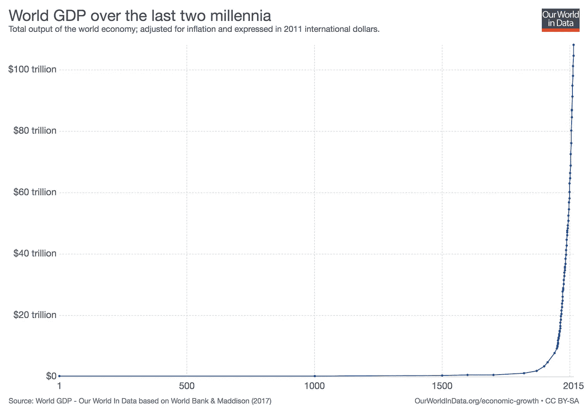
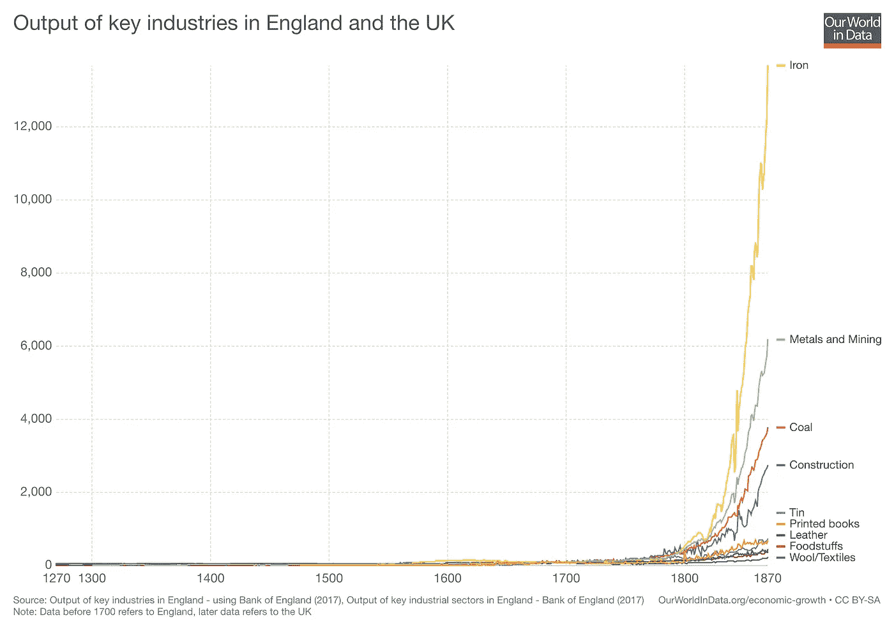
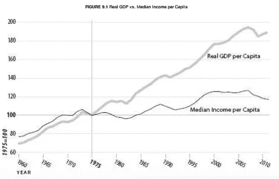
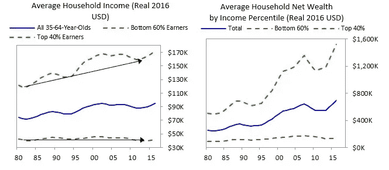
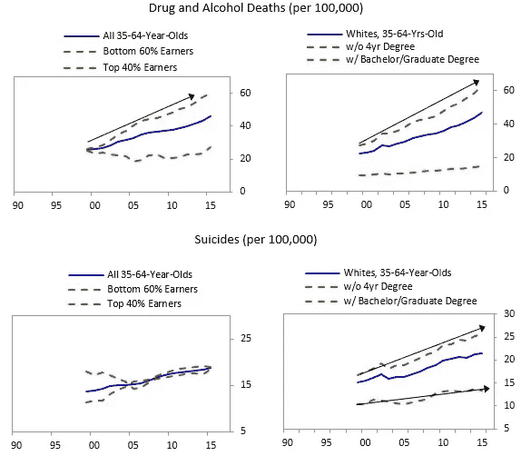

# 没有工作的未来会是什么样子？

> 原文：<https://medium.com/swlh/what-does-a-future-with-no-jobs-look-like-71bda1004a71>

1931 年，在大萧条最严重的时候，英国经济学家约翰·梅纳德·凯恩斯发表了一篇名为《我们孙辈的经济可能性》的文章。

凯恩斯得出结论，大萧条只是暂时的，并预测到 2030 年，人们每周工作时间将不会超过 15 小时，其余时间将用于休闲和文化。

凯恩斯关于经济增长正在复苏的观点是正确的，但我们大多数人每周工作时间远远超过 15 小时。我们仍然生活在一个变化过快的时代。技术创新从根本上改变了我们的工作方式，但我们真的正在走向一个人类可以自由追求文化和休闲，同时享受富足时代的社会吗？

# 我们生活在一个前所未有的变革和进步的时代

对于大多数人类来说，我们已经取得了不起眼的进步，但在过去的 80 年里，正如这张图表所示，进步呈爆炸式增长。

正如尤瓦尔·诺亚·哈拉里(Yuval Noah Harari)在《T2 智人》(Sapiens 中所写的那样，人类进步可以用五次重大革命来标志，其中最具变革性的革命发生在 50 年前。首先是认知革命；大约 7 万年前，我们发明了语言，开始保存知识。然后是农业革命；大约 11，000 年前，在我们学会如何利用自然的力量耕种而不是寻找食物后，我们从游牧部落转变为城镇居民。大约 500 年前，科学革命将欧洲带入了帝国主义和快速扩张的时代。这反过来启动了大约 250 年前的工业革命和大约 50 年前的信息革命。

每次人类历史向前跳跃，我们都通过发明更好的方法取代了无数的工作:农民取代了猎人，蒸汽机取代了人类工人。在每一点上，这些发明都伴随着快速的经济增长，使人类的生活总体上变得更好。

即使我们已经明显擅长于用机器代替我们自己，我们仍然为自己是地球上最好的思想家和决策者而自豪。因为虽然机器可以帮助农民增加作物产量，但播种什么和何时收获的最终决定权仍在农民手中。

我们相信我们是地球上最好的思想家和最快的学习者。但现在已经不是了。

2016 年，AlphaGo 创造了历史，成为第一个毫无障碍地击败职业选手李·塞多尔获得冠军的计算机程序。这样的开局给人留下如此深刻的印象，其中一个原因是 Go 被认为比其他基于策略的棋类游戏难度要大得多，和国际象棋的 20 步开局相比，它有超过 250 步可能的开局。

机器正在快速复制(并改进)我们以前独特的能力，即快速学习并根据环境变化做出决策。最终，机器将取代大多数类型的工作——包括工人必须基于有限的信息做出决策的角色，而不仅仅是常规的、可预测的人类劳动。

**人类很难预测技术变革**

如果有人发明了一台时间机器，把一个普通人从 16 世纪运送到 18 世纪，她就不难理解这个世界了。如果一个人从 18 世纪被带到 20 世纪，情况就不一样了——技术变化如此之快，以至于她可能会认为自己被带到了一个不同的世界！

The changes in outputs of key industries created a drastically different world

关键行业产出的变化创造了一个截然不同的世界。

同样，如果你问一位 20 世纪 70 年代的工厂工人，他是否相信机器最终会让他失业，他会发现这个问题很难理解，更不用说答案了。这就是为什么我们必须不断质疑我们对技术进步速度的理解，并承认我们中的绝大多数人没有能力去理解这一切。

据估计，在未来 20 年内，全球多达一半的劳动力将实现自动化。劳动力市场的这种大规模颠覆有两种潜在结果:

**(1)大规模失业和社会不稳定的时代，或者说**

**(2)一个富足的时代，在这个时代，我们可以自由地追求创造性工作**

**场景 1:社会动荡时代**

1990 年，美国中等家庭经通胀调整后的实际收入达到 54，932 美元，但随后开始下降。埃里克·布林约尔夫森和安德鲁 McAfee 合著的《第二个机器时代》一书指出，到 2011 年，尽管美国 GDP 总量创下历史新高，但仍下降了近 10%。

Source: The Second Machine Age

相比之下，这一时期的生产率平均每年增长 1.56%，而这一增长的大部分直接转化为可资比较的平均收入增长。Brynjolffson 和 McAfee 认为，中位收入缩水是因为贫富差距扩大。

Source: The Second Machine Age

Bridgewater Associates 的创始人雷伊·达里奥也得出了同样的结论。2016 年 10 月，Dalio [通过将美国经济分为两个队列](https://www.linkedin.com/pulse/our-biggest-economic-social-political-issue-two-economies-ray-dalio/)来评估美国经济，即顶层 40%和底层 60%。

他发现，收入最高的 40%家庭的平均收入是收入最低的 60%家庭的四倍。尽管底层 60%的人最近收入有所增长，但实际收入自 1980 年以来一直持平或略有下降(在同一时期，顶层 40%的人收入有所增加)。现在，收入最高的 40%的人平均拥有的财富是收入最低的 60%的人的 10 倍。

Brynjolfsson 和 McAfee 认为，收入不平等的主要驱动力是被自动化完全或部分取代的工作的工资快速下降的压力。

例如，如果一小时的人类劳动可以用一美元的机器来完成，那么在自由市场体系下，以利润为中心的雇主不会提供超过一美元的工资。那个工人将不得不接受更低的工资，并可能被完全解雇。

因为数字技术可以以低成本复制创新想法，所以找到利用它们的方法的人将获得比可能获得的更多的收益 Brynjolfsson 和 McAfee 称之为“赢家通吃”的市场。例如，相对少数的设计师和工程师可以创建事实检查软件。一旦软件工作，它就可以以几乎零成本交付给数百万用户。如果这种软件被广泛采用，成千上万的事实审查员将会失业，而一小部分人则攫取了他们的软件创造的财富。

赢家通吃市场的第二个重要特征是，创造颠覆性技术的个人不仅仅获得相对优势——他们赢得了整个市场。在传统市场中，90%好的人会赚 90%的钱。但是在今天的市场上，当你可以使用最好的软件时，没有理由使用第二好的事实核查软件。

在这种类型的经济中，创新者获得了不成比例的财富，同时减少了对以前重要类型劳动力的需求。

如果我们不能实施先发制人的措施，这种贫富差距可能会加剧。在技术导致大规模失业的夸张场景中，消费者花在产品和服务上的钱会减少。企业将不得不通过降价来追逐日益萎缩的顾客群，这将使整个经济陷入通缩螺旋。

**场景二:一个富足的时代**

由技术进步导致的经济不平等没有显示出任何放缓的迹象，这种差距的影响不仅仅是净值的差异。Dalio 研究的另一个数据点表明，随着财富差距的扩大，底层 60%人群的过早死亡也会增加。我们已经从与药物和酒精使用相关的死亡增加(自 2000 年以来增加了 100%)和自杀增加(自 2000 年以来增加了 50%)中看到了这一趋势。

除非采取行动减少这种不平等，否则这种不平等很可能只会继续迅速恶化。这不会是一条容易的道路——潜在的解决方案需要社会政策的重大变革，而这只能通过政治进程来实现，并且需要我们如何分配财富的巨大转变。

如果旨在解决这一问题的政策取得成功，技术进步有可能创造一个富足的时代，在这个时代，我们可以找到可行的解决方案来减轻财富整合导致的收入差距扩大的影响。

为人们提供基本保障的一个可能的解决方案是普遍基本收入。一个使用这种体系的国家将向公民支付基本工资，这取决于他们对经济的参与程度。鉴于人们参与经济，通过向他们提供一个安全网，人们被激励从事生产，并被给予参与市场的手段。

一些 UBI 的支持者认为，一旦 UBI 建立起来，我们将能够取消所有的社会福利项目，因为这些项目只是给人们钱的替代方式。一个收入系统消除了并行运行多个程序的需要，降低了成本和复杂性。

另一个潜在的解决方案是负所得税。根据目前的税法，我们实行正所得税，在收入达到某一临界值后，对家庭进行累进征税。在负所得税制度下，收入低于起征点的人，其收入与起征点之间的差额为负应税收入。将起征点视为累进税级的一面镜子——一个人在达到起征点之前的总收入越高，他们的应税收入就越少，从政府那里获得的收入也就越少。

这一制度在激励人们工作的同时提供了最低收入。Brynjolfsson 和 McAfee 的研究表明，如果使用负所得税，人们仍然保持生产力。例如，如果年收入的分界点是 3000 美元，那么没有收入的人可能会收到大约 1500 美元的负所得税，一年的总收入为 1500 美元，但收入为 2000 美元的人可能会收到 500 美元，最终总收入仍会更高。这种制度激励人们去找工作，即使这份工作的收入很低，因为他们仍然可以从他们赚的每一美元中得到提升。

普遍基本所得税或负所得税可以:

*   允许人们从事传统上在资本主义经济中报酬不高的工作，如社区建设和社会工作
*   通过让人们在追求有价值的工作时承担更大的风险，创造一个更进步的创业环境
*   帮助重新安排社会期望。目前，我们将就业视为一种选择——但 UBI 和 NIT 将失业视为市场失灵，而非个人失灵。随着越来越多的人面临被自动化淘汰出工作岗位，重新构建我们对工作的看法对于维持社会稳定至关重要。
*   除了 UBI，另一个选择是诺贝尔奖得主、保守派经济学家米尔顿弗里德曼(Milton Friedman)所说的负所得税。根据目前的税法，我们实行正所得税，即在某个起征点以上，对一个家庭实行累进所得税制。在负所得税制度下，收入低于起征点的人将从政府获得一定比例的差额。

# 没有工作的未来不等于没有工作的未来。

要让这两种体系发挥作用，我们仍必须关注生产率，即经济增长的驱动力。将货币仅仅用于消费作为基本收入，而不是用于提高生产，这将降低货币的价值，使经济停滞不前。

无条件拨款会导致需求拉动型通货膨胀的发生，因为一个经济体对商品和服务的总需求会比其生产增长更快。

因此，有效税收计划的关键是:

1.  一个足够低的截止点或补助金额，人们仍然会争取更多
2.  仅发放给合格消费者的授权

像[区块链](https://en.wikipedia.org/wiki/Blockchain)这样的技术创造了一个前所未有的机会来测试资源分配的分散决策。使用分布式分类账系统来确保资金仅分配给完成生产性工作的人，这是由人工智能引擎监控的一组不断变化的条件或优先级确定的。

虽然我们离开发通用人工智能还很远，但我们手头的计算工具已经在帮助我们对激励不同人的因素做出决定。例如，耶鲁大学政治学教授艾坦·赫什(Eitan Hersh)是《黑客攻击选民:竞选如何感知选民》一书的作者，他研究了竞选如何使用大数据和机器学习来动员选民。为分析选民行为而开发的算法可能是开发更复杂模型的先驱，这些模型可以预测如何最好地鼓励参与经济。

归根结底，是否采用有助于解决日益加剧的不平等的税收制度，与其说是一个经济问题，不如说是一个政治问题。很难向一个建立在自由市场和财政保守主义理念基础上的国家提出“免费货币”的概念。任何解决方案都必须融合新的和现有的政策，并将支出分配给能够帮助工人更好地适应后就业经济的培训项目，而不仅仅是为消费提供普遍支付。

事实仍然是，没有人知道所有的答案，在政治舞台上找到解决方案将是一场艰苦的战斗。

这篇文章中所提倡的政策并不容易实施，即使它们被成功采纳，通货膨胀的上升和工资的下降也不会立即得到抑制。

# 前进的道路

随着技术的不断进步，更多的传统工作将受到自动化的威胁。任何解决方案都将涉及政府干预，以监管首先造成不平等的自由市场条件。

的一个潜在结果是呼吁对技术进行监管或限制，以减少受威胁的工作岗位。这将是一个可能发生的巨大错误，因为技术进步是我们今天比仅仅十年前过得更好的原因。[人类进步的团队所做的研究表明，光的成本已经下降了 50 万倍](http://humanprogress.org/blog/how-the-cost-of-light-has-fallen-by-a-factor-of-500-000)，以前购买 54 分钟光的劳动力现在可以购买 52 年的光。

然而，认为美国政府同意税收改革者每月发放支票来支持工人阶级的想法是一个巨大的信仰飞跃。

我的希望是，我们必须积极利用技术来帮助改善我们的生活，如果没有，就通过小幅度的修正来改变我们利用技术的方式，而不是通过监管来阻止进步，或者基于自由资本市场的先入为主的概念来拒绝 UBI 和负所得税。

目前正在评估的政策包括:

*   支持部门培训、学徒和边学边赚项目。
*   实施全民学前教育，补贴随着收入的增加而逐步取消。
*   提高最低工资并将其与通货膨胀指数化，同时提高加班工资门槛。

很可能没有一个单一的解决方案是完美的，我们必须讨论和探索多种政策，以创造一个更美好的未来。虽然还有很多工作要做，但我对未来充满希望和乐观。

*最初发表于*[*【blog.hubspot.com】*](https://blog.hubspot.com/marketing/what-does-a-future-with-no-jobs-look-like)*。*

有兴趣亲眼看看人工智能如何帮助你更好地完成工作，而不是取代它吗？

查看 HubSpot 的[聊天机器人构建器](https://www.hubspot.com/products/crm/chatbot-builder?hubs_campaign=freemiumacquisition-botbuilder&hubs_content=https://medium.com/swlh/what-does-a-future-with-no-jobs-look-like-71bda1004a71)工具，它允许你用可视化界面构建复杂的逻辑。