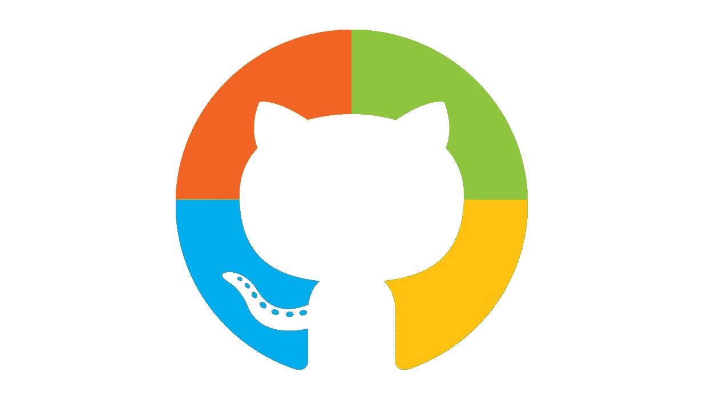

# 让我们来解开微软收购 GitHub 的谜团

> 原文：<https://medium.com/swlh/what-does-microsofts-acquisition-of-github-means-5197001ffaea>

如果你参与开源开发，你可能听说过微软最近收购了 GitHub。然而，如果你没有，这里有一个快速回顾发生了什么。

# 背景故事

先从 2014 年说起。今年 2 月，微软宣布新任首席执行官将是塞特亚·纳德拉，一位专注于云的开发人员，他将带领公司走向一个全新的方向。

随着时间的推移，微软对其软件开发过程变得更加开放和透明。2016 年，纳德拉甚至宣称“微软热爱 Linux”，并成为 Linux 基金会的白金会员。

微软战略的这一彻底转变——一个曾经拒绝接受开源软件并严厉批评 Linux 的公司——解释了为什么最近这个雷德蒙德巨人收购 GitHub 的消息相对来说没有引起多少惊讶。

现在，让我们试着去理解这对不同的关注群体意味着什么。

# 开源社区

作为一名开源开发者，我很有信心这次收购将对开源社区产生积极的影响。

首先，微软在过去几年中已经接受了开源，甚至已经成为 GitHub 上最活跃的贡献者(有近 200 万次提交)。所以他们可能会密切关注活跃在 GitHub 上的开发者的关注点和要求。

此外，这可能意味着 GitHub 和微软服务之间的更多集成。

What would have once been a joke is now a reality

在 GitHub Marketplace 中发布的[应用中心](https://blogs.msdn.microsoft.com/vsappcenter/microsoft-build-2018-github-integration-faster-devops-and-new-distribution-features/)是这两家公司实现 GitHub 在微软生态系统中进一步整合的一个明显例子。这是一个插件，允许开发人员在不离开 GitHub 的情况下将他们软件的新版本推送到各种应用商店。

# Windows 开发人员

对于为 Windows 平台开发的人来说，收购不会有太大的改变。微软在 GitHub 上已经有了许多范例库，它的开发者在回应问题时非常积极。

也就是说，我希望看到在 GitHub 上发布应用程序源代码的更多激励，以及与 Visual Studio 的更多集成——我说的是经典版本，而不是代码，它与 GitHub 配合得非常好。

# 重叠产品

微软和 GitHub 业务的重叠比你想象的要多。事实上，微软为 GitHub 提供的几乎所有服务提供了替代方案。

比如 Visual Studio Team Services 和 GitHub 本身就是在版本控制市场上竞争。Visual Studio 代码和 Atom 是相互对立的。微软最近对渐进式网络应用的推动可能与电子公司的愿景相冲突。我们来逐一分析这些案例。

## VSTS 和 GitHub

Visual Studio Team Services 的诞生是为了解决 Git 给大型企业带来的最大问题:等待大型存储库的漫长时间。出于这个原因，我希望这两种服务能够保持活力，直到有一天它们能够完全集成，最终成为一个产品。不过，我预计这一天在未来还会遥遥无期。

Microsoft started developing internally VSTS because of Git’s eternal waiting time for the primary Windows repository. Source: [Windows development session at Build 2018](https://www.youtube.com/watch?v=vJKV3DJ_-Xg)

## Visual Studio 代码和 Atom

自 2015 年首次公开发布以来，VS Code 走过了漫长的道路。对于许多开发人员来说，它已经在他们的工作流程中完全取代了 Atom。

此外，Atom 还有各种缺点(例如，当被太多插件拖累时，它会变得非常慢)。此外，VS 代码开发人员现在可以访问大量的扩展(以前是 Atom 最大的优势之一)。所以我会说 GitHub 的解决方案将会被抛弃。

## 窗户和电子上的 PWA

随着 Windows 10 的最新功能更新，微软引入了渐进式网络应用支持。许多人认为这是试图取代 GitHub 的 Electron，这是一个框架，允许用 web 技术开发的应用程序在桌面上运行，就像它们是原生应用程序一样。

尽管这两种解决方案看起来相似，但我认为它们针对的是两个截然不同的市场。

我的意思是，对于那些用 JavaScript 编写应用程序，但希望它们只作为原生程序运行的人来说，Electron 仍然很有用(例如，如果他们需要一些浏览器还不能访问的原生功能)。

# 包扎

仅仅在 5 年前，微软和 GitHub 之间的这笔交易是不可思议的。但是现在纳德拉的微软和老公司已经大不一样了。它对 GitHub 的收购可能是开源多年来最大的新闻。