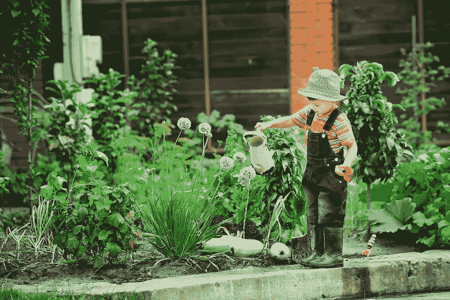
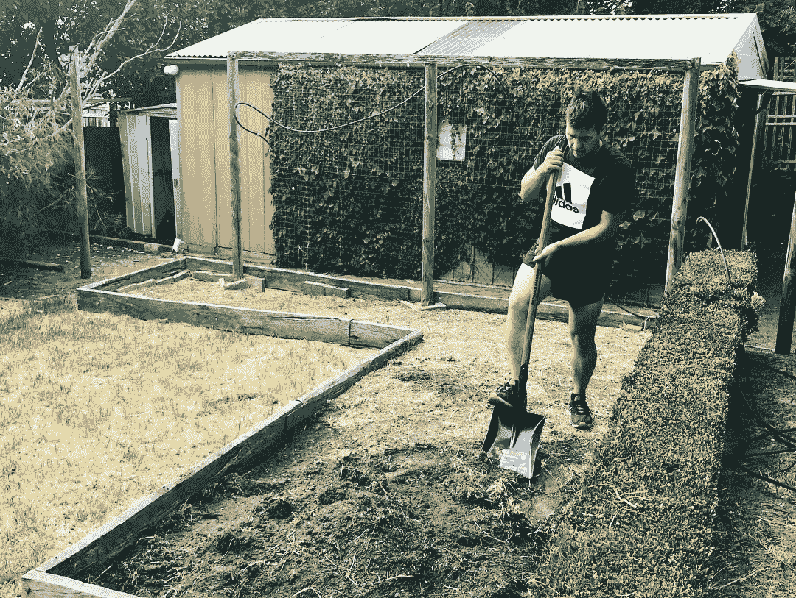
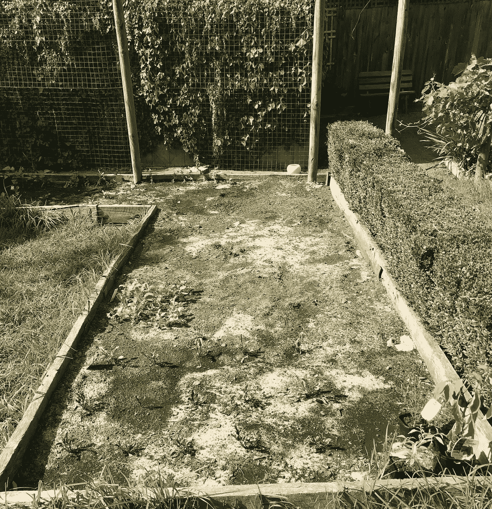

# 每个企业家能从种植菜园中学到什么。

> 原文：<https://medium.com/swlh/what-every-entrepreneur-can-learn-from-growing-a-vegetable-garden-ad11282dc4ce>

> "播下种子，它就会生长。"

我最近了解到，这句古老的格言在蔬菜种植和商业中同样存在缺陷。

作为一个第一次种花的人，有了时间、金钱和发现了种植花园的空间，我已经说服自己，对我来说会有所不同(第一次创造者的幻觉)。

看到我周围的人炫耀他们的劳动成果，分享他们慷慨而轻率地将无尽的农产品送给朋友和家人的故事，我受到了启发——多么美好的生活啊！

## 我想加入。我们明天开始。

逛完五金店后，我有了第一把铲子。

我们不知道我们要种什么，但这没关系，我们在种花，走上了富裕生活的道路。

几分钟后，我们发现了第一个障碍。土壤太差了。整个停车场没有一个活着的生物，没有虫子，没有蚂蚁，没有令人毛骨悚然的爬虫。连根草都算不上！

我们最初看不到这里有任何东西生长，以为我们会胜出。我们说服自己，如果这里寸草不生，那就是我们拥有这片空间并占据主导地位的绝佳机会。

显而易见的是，缺乏竞争并不是未知领域的标志，而是对那些以前见过的人来说缺乏吸引力。这与商业有着深远的相似之处。

然而，我们的任务才进行了几分钟，我们就决心完成这项工作——无论代价如何——所以我们决定简单地更换土壤。

不久后，我们带着九袋各种各样的肥料、土壤增强剂、堆肥和商店卖给我们的任何东西回来了。

这不足以清除这些可怕的土壤，但我们会把它们混合在一起，用肉眼观察，你会发现没有什么不同。

它肯定会粘在一起。毕竟，至少有一半的土壤是“顶级的”,所以这肯定足以建造一个世界级的地基。

然而，任何开发人员都知道，试图集成到糟糕的基础中很少像听起来那么简单。将它们捣碎后，我们开始测试，用水淹没该区域，很快发现某些部分无法吸收水分，而其他部分只是看到贫瘠的土壤上升到顶部。

这不是我们计划的，但我们不能回头。

我们自豪地向朋友和家人宣布，我们将在周末种植一个菜园，这一简单的承诺意味着我们必须不惜代价向前推进。

# 随着我们危险的基础的建立，现在是激动人心的时刻了——我们将把什么产品带到这个世界上？

我有远大的梦想。我想要西红柿。每个人都喜欢西红柿。如果我们有西红柿，我们就会成为街上的苏丹。

然而，当我到达邦宁斯的时候，我被礼貌地告知，现在不是种植西红柿的时候，也不是合适的环境。那么玉米呢？类似的故事。

沮丧的我开始质疑这个人是否知道他们在谈论什么。也许他们只是不喜欢西红柿，或者没有足够的勇气离开规则书去尝试新的东西——毕竟，我是一个创新者，一个颠覆者。

当然，只要我种下它，它就会知道如何生长。我愿意花任何钱来确保这一点，而且我们有了很好的新土壤。表面上看起来很神奇。

幸运的是，我最终被说服放弃了这个建议，选择了一个更“安全”的选项，更适合当前的季节、我们的环境和我们的专业水平——大量的阳光、最少的护理、最少的知识需求。完美！

这将是一个人们在未来几十年都会谈论的丰收。

那是三周前的事了…这是今天。

**这是首次创业者的经典故事。**

我现在意识到，当我宣布我将建造世界上最大的菜园，我的策略是简单地播种，准备一夜成名时，人们为什么会礼貌地微笑(听起来很熟悉吧？).

面对被阳光淹没的雪豌豆、没有生命的生菜和有咬痕的西兰花，我经常看着我的花园，想知道它们为什么没有长得更快——不知道我应该寻找什么迹象，我只关注一个简单的指标——快速增长——但它缺乏。

但我愿意为此付钱，我告诉人们。谁能帮我？谁有魔药，蛇油？

我的女朋友一直告诉我这很正常，“这是天性”，她说。

**但是谁有时间进行有机增长呢？**

我们已经在这方面投入了太多的资金，不能让它就这么结束，尽管我可以从一开始就看到我们错在哪里，但我当然不愿意重新开始，必须有一个更简单的方法。

我需要虚荣心指标，我不在乎表面之下发生了什么，我只想看到我美丽的植物沐浴在阳光下，让其他人也看到这一点——我真的不在乎他们如何实现这一点，只是让它发生。

这是缺乏耐心的创始人的谬论，因为任何伟大的创造者都知道，成功的道路是建立在规划和战略上的，只有在这些坚实的基础上才能实现增长和规模。

虽然我们经常只听到人们在收获成熟后谈论成功，正因为如此，这种幻觉才会延续下去，人们只会在享受荣耀时寻求他人的倾听，而不是在陷入泥沼时伸出援手。

这就是我今天的处境。

当我反思这段短暂的旅程时，我发现这与商业世界有着深刻的相似之处。当我反思我最初的理由和动机时，很明显为什么它们是如此的有缺陷，我确信其他人可以从我的错误中吸取教训。

我所学到的是，最好的园丁建造一个花园不仅仅是为了从它的产品中获利，他们这样做是为了不断地从这个过程中学习，这样随着时间的推移他们会变得更好。

他们种植一个花园并不希望永远不再这样做。他们这样做，主要是为了继续这样做，并使之成为一种生活方式，与商业的相似之处是如此明显。

Simon Sinek 经常分享真正理解你的“为什么”和反思我创造这个花园的动机的重要性。当我不能简单地享受我在不到三周前种植的财富时，我为什么变得如此沮丧是如此明显。

这是一个关键的问题，不仅要问你自己，还要问你的创始人，因为这是一个常见的问题，为什么当挑战出现时，商业伙伴会变得如此沮丧，他们发现自己的创业动机、梦想和抱负远不如他们曾经意识到的那样一致。

**因此，我现在面临一个选择。**

我是应该踏上一段谦卑的学习之旅，从前人那里发现种植菜园的代价，还是应该继续尝试挑战自然，寻找捷径和快速解决方案，直到这些万福玛利亚方案不起作用时，才像我被警告的那样，把手举到空中？

这个决定的核心将是我的“为什么”。内心深处，“为什么开始这段旅程对我来说如此重要，是什么让我如此渴望通过这样做来实现，为了确保这一切发生，我愿意放弃什么？”

在你开始一项新业务之前，我建议问问你自己和你的合伙人这些问题。

这将需要一些自我反省，你会钻研得比你感觉舒服的更深，但这是至关重要的，会让你省去很多困难，而不是等到为时已晚才进行这些对话。

我希望你的冒险一切顺利，并希望你喜欢这个故事。谁会想到我会从简单地着手创建一个简陋的菜园的挑战中学到所有这些经验。

但我怎么推荐都不为过，因为它会带你回到创造的基础，据我所知，在花园和在商业中一样，成功的关键在于规划，在于策略，在于明确你的“为什么”以及与能帮助你实现这一使命的人联系。

因此，我希望你能与我联系，如果你有任何园艺技巧，请分享，我现在洗耳恭听。

## 这个故事发表在 [The Startup](https://medium.com/swlh) 上，这是 Medium 最大的企业家出版物，拥有 299，352+人。

## 订阅接收[我们的头条](http://growthsupply.com/the-startup-newsletter/)。

