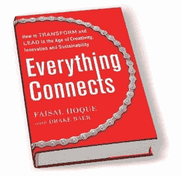

# 每个企业家在进行任何外部投资之前都应该知道的事情

> 原文：<https://medium.com/swlh/what-every-entrepreneur-should-know-before-taking-any-outside-investment-b6c2b384e2b1>

寻求外部投资的残酷事实。

W 无论你是想通过自举建立一个精干的创业公司，还是想从风投或机构资金中获得数百万美元的丰厚的创业公司，你都需要一定程度的资金。

尽管关于你为什么应该和不应该为你的企业筹集资金有许多争论——那是一个不同时间的话题——不管走什么路，每个企业家都应该在接受任何资金之前了解一些融资结构的基本现实。

融资实际上会扼杀你的创业，尤其是当你和投资者之间出现重大分歧的时候。断开可能出现在三个主要类别中:

# 1.错位结构

资金的结构应该创造共同的激励机制和共同的风险。然而，大多数公司的融资结构是通过“优先股”或“可转换债务”结构实现的，而企业家和员工通常持有普通股。

这种结构有一些基本问题:

普通股股东处于优先权阶梯的最底层。在清算的情况下，只有在优先股股东和其他债务持有人得到全额偿付后，普通股股东才有权获得公司的资产。

优先股股东比普通股拥有更高的资产和收益要求权。优先股通常有股息，必须在向普通股股东分红之前支付。

可转换债务(通常利息非常高)是一种在初始债务累积利息的同时可以转换为股权的贷款。可转换债券就像从银行贷款一样，但债券投资者通常可以在不转换为股权的情况下，连同累计利息一起收回贷款。

通常情况下，企业家关注的是估值，而不是投资结构。人们通常认为，高估值会降低投资者对公司的控制权。在现实中，往往是融资结构而不是估值给了你或多或少的控制权。我犯了两次这样的错误——一次是优先股，一次是可转换债券。

这些结构创造了一个错位的激励模式。甩卖和/或破产通常对债务人或优先股股东有利，但对普通股股东有害。

尽管代表优先股股东或债券持有人的董事会成员对所有股东负有信托责任，但他们可能会投票支持自己的利益。因此，公司的战略、执行和长期前景往往会受到影响。

# 2.错位技能

在大多数情况下，投资者(无论是风险投资还是天使投资)对企业的了解都不如企业家。他们在经营企业方面的日常经验可能有限。他们可能不像企业家那样了解人、客户、合作伙伴和市场。这在企业家和投资者之间造成了巨大的技能和知识差距，导致频繁的冲突。

他们通常最重视财务分析，而不是运营能力。虽然财务细节至关重要，但它们没有包含足够的前瞻性信息来理解、跟踪和管理当今不断变化的市场的风险表现。

科斯拉风险投资公司(Khosla Ventures)的著名创始人维诺德·科斯拉在 TechCrunch 的一次活动中说，70%到 80%的风险投资会增加负价值。根据他的说法，大多数风投“什么都没做过”，不知道如何告诉正在经历困难时期的初创公司。

对于其他类型的投资者，如高净值投资者、家族理财室和私人股本，也可以得出类似的成功结论。

正如科斯拉在 TechCrunch 上分享的那样，“我不知道有哪家初创公司没有经历过艰难时期。”

他帮助企业家的方法是:“我给他们建议，但我告诉他们我不确定的事情。”

他说，创始人应该礼貌地倾听，无论如何只做他们想做的事情。

但在许多情况下，鉴于融资结构，很难避免投资者的要求。他们的建议伴随着他们的偏见，他们经常表现得像一个有统治力的老板，而不是一个有价值的合作伙伴。

观看以下对科斯拉的视频采访，了解更多信息:

# 3.未对齐的时间轴

通常神话是风投、天使投资人和其他投资者承担巨大风险并支持创新。现实情况恰恰相反。

考虑风险投资基金的结构:风险投资基金有一个生命周期。他们的回报时间表往往与专注于长期创新的企业家不匹配。风险基金需要在基金的生命周期内收回投资，通常是六到七年。他们寻找能在两到四年内产生收益并在此后不久就能实现收支平衡的投资。他们的理想情况是，以高价出售公司，或者在基金存续期内上市。

风险投资基金如此短的生命周期对创新有负面影响，尤其是对专注于解决复杂问题的创新。大多数投资者不会看好需要多年研究的基金公司。并不是说他们对创新不感兴趣。他们不会资助耗时的创新。

大多数风投倾向于投资商业周期和趋势。我们已经看到了投资者和风投在网络泡沫期间的表现。有人可能会说，我们可能会在社交媒体上看到同样的心态。

将企业家的时间表与投资者的时间表相匹配很重要。

# 投资者——你的旅伴？

在之前的一篇《快速公司》 的文章中，我写道:“如果我从我的创业之旅中学到了什么，那就是我们对合作伙伴的选择——无论是生活伴侣、联合创始人、管理团队、投资者还是董事会成员——都可以成就或毁掉一家企业。”

你身边的投资者决定了你是成功还是失败。重要的是和那些长期信任和支持你的人在一起。同样重要的是，避开与你不结盟，带你倒退，对你的苦难没有同情心的人。

如何解决你的资金需求没有简单的答案。然而，如果你要用外部资本建立一家公司，你要做的最关键的决定之一就是和你上床的投资者。

*【存钱罐男人:Kues via*[*Shutterstock*](http://www.shutterstock.com/pic-232665784/stock-photo-young-cool-black-man-with-piggy-bank.html?src=D6go7oD5KpFBOefJCNmnIg-6-22)*】*

原创文章@[faisalhoque.com](http://faisalhoque.com/2015/10/21/what-every-entrepreneur-should-know-before-taking-any-outside-investment/)和[快公司](https://medium.com/u/ada2289350de?source=post_page-----b6c2b384e2b1--------------------------------)。

**版权所有 2018，作者 Faisal Hoque。保留所有权利。**

我是一名企业家和作家。 [SHADOKA](http://shadoka.com/) 等公司创始人。Shadoka 促进企业家精神、增长和社会影响。著有《 [*《万物互联——如何在创意、创新和可持续发展的时代转型和领导》*](http://www.amazon.com/Everything-Connects-Creativity-Innovation-Sustainability/dp/0071830758/ref=sr_1_1?ie=UTF8&qid=1376488798&sr=8-1&keywords=everything+connects%2Bfaisal+hoque)》(McGraw Hill)、《生存与发展:富有弹性的企业家、创新者和领导者的 27 种实践 》(励志出版社)等书籍。在 Twitter 上关注我@ [Faisal Hoque](http://medium.com/u/66953a6e238f) 。*免费使用* [*万物互联*](http://app.everythingconnectsthebook.com/login.php) *领导力 app 和* [*生存茁壮*](http://app.survivetothrive.pub/login.php) *弹性 app。*

## 这篇文章发表在 [The Startup](https://medium.com/swlh) 上，这是 Medium 最大的创业刊物，拥有 340，876+的读者。

## 在这里订阅接收[我们的头条新闻](http://growthsupply.com/the-startup-newsletter/)。

