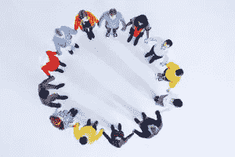

# 每个想要成为企业家和有影响力的人都忘记了——这不是关于你的。

> 原文：<https://medium.com/swlh/what-every-wannabe-entrepreneur-and-influencer-forgets-its-not-about-you-ad2fcd652d41>

*Image Credit: Armánd Johnson*

如果你想成为一名成功的企业家或有影响力的人，这是你必须要听的信息。这是你唯一需要时刻严格遵守的真正秘密。不是你的问题！！！！

如果你不能理解这一概念，那么我向你保证，你永远不会成为有影响力的人，也不会在商业中赚到任何真正的钱。如此多的人忘记了这个想法，即使在我看来，它是非常明显的，并且经常被交流。

**你有没有参加过一个活动，你第一次见到的人只是谈论他们自己？**

是不是让你想往反方向跑？当然会，这就是为什么我今天要灌输给你们的这一课如此重要。

我通过 Addicted2Success 遇到的每一个有影响力的人，以及我在日常工作中遇到的每一个成功的硅谷企业家，都理解这个概念，并坚信这个概念。

如果你不花时间实践我将要谈到的内容，无论如何你都会失败。

## 下面这七条规则是你如何确保你所做的是关于你所服务的人，而不是你自己:

# 规则 1——建立个人品牌是废话

自从社交媒体被发明以来就一直存在的一句口头禅就是建立你的个人品牌。建立个人品牌完全是胡扯！

**通过建立个人品牌，你告诉网上的每个人，你所做的一切都是关于你自己的。**建立个人品牌通常意味着发布总是谈论你自己或有一些你做了一些对任何人的生活没有任何价值的事情的愚蠢自拍的内容。

建立个人品牌的方法是不建立自己的品牌。听起来令人困惑，不是吗？这应该是因为只有当你给人们增加价值的时候，你才会建立品牌——故事结束。

在社交媒体上不断谈论自己的人让我呕吐，我知道你可能有同样的感觉，所以不要像这些傻瓜一样！找到自己在乎的东西，分享给全世界，去帮助别人。如果你做得足够多，那么也许，仅仅是也许，你可能会建立一个品牌。

# 规则 2——不要自负

当你给别人的生活增加价值时，确保你不要骄傲自大，或者用一种让你听起来比其他人都好的方式来交流。你不是，我也不是。我们都是这个世界的全球公民，寻找我们的目标，这样我们才能实现自己——这就是我们存在的原因。

当然，告诉人们你在生活中取得了成功，谈论你做的事情和你擅长的事情，只是不要以一种给人留下自大印象的方式。作为一个创业者，你永远不会自己创造一个改变游戏规则的企业；你必须吸引他人加入你的使命。

如果你有一个充满热气的大胖脑袋和一种令人厌恶的傲慢感，没有人会加入你的使命。能为你打造一个庞然大物的，是以某种方式激励人们，让他们愿意加入你的愿景的能力。这一个提示可以让你开始下一个优步！

# 规则 3——影响需要时间

在我参加的各种活动中，我遇到许多人，他们尝试了三个月，然后说没有人在听。我们生活在一个充满干扰的忙碌世界，据统计，现在人们需要与产品互动 16 次才能做出反应。

对社交媒体或作为企业家的影响力需要时间。我说的时间是指至少一年，对于我所知道的成功企业家来说，通常是五年。

所以，坐下来，放松，吃一片镇静剂，确保你正在做的事情是你喜欢的，否则你将永远无法拥有成功所需的耐心。

# 规则 4——不要仅仅为了帮助自己而建立一个社区

有一天有人对我说，“蒂姆，我拥有这个社区已经有一段时间了，但它并没有为我赚到任何钱。”我的回答是“那是因为社区不是为了让你赚钱，而是为了从你那里得到什么。”

我说这话的意思是，只有当你给你的社区他们想要的东西时，你才能得到你想要的东西。如果你创建一个社区只是为了赚钱的自私目的，那么你会比上周主流电视新闻更快被遗忘。

# 规则 5——一个社区不是用来兜售东西的

与我之前的观点直接相关的是，一个社区的存在并不仅仅是为了被轰炸和推销那些对他们没有帮助或者他们从来没有要求过的无用产品。相反，找到对你有用的东西，问问你的社区他们有什么问题，你能怎么帮他们。

> “当你对一群人说的每一句话都被某个可笑的产品自豪地带给你时，你会很快感到非常痛苦”

如果你打算提供产品和服务，那么先给出足够的价值，然后**以一种非垃圾的方式展示你能提供的东西，不要过度展示。**

# 规则 6——100%透明，分享你所知道的一切

不仅仅是你做什么与你无关，如果你要作为一个有影响力的人或企业家领导一群人，那么要确保你是 100%透明的。如果你想加速你的结果，那么分享你所知道的一切。

一个很好的例子是《创始人》杂志的创始人陈庭威。几周前我看过他的演讲，他分享了一切。他谈到了他的财务，分享了他遇到的法律问题，甚至告诉了我们他对一个还没有发布的产品的社交媒体策略。

他在一屋子大多不认识他的人中间立刻变得可信，看到一个人全力以赴，毫无保留，真他妈的有感染力。内森展现出的特质是不完全以自己为中心的真正本质。

# 规则 7——不要利用别人的社区，然后去他们的

不要只关注自己的最后一条规则是，不要帮助别人建立他们的社区，然后颠覆他们，窃取你帮助他们创造的东西。当你帮助建立别人的社区时，你是作为一种特权这样做的。

你这样做并不是因为这一切都是为了你，而是因为你相信这个社区所代表的东西。你得到的回报(虽然不是关于你的)是你以前没有的信誉、免费教育和与人交往的机会。

通过从其他人的社区偷东西，你正在制造关于你自己的东西，如果人们知道你偷了东西来达到目的，他们永远不会转移到你自己的社区——关于不诚实的人的真相传播得比流星还快。

*原贴于*[*【Addicted2Success.com】*](https://addicted2success.com/entrepreneur-profile/what-every-wannabe-entrepreneur-and-influencer-forgets-its-not-about-you/)

# 行动呼吁

如果你想提高你的工作效率，学习一些有价值的生活窍门，那就订阅我的私人邮件列表吧。你还将获得我的免费电子书，它将帮助你成为改变游戏规则的在线影响者。

[**点击这里立即订阅！**](http://timdenning.net/free-ebook)

## 这篇文章发表在 [The Startup](https://medium.com/swlh) 上，这是 Medium 最大的创业刊物，拥有 298，432+人关注。

## 在此订阅接收[我们的头条新闻](http://growthsupply.com/the-startup-newsletter/)。

