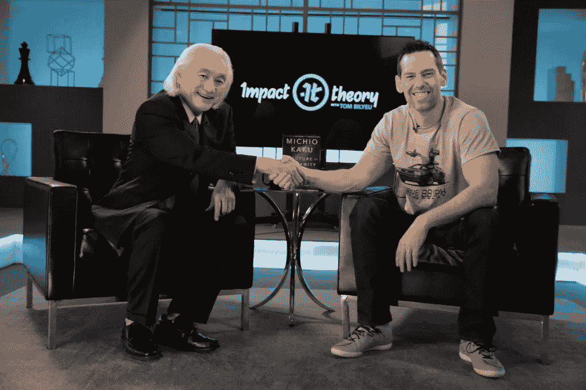

# 每个人都应该知道的延迟满足

> 原文：<https://medium.com/swlh/what-everyone-ought-to-know-about-delayed-gratification-3416a755ad0e>

## 从生活中得到你想要的东西背后的科学。

Photo by [Form](https://unsplash.com/photos/RqPJhqwp4b4?utm_source=unsplash&utm_medium=referral&utm_content=creditCopyText) on [Unsplash](https://unsplash.com/search/photos/dream?utm_source=unsplash&utm_medium=referral&utm_content=creditCopyText)

我有无数个夜晚熬夜到凌晨，直到黎明。

我的头脑会飞速运转，我会辗转反侧。当天早些时候，我可能跑了 3.5 英里，或者在健身房做了一个小时的 HIIT 运动。我的身体已经筋疲力尽，但我发现自己在床上来回踱步。

我知道焦虑来自哪里—

> **对自己未来能否成为作家、博客写手和创意人的极度恐惧。**

在过去的一年里，我确实取得了很大的进步，这让我确信自己正走在正确的道路上:

*   我已经能够在我的博客和像 Medium 和 Quora 这样的网站上建立一个社区。
*   我建立了一个拥有 1100 多名粉丝的电子邮件订阅者名单。
*   我已经向这些追随者出售了多本我的[电子书](https://www.tribeloyal.com/take-whats-yours-store/)，这些书提供了如何扩大你的读者群、建立追随者并利用他们获取经济利益的指南。
*   在这个数字空间里，我和各种各样的人交了朋友，帮助我学习、发展和创造我以前无法做到的东西(我的前媒体自我在笑)。

我想了很多关于我如何能够在这个领域取得这种(适度的)成功。

我一直认为自己是个勤奋的人。这是我父亲在我和弟弟、妹妹小时候灌输给我们的。他总是告诉我们，生活中伟大的事情需要卷起袖子，让自己有所作为。

所以，有时候我躺在床上完全睡不着，我对自己说，“我一直在努力工作——为什么我没有拥有我梦想的一切？”

当然，这种想法是幼稚和愚蠢的。

伟大的事情需要时间。

伟大的事情也从来没有保证。

有了创造性的工作和企业家的努力，你就把赌注押在了自己身上。这个赌注从来都不是一件确定的事情。妈的，这个赌注对你非常不利。

因此，考虑到你在这个探索中的不利条件，如果有的话，你可以求助于什么指标来证明他们的创业追求呢？

# 斯坦福棉花糖实验

Photo by [Autumn Mott](https://unsplash.com/photos/YccQtENMuXw?utm_source=unsplash&utm_medium=referral&utm_content=creditCopyText) on [Unsplash](https://unsplash.com/search/photos/smore?utm_source=unsplash&utm_medium=referral&utm_content=creditCopyText)

在寻找上述问题的答案时，我偶然发现了这个发生在 20 世纪 60 年代斯坦福大学的著名实验。由心理学家沃尔特·米歇尔进行的这项实验主要关注延迟满足的普遍程度，以及它如何成为一个人未来生活成功的指标。

在这些研究中，儿童可以在立即提供的一个小奖励(棉花糖)或两个小奖励之间进行选择，如果他们等待一小段时间，大约 15 分钟，在此期间测试者离开房间，然后回来。

在后续研究中，研究人员发现，通过 SAT 分数、教育程度、身体质量指数(身体质量指数)和其他生活指标来衡量，能够等待更长时间来获得首选奖励的儿童往往会有更好的生活结果。

最初的研究(在 1960 年进行)的目的是发现*延迟满足*何时在青少年中出现(第一次实验的中位年龄是 4 岁半)。

Photo by [MI PHAM](https://unsplash.com/photos/FtZL0r4DZYk?utm_source=unsplash&utm_medium=referral&utm_content=creditCopyText) on [Unsplash](https://unsplash.com/search/photos/brain?utm_source=unsplash&utm_medium=referral&utm_content=creditCopyText)

这些实验在大约 30 年后的 20 世纪 90 年代进行了跟踪，以测量受试者在青少年时期拥有的延迟满足指标如何以及是否有任何指标将在个人成年后做出贡献的成功中发挥作用。

1988 年的第一项跟踪研究表明*“在自我延迟范式中延迟满足时间更长的学龄前儿童，在 10 年后被他们的父母描述为明显更有能力的青少年。”*

2011 年对最初的斯坦福参与者中年时的样本进行的大脑成像研究显示，延迟时间长的人和延迟时间短的人在两个领域存在关键差异:当他们试图控制对诱惑的反应时，他们的[前额叶皮层](https://en.wikipedia.org/wiki/Prefrontal_cortex)(在延迟时间长的人更活跃)和[腹侧纹状体](https://en.wikipedia.org/wiki/Ventral_striatum)(在延迟时间短的人更活跃)。

# 著名天体物理学家对实验的进一步解释

所以这一切都很棒，对吗？

但你不是实验的一部分。此外，你无法回忆起当你还是个青少年的时候，你和未来讨价还价的能力有多强。

在研究这个实验的过程中，我看到了一篇对企业家兼 Quest Nutrition(2014 年发展第二快的公司)的联合创始人汤姆·比尔尤(Tom Bilyeu)和美国理论物理学家、未来学家、科学普及者、纽约城市学院理论物理学教授加来道雄(Michael Bloomberg)的深度采访。

在采访中，Bilyeu 问 Kaku 他对个人未来成功指标的看法。Kaku 引用上面描述的棉花糖研究作为回应。

[https://bit.ly/2tsmKOJ](https://bit.ly/2tsmKOJ)

Kaku 将这项研究向前推进了一步。他不一定对延迟满足感何时在年轻人中出现感兴趣。他更感兴趣的是，当我们在自己的生活中推断这些发现时，延迟满足的意义告诉了我们什么。

[采访](https://www.goalcast.com/2018/05/18/michio-kaku/)的文字记录:

> 这个棉花糖测试是什么？
> 
> 嗯，当你看着孩子，你看着所有关于成功孩子的不同理论，你意识到几乎所有的理论都是错误的，因为它们还没有被证实。
> 
> 比如说，高智商。许多高智商的人成为社会的边缘成员，那么与人生成功相关的心理测试是什么呢？而且我发现是棉花糖测试。
> 
> …
> 
> **如果你能向人们展示外面有一桶金，是的，你坚持下去，上大学，学习一门学科，外面就有一桶金。你可以学会欣赏这个事实。**
> 
> 我们大脑中与动物不同的是我们理解时间。我们了解未来。
> 
> …
> 
> **这就是我认为的智力。智能是能够描绘未来，模拟未来。因此，如果你让低智商和高智商的人做一个实验，把他们放在同一个房间里，你给他们同样的工作。抢劫银行。你会发现，低智商的人在抢劫银行、策划银行抢劫方面可能比高智商的人做得好得多，高智商的人会被法律问题之类的事情搞得一团糟。**
> 
> 关键是，你可以有一些非常聪明的强盗，因为他们看到了未来，这是我们人类所做的，而动物不能。我们不断地做白日梦。我们不断创造不存在的世界。对我来说，这就是智慧。
> 
> 有些人问我，那么生活的意义是什么？我对自己说，有人从高处给了你生命的意义，这太容易了。我是说，就这些吗？我的态度是，这是自我发现。我们必须重塑自我。我们必须重新创造自己，重新发现生命的意义。

# 这个想法如何反映你自己的生活和工作

Photo by [Ben White](https://unsplash.com/photos/qDY9ahp0Mto?utm_source=unsplash&utm_medium=referral&utm_content=creditCopyText) on [Unsplash](https://unsplash.com/search/photos/reading?utm_source=unsplash&utm_medium=referral&utm_content=creditCopyText)

在这一点上，你可能会问自己这如何适用于你自己的生活。

我们思考一会儿，盘点一下你所做的选择。

*   说到工作，你是从学校里拿走了第一份报酬丰厚的工作，还是听从了你头脑中的灵感？
*   说到爱人，你是因为接近才和某人配对还是真的为了和一个很棒的补充配对而先发展自己？
*   当谈到你的身体健康时，你是否在营养方面采取了权宜之计，即快餐，或者你是否有意识地注意自己摄入的食物，并定期锻炼以保持身材？

我在自己的生活中思考这个问题。

我年轻的时候，在一家初创公司有一份高薪工作。我赚了很多钱。然而，我漫无目的。

我没有做与我的灵魂一致的工作。我没有听缪斯女神的话。

我得出的结论是，在我职业生涯的早期，我会立即拿起棉花糖，而不是等上两年或更多年。

我在人际关系上这样做，也在健康上这样做。我生活中所做的一切都是关于现在的我是谁(T2)，而不是未来的我会是谁(T3)。

# 你现在可以采取的行动

Photo by [William Stitt](https://unsplash.com/photos/LB4uCiXJYa0?utm_source=unsplash&utm_medium=referral&utm_content=creditCopyText) on [Unsplash](https://unsplash.com/search/photos/running?utm_source=unsplash&utm_medium=referral&utm_content=creditCopyText)

你在生活中吃过哪些权宜之计的棉花糖？

你在哪里满足于眼前的回报而不是延迟的满足？

你的创作追求是什么，在向它前进的过程中你采取了哪些行动？

我知道很长一段时间以来，我只会阅读媒体上的文章。我尽可能地阅读所有的内容，希望进入我大脑的成千上万个单词能够开启某种类型的神经发生，让我去完成这项工作。

当然，再多的消耗他人的工作也不会导致我自己的成就(尽管仍然有价值)。

*   所以在我自己的生活中，一年多前，我开始写作。我写了一篇文章，后来变成了两篇，最后变成了 150 多篇。
*   我决定建立一个电子邮件列表，从一个订户变成两个订户，再变成 1100 个订户。
*   我写了一本电子书，并试图出售。找不到买家，觉得很失败。我修改了这本书，重新推广了这个项目。这转化成了销售。

有了这些，我知道我离我想去的地方还很远。

然而，如果我能低着头，做好工作，抵制接受一份让我赚很多钱但与我灵魂深处的梦想和目标不一致的工作的即时回报，就会有一座棉花糖山在等着我。

那么你有什么目标和梦想呢？

现在需要延迟什么棉花糖才能在未来收获 100 倍的回报？

# 还有谁想自己当老板？

## 我提供给你一个经过测试和验证的 6 部分指南，它包含了强大的概念，可以帮助你识别、规划、成长和完成你的创造性追求，这可以帮助你成长为一个财务奖励。

# [> > >在这里获得免费指南< < <](https://mailchi.mp/4b982beed325/free-6-step-course)

## 学到了什么？按住👏说“谢谢！”并帮助他人找到这篇文章。

## 还评论！你喜欢什么？你讨厌什么？你在做什么？

## 这篇文章发表在 [The Startup](https://medium.com/swlh) 上，这是 Medium 最大的创业刊物，拥有 338，320 多名读者。

## 在这里订阅接收[我们的头条新闻](http://growthsupply.com/the-startup-newsletter/)。

