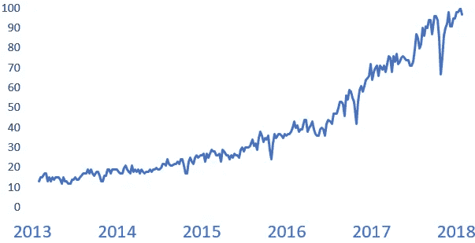
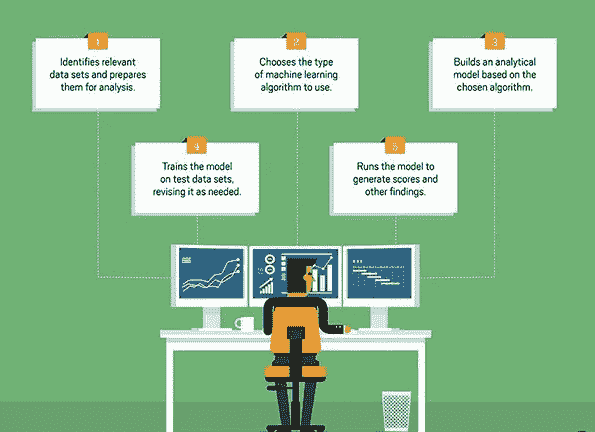
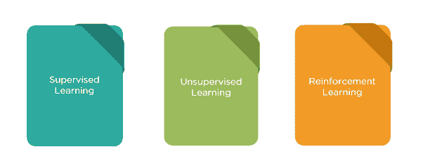
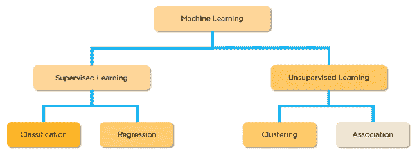
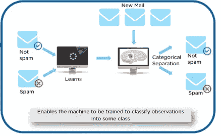
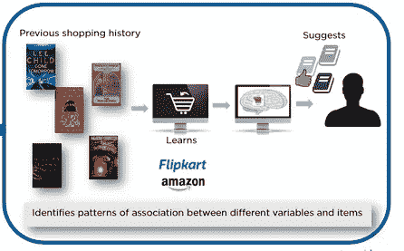

# 机器学习到底是什么？

> 原文：<https://medium.com/swlh/what-exactly-is-machine-learning-50789d7860ec>

人工智能、深度学习和机器学习是当下的流行语。在 Google Trends 上简单搜索*机器学习*就能描绘出一幅清晰的画面。在过去的几年里，人们对这些主题的兴趣急剧增加。

# **那么“机器学习”这个术语到底是什么意思？**

即使在机器学习的实践者中，对于什么是机器学习，什么不是机器学习，也没有一个被广泛接受的定义，但最普遍的想法是-

*“机器学习是人工智能(AI)的一种应用，它为系统提供了自动学习和根据经验改进的能力，而无需显式编程。”*

# 热门人工智能文章:

> [1。引入露天开采:分散人工智能](https://becominghuman.ai/introducing-open-mined-decentralised-ai-18017f634a3f)
> 
> [2。TensorFlow 对象检测 API 教程](https://becominghuman.ai/tensorflow-object-detection-api-tutorial-training-and-evaluating-custom-object-detector-ed2594afcf73)
> 
> [3。TensorFlow 对象检测 API:检测基础(2/2)](https://becominghuman.ai/tensorflow-object-detection-api-basics-of-detection-2-2-28b348495eec)
> 
> [4。Keras 深度学习库的词性标注教程](https://becominghuman.ai/part-of-speech-tagging-tutorial-with-the-keras-deep-learning-library-d7f93fa05537)

这个世界充满了数据。很多很多数据。从图片、音乐、文字、电子表格、视频等等。看起来短期内不会减缓。机器学习带来了从所有这些数据中获取意义的希望。

乍一看，ML 似乎很神奇，但是一旦你深入了解，你会发现它是一套从数据中获取意义的工具。

# 我们周围的数据

传统上，人类分析数据并使系统适应数据模式的变化。然而，随着数据量超过人类理解数据和手动编写规则的能力，我们将越来越多地转向能够从数据中学习的自动化系统，更重要的是，数据中的*变化*，以适应不断变化的数据格局。

# 机器学习已经无处不在

在我们今天使用的产品中，我们看到机器学习在我们周围，但对我们来说，机器学习并不总是显而易见的。

*   **在线推荐。**机器学习允许零售商根据你之前的购买或活动为你提供个性化的推荐。
*   乘坐优步和 Lyft 这样的共享应用。他们如何决定你的乘车价格？一旦你叫到车，他们是如何将等待时间减到最少的？这些服务如何将你与其他乘客最佳匹配，以最大限度地减少弯路？所有这些问题的答案都是 ML。
*   **垃圾邮件过滤器。**你的电子邮件收件箱似乎不太可能是 ML 的地方，但这项技术在很大程度上为其最重要的功能之一提供了动力:垃圾邮件过滤器。
*   **脸书的新闻提要。**新闻订阅使用机器学习来个性化每个成员的订阅。如果一个成员经常停止滚动阅读或喜欢某个朋友的帖子，新闻提要将在提要的早期显示该朋友的更多活动。

# **机器学习是如何工作的？**

The typical stages while building a Machine Learning model.

机器学习分为三大类。

*   **监督学习**:在这里，系统使用过去的数据进行训练，包括输入(也称为特征)和输出(也称为标签)，当遇到新数据时，能够做出决策或做出预测。
*   **无监督学习:**系统能够识别模式、相似性和异常，仅考虑输入数据，即仅使用特征。
*   **强化学习**:系统根据上一次执行的动作得到的奖励/惩罚做出决定。这种方法没有过去的数据。当系统所处的环境发生变化时，系统采取动态决策。

这些类别进一步分为:

***1。分类:***

这里，数据需要根据使用过去数据的训练分成许多不同的类别。分类问题的一个例子是，我们如何能够将电子邮件分类为垃圾邮件，或者使用以前收到的已经被识别的电子邮件。可用于解决分类问题的一个著名算法是朴素贝叶斯定理。

Classification

**②*。*回归:**

我们基于先前接收的信息来预测输入的值。虽然这听起来类似于分类，但考虑到它们都使用过去的数据进行预测，它们的相似性仅此而已。在回归的情况下，你试图估计一个值，而不仅仅是一类观察值。

现在，让我们考虑你想要预测你要卖的房子的价值。这个问题不属于分类，因为我们不预测是否会出售。相反，我们是在预测房子出售时的价格。

***3。聚类:***

这使用了一种方法，其中我们将一组观察值分配到子集。这些子集被称为集群。基于这样或那样的参数，这些星团内部的观测结果彼此相似。因此，所有的数据都被划分成簇。

使用集群的一个例子是，当电信提供商希望通过在一个地区建立发射塔来建立网络时，他们使用集群算法，考虑为所有用户提供最佳连接的区域以及蜂窝发射塔的最大范围，将整个区域划分为集群。K-Means 是一种基于相似性度量将数据聚类到 k-簇中的常用方法。

***4。联想:***

在关联问题中，我们识别不同变量或项目之间的关联模式。

它的概念被应用到电子商务网站上，在那里，他们能够根据你以前的购买情况，向你推荐其他商品。

Association

# **机器学习的未来？**

可能性是无限的。以下是其中的一些:

还记得你在 **I《机器人》里看到的那些机器人助手吗？想象一下我们日常生活中的那些。帮助清洁我们的家园，让生活变得更加轻松。**

交通让你心烦？你在你汽车的空调里放松一下，它会照顾你到你的目的地，怎么样？靠自己？全拜**自动驾驶汽车**所赐。

或者，当你一走进医生的办公室，他们就能看到你所有相关的医疗细节。使他们能够为您提供更加**个性化的诊断**

机器学习可以带来所有这些甚至更多！

# 别忘了给我们你的👏！

