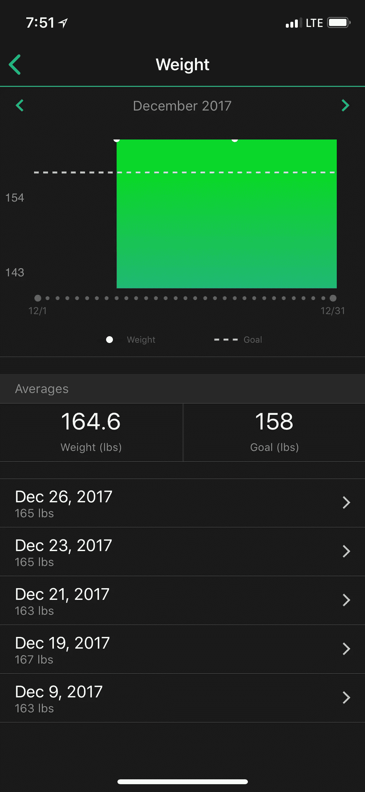
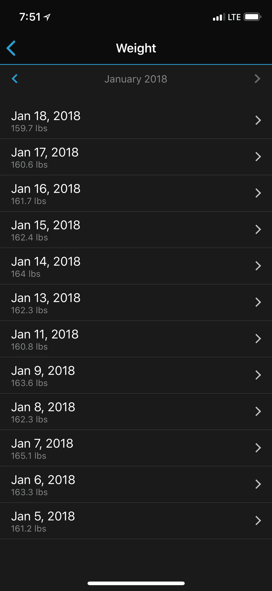
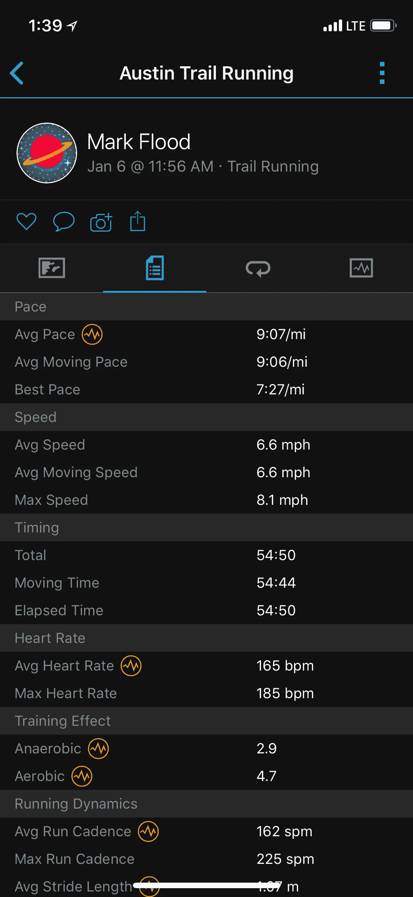
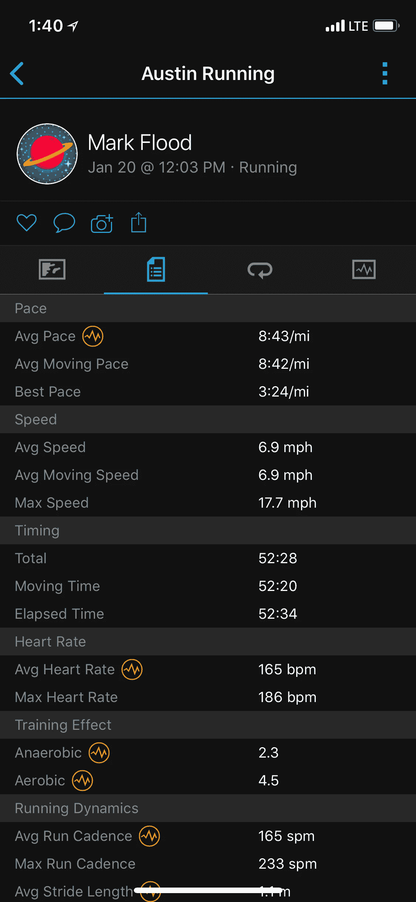

# 被测量的东西被改变(改进)

> 原文：<https://medium.com/swlh/what-gets-measured-gets-changed-improved-e8eacacc032>

最近多次看到不同类别的同一个故事。见鬼，我甚至发现它发生在我身上。这令人沮丧，令人泄气，它会彻底扼杀你的项目或你的目标。这是…缺乏进步。它可能发生在我们最好的人身上。解决办法很简单；测量。如果你发现你没有系统地接近你的目标，你需要确保你正在测量(也就是跟踪)正确的事情。正如我之前提到的，对我来说，健康和健身是生活中许多其他类别的一个很好的比喻。接下来，我会提到健康，但是同样的概念可以，而且很可能应该，应用于商业或生活的其他方面。

比方说，你目前的目标是减掉 10 磅脂肪(注意这个目标的特殊性？这是一个比“减掉 10 磅”更好的目标)。当你开始这个过程时，你首先需要知道的是你从多少脂肪开始。如果你没有一个很好的体内脂肪量的近似值，你怎么知道你减掉了多少呢？这需要我来衡量。对于这个具体的例子，你的选择可以包括比较你的身体图像和你在网上找到的身体脂肪百分比图像。它可以用卡尺来测量。或者最好使用一台可以持续测量你身体成分的机器(DEXA、博德波德等)。通过这样做，你现在已经建立了一个基线，你现在可以衡量和跟踪你的目标。

既然基线已经建立，那么系统化的度量实际上是什么样的，你需要有多“强迫症”呢？这取决于几个因素。如果你在过去很难减掉脂肪，或者喜欢溜溜球，我会说你需要对此保持清醒。随着时间的推移，你会对事物有一种感觉，这种严格的测量是没有必要的。以下是我衡量自己进步的方法。我每天早上醒来的时候都会称体重，我会在无数可用的健身应用程序中记下体重，或者至少使用电子表格。从那以后，大约每个月我都会重新测量我的身体成分。12 月中旬，我的体重约为 167 磅。对于我现在的训练团，我想变得更轻一点。158 左右是我的目标。这是几天前这段旅程的样子。

Holiday Eating!

从趋势可以看出，这里没有一个数据点是如此重要。你的体重会因各种因素而波动。重要的是均线。如果不是经常称体重，我可能会在 1 月 14 日称体重，并认为自己几乎没有取得任何进步！持续测量的一个巨大好处是，它可以帮助您识别和纠正缺乏进展的情况。如果从今天起的一个月内，我发现我的 7 天平均值没有明显变化，我知道我只是吃得太多了，可以做出调整。

控制体重已经成为我的第二天性，我不需要如此勤奋地测量。实际上，我非常仔细地跟踪了这一点，以表明体重的日常波动并不那么重要。一个让我完全不舒服的领域是耐力训练。在 12 月之前，距离我上次跑 3 英里可能已经有 10 年了。我一直在慢慢建立有氧能力和耐力的基础，使用的原则与我用于力量训练的原则相同。因为我不熟悉我的身体对所有这些的反应方式，我一直在使用我的 Garmin 手表和心率监视器尽可能多地跟踪。下面是我两次六英里跑步的截图，两次跑步相隔两周。

9:07 pace @ 165 bpm

8:43 pace @ 165 bpm

如果我没有跟踪这些数据，我可能不知道到底发生了什么。如果我不知道跑完这段距离花了多长时间，我就不能确定我跑得有多快。如果我知道时间，但没有心跳的指示，我就不知道努力程度是否大致相同。为了在给定的距离内随着时间的推移提高体能，您的 BPM 应该在相同的配速下降低，或者您的 BPM 应该保持不变，而您的配速应该加快。除此之外，健康还有很多其他的变量，但是对于这次谈话的范围来说，这些是最相关的。简而言之，我非常自信我的健康状况确实在改善。我很高兴开始延长我的距离，看看我是否能保持同样的速度和 BPM。

上面的例子是急性的，特别是健身相关的。我喜欢使用健身，因为它是有形的，而且在很大程度上，很容易概念化。测量不仅仅是为了健康和健身。你在做生意吗？如何知道自己是否在进步？收入是最容易跟踪的东西，但是还需要监控什么来确保你朝着正确的方向前进呢？我将把需要在另一篇文章中衡量的一系列业务指标留给大家，但可以说，这里有很多选项。选择正确的度量标准与持续注意和审查它们一样重要。

你发现测量帮助你成功了吗？你最喜欢测量的东西是什么？我喜欢谈论这些东西，所以如果你想讨论，请留下评论！

*   中频

## 这个故事发表在 [The Startup](https://medium.com/swlh) 上，这是 Medium 最大的创业刊物，有 287，184+人关注。

## 订阅接收[我们的头条新闻](http://growthsupply.com/the-startup-newsletter/)。

