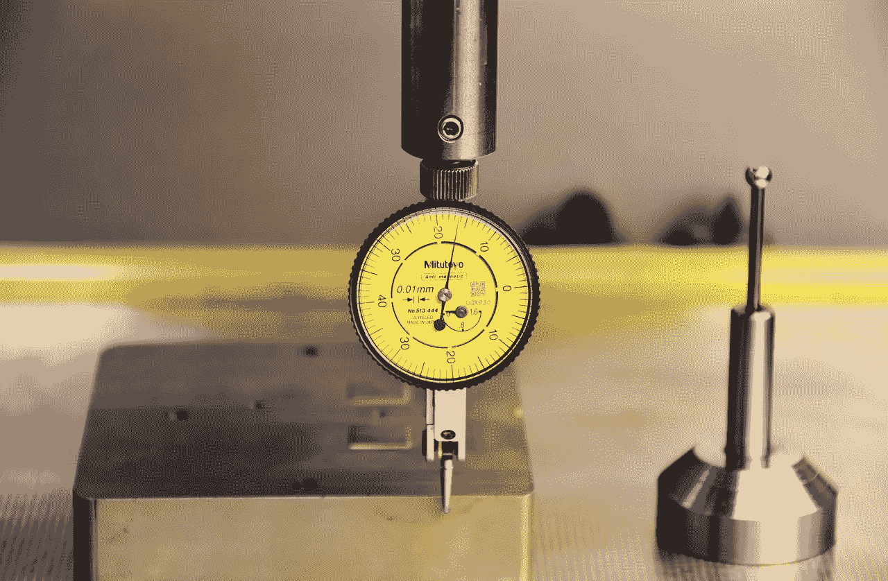

# 被衡量的东西会得到改进

> 原文：<https://medium.com/swlh/what-gets-measured-gets-improved-96247e59091b>

[Capri23auto/pixabay](https://pixabay.com/en/gauge-button-probe-keys-measure-3081407/)

在之前的一篇文章中，我认为在生活中取得成功的唯一技能是辨别真伪。为了提高这种技能，你可以做很多练习。

这些实践并不是相互替代的，所以，你更愿意参与其中的每一个。今天，我要讨论另一个想法，它将帮助你辨别真伪。正如你从标题中可以理解的，这是管理大师彼得·德鲁克的一句话，这种实践是测量。

测量可以被看作是[科学方法](https://ideavisionaction.com/personal-development/how-to-eliminate-the-stress-while-working-towards-your-goals/)的一部分，但它也可以在没有其余部分的情况下单独使用。这是辨别真伪的一个很好的工具。换句话说，你很容易明白是你还是别人在忽悠你。

测量不仅能帮助你发现真相。它也将你的注意力集中在测量的对象上。结果，你的能量流向了你的注意力焦点，你的成绩也提高了。

> ***“注意力到哪里，能量就流向哪里。”詹姆斯·莱德菲尔德***

**测量什么**

在某些情况下，测量可能很困难。在创业的早期阶段，你可能会非常努力地工作，但你的收入可能在很长很长一段时间内仍然为零。如果是这样的话，你可能想把你的注意力从收入转移到其他指标上。

用户数量和用户参与度可能是跟踪初创公司的有趣指标，因为这些数字对已建立的企业和投资者来说是有价值的。

如果衡量朝着最终目标的进展没有意义，那么你可以将目标分成更小的目标，然后衡量朝着你面前的第一个目标的进展。这种策略叫做[分而治之](https://ideavisionaction.com/personal-development/how-to-tackle-overwhelming-challenges-effectively/)，是一种有效的策略。

在某些情况下，如果目标的进展不是线性的，那么衡量结果可能没有任何意义。例如，如果你在卖房子，你的结果将在很长一段时间内保持为零，直到你卖掉房子。

奇怪的是，很多现实世界的过程都类似于卖房子。你必须忍受长时间的停滞不前，然后突然看到你的结果呈指数级增长。我在另一篇名为[的文章中讨论了这一现象，这就是你的期望如何破坏你的成功](https://ideavisionaction.com/personal-development/this-is-how-your-expectations-sabotage-your-success/)。

如果衡量结果没有意义，你最好衡量你的输入。在房地产销售的情况下，这可能是你打销售电话的数量。

**如何测量，举个例子**

以前不太注意饮食和健身。因此，我的体重过去变化很大。在某些时候，我会瘦很多。在其他时期，我的体重会增加很多。没有一个是健康的或美观的。

当我决定测量我的热量摄入和健身努力时，我的体重和健康水平稳定下来并开始改善。这比听起来容易。我每天吃相似数量的相似食物，所以测量它们的卡路里相当容易。

如果我吃了常规食物之外的东西，我会对它的热量进行有根据的猜测，然后调整当天或第二天的剩余食物消耗量，以保持热量摄入不变。这真的很容易做到，因为我的早餐是燕麦片。我可以用一个简单的厨房秤很容易地调整我可以食用的燕麦片的量，燕麦片的卡路里是一个已知的变量。

**测量我的健身努力**

我开始测量的另一个变量是我的健身运动投入。回到过去，我会做一些俯卧撑和仰卧起坐，在公园散步，并把它称为健身锻炼。现在，我把我的健身努力分为两类，有氧运动和重量训练。

我买了一个有氧运动的心跳监测器，我强烈推荐，因为你永远不知道你的有氧运动强度有多大。在某些日子里，你可能认为你的训练强度很大，但你可能做得不多。在其他日子里，你可能认为你很放松，但实际上你正在进行一次非常激烈的锻炼。

为了避免我的有氧运动中的猜测，我用一个监视器和一个智能手机应用程序来测量我的心跳。我的目标是每分钟超过 110 次，并在这个水平上花半个小时。我没有考虑我花在达到每分钟 110 次的水平上的时间。

我的有氧运动努力绝不是运动成就，但我对这种投入感到满意，因为运动成就不是我人生的首要目标。

我也记录我的重量训练。我会记录我做了哪些运动，做了多少组，重复了多少次，每组的重量是多少。我用 Evernote 和我的智能手机来做这件事。

最后但并非最不重要的是，我的有氧运动和负重训练都在我的周计划中。这样，不仅我的健身努力持续不断并不断提高，我还利用了一个叫做“按计划完成任务”的原则。如果没有这个原则，就很容易找到借口不去锻炼。

**总结**

如果你想改善你的业务或生活的某个方面，那么就听从彼得·德鲁克的建议，开始衡量吧。如果衡量结果没有意义，那就衡量你的投入。不要忘记安排你想要完成的任务。计划和测量的结合将会提高你的结果。

*阅读下一篇:* [人生成功所需的唯一技能](https://ideavisionaction.com/personal-development/the-only-skill-you-need-to-succeed-in-life/)或者报名参加[每周简讯](https://ideavisionaction.com/email-newsletter/)。

## 这篇文章发表在 [The Startup](https://medium.com/swlh) 上，这是 Medium 最大的创业刊物，拥有 299，352+读者。

## 在这里订阅接收[我们的头条新闻](http://growthsupply.com/the-startup-newsletter/)。

