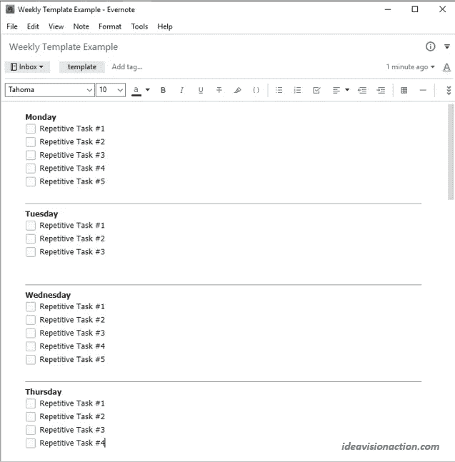
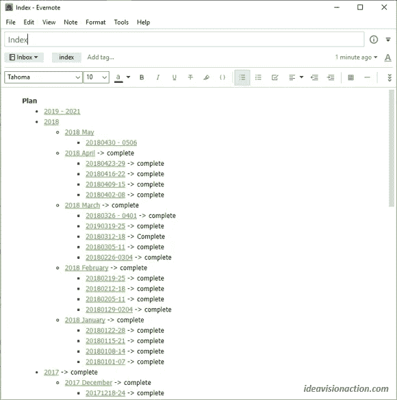
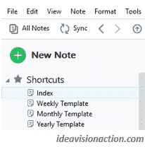

# 安排好的事情就能完成

> 原文：<https://medium.com/swlh/what-gets-scheduled-gets-done-2a13aa7f4e8f>

[rawpixel/pixabay](https://pixabay.com/en/business-paper-office-aerial-3190209/)

在昨天的帖子里，我分享了 [**时间管理的简单公式**](https://ideavisionaction.com/productivity/the-simple-formula-of-time-management/) 。

> **时间管理=计划+意志力**

我把计划分成三步。

1.  分析
2.  优化
3.  行程安排

我在昨天的帖子[中解释了分析和优先化的步骤。今天的帖子将是关于第三步，调度。](https://ideavisionaction.com/productivity/the-simple-formula-of-time-management/)

**什么是排班？**

我所说的日程安排是指日常活动的计划。从技术上来说，日程安排就是给一项活动指定一个日期和时间。有时候，我会给一项活动分配一个特定的时间，比如，万一有约会。

在其他时候，我指示行动项目的顺序，而不指示具体的开始和结束时间。这个顺序通常与行动项目的优先级相匹配，但不一定如此。

在某些情况下，我可能一大早就有一个约会，下午还有一个更重要的任务。

**细节的层次**

您可以决定在日程安排中包含多少细节。我喜欢在我的日常日程中只计划关键和重要的任务。查看[昨天的帖子](https://ideavisionaction.com/productivity/the-simple-formula-of-time-management/)我说的关键重要任务是什么意思。

通过只包括关键和重要的任务，我的日常计划不会变得拥挤。我可以很快看到当天我必须采取的 4-5 项重要行动。有时候，我会超过 5 个，但是 4-5 个基本任务对我来说是最理想的。

**待办事项应用的陷阱**

以前我用的是一个待办事项 app。我把脑海中出现的每一个想法都作为待办事项添加到清单中。结果，我最终有了成千上万的行动项目。关键和重要的行动项目迷失在“美好的事情”和“总有一天，我会做的事情”中

我不再把我随意的想法和高优先级的任务混在一起。我在 Evernote 的一个单独的笔记中添加了我的偶然想法。

**我用来排班的工具**

[**我用的最多的**](https://ideavisionaction.com/productivity/the-app-that-i-use-the-most/) 的 app 是 Evernote。我也用它来安排时间。

我喜欢音符的弹性。我可以随心所欲地组织和格式化它。我可以把几个笔记和内部链接功能结合在一起。以下是一些让 Evernote 成为我的优秀日程安排工具的特性。

*   快捷指令
*   复制一张便条
*   备忘录中的复选框
*   将内部链接复制到便笺
*   格式化便笺

我如何安排时间？

日程安排的目标是计划几天内预定的活动。如果你想知道我是如何确定和优先处理我的活动的，你可以查看[昨天的帖子](https://ideavisionaction.com/productivity/the-simple-formula-of-time-management/)。

我区分了两种类型的活动。

*   重复的
*   一次性的

重复的活动每周、每月、每季度、每年重复一次或多次。我使用模板来计划我的重复性活动。

**模板**

我有三个模板。

*   每年的
*   每月
*   一周的

我在月度模板中包含了季度活动。

模板是一个简单的注释，包含在给定的时间范围内要执行的重复活动。例如，年度模板包括以下项目。

*   生日
*   周年纪念
*   税收和保险管理及支付
*   汽车保养
*   诸如此类…

这些是每年发生一次的事件和行动。我把每年的模板分成十二个月。Evernote 的格式化功能非常适合这样做。同样，我把每周模板分成七个工作日。

Fig. 1\. Weekly Template

**创建实际时间表**

我在相关周期开始之前创建了一个实际的时间表。在开始之前，我会为下一年、下个月和下一周做一个记录。有了“复制笔记”功能，这真的很简单。

“复制注释”功能创建注释的副本，在本例中，是我们的模板注释。然后，我将便笺的标题调整为相关的年、月或周，就这样。对于一周，我使用一周的开始和结束日期作为标题。

一旦我复制了一个模板注释，我的注释中就会有重复的任务。然后，我将一次性任务添加到周期注释中。

**需要多长时间？**

一旦你准备好了分析、优先排序和模板，就需要大约 10-15 分钟来创建一个周计划。

准备分析、确定优先级和模板需要更多时间。这些任务永远不会完成。

> **久而久之，你的生活在演变，你的优先事项也在改变。**

您的分析、优先级和模板会随着您的优先级而变化。你需要在这些活动上投入时间，以跟上你生活的优先顺序。

**我如何创建一个实际的日程表？**

我每周周日做一次日程安排。我在 10-15 分钟内完成所有的日程安排工作。

*   如果下一年即将来临，我会为下一年写一张便条。
*   如果下个月快到了，我会为下个月写一张便条。
*   无论是哪种情况，我都会为下周创建一个便笺。

一旦这些笔记准备好了，我就把具体的行动项目从年笔记移到月笔记，从月笔记移到周笔记。然后，我把一次性活动添加到周记录中。在这一步之后，我的周计划就完成了。

> 我的日程表上只包括具体的行动项目。我不加含糊的计划。

例如，“将汽车送去保养”是一个特定的行动项目。“考虑买辆新车”不是。在分析和优先化阶段，必须对模糊的计划进行分析、具体化和优先化。

**长期票据**

除了我的年、月、周笔记，我还有一个长期笔记。不要把长期注意和长期愿景或任何其他抽象的想法混淆。这些想法会被放到分析文档中。

长期便笺包含了截止日期在下一年年底之后的行动项目。比如我每五到十年就要更新一次密码和 id。

**把所有这些放在一起**

Evernote 中排序笔记的选项并不多。结果，你最终得到的是一堆没有任何逻辑顺序的音符。我创建了一个索引注释来解决这个问题。

Fig. 2\. The Index Note

每当我创建一个新的年、月或周便笺时，我会将它添加到我的索引便笺中。这在 Evernote 的“复制内部链接”功能中非常简单。然后，我将链接粘贴到索引注释。

**快速访问重要笔记**

索引注释和模板注释是重要的注释。我在左侧面板上添加了它们的快捷方式。

Fig. 3\. Shortcuts

**一天中任务的顺序**

正如我之前提到的，我不会给一天中的任务分配时隙。唯一的例外是设定了开始和结束时间的约会。

我根据任务的优先级来计划任务，没有设定开始时间。任务的优先级越高，它被调度的时间就越早。

设定任务的顺序有几个好处。

*   尽量减少浪费在思考下一步该做什么的时间。
*   通过避免决定下一步做什么来最大限度地减少决策疲劳。
*   优先级较高的任务先完成。

**规划对你生活的影响**

> **“花在计划上的每一分钟都可以节省执行上的十分钟。”布莱恩·特雷西**

我引用了上面的话，因为我喜欢它背后的想法。我 100%不同意。

> 在某些情况下，计划可能会浪费大量时间。

以前迷失在细节里，一直在规划。结果，我在没有完成很多工作的情况下，浪费了很多时间做计划。

随着时间的推移，我学会了在做计划时专注于最关键和最重要的任务，放下其他的事情。

> 关注最关键和最重要的，放下其余的。如果你这样做，规划的好处比节省 10 倍的时间还多。它让不可能变成可能。

**结论**

时间管理包括计划和意志力。规划需要分析、优先排序和时间安排。

我在[昨天的帖子](https://ideavisionaction.com/productivity/the-simple-formula-of-time-management/)里讨论了分析和优先排序，在今天的帖子里讨论了调度。

调度包括两个步骤。

1.  拥有包含重复任务的年度、月度、周模板。
2.  通过添加一次性任务来创建基于模板的实际期段计划。

当安排时间时，我只关注最重要的、具体的任务。如果我的任务没有设定开始时间，比如约会，我会根据它们的优先级来排序。

我用 Evernote 创建我的日常日程表。它有几个特点，使创建和使用日常计划的效率。

> **说到日程安排，证据就在布丁里。**

你必须经历昨天和今天的帖子中解释的步骤，看看它对你和你的生活有什么作用。花一个月的时间设置它，用一个月的时间使用它。自己看效果。

**即将推出**

我们大多数人都会犯把时间管理等同于计划的错误。规划只是等式的一半。另一半是意志力。

> 如果你没有坚持计划的意志力，再多的计划也救不了你。

请继续关注关于时间管理的意志力方面的帖子。那个帖子不会是一般的激励性帖子，对着你大喊让你把事情做好。我会用一些你可以马上使用的头脑黑客来支持它。

**轮到你了**

你对昨天和今天的帖子中解释的系统有任何问题或反馈吗？请在评论中告诉我。我会尽我所能回答你的问题，如果有必要，我会写一个后续的帖子。

[***注册我的电子邮件简讯***](https://ideavisionaction.com/email-newsletter/) ***接收我每周发布的关于人生经验、个人发展、写作、博客、营销、商业、创业和企业家精神的文章摘要。***

## 这篇文章发表在 [The Startup](https://medium.com/swlh) 上，这是 Medium 最大的创业刊物，有 321，672+人关注。

## 在这里订阅接收[我们的头条新闻](http://growthsupply.com/the-startup-newsletter/)。

