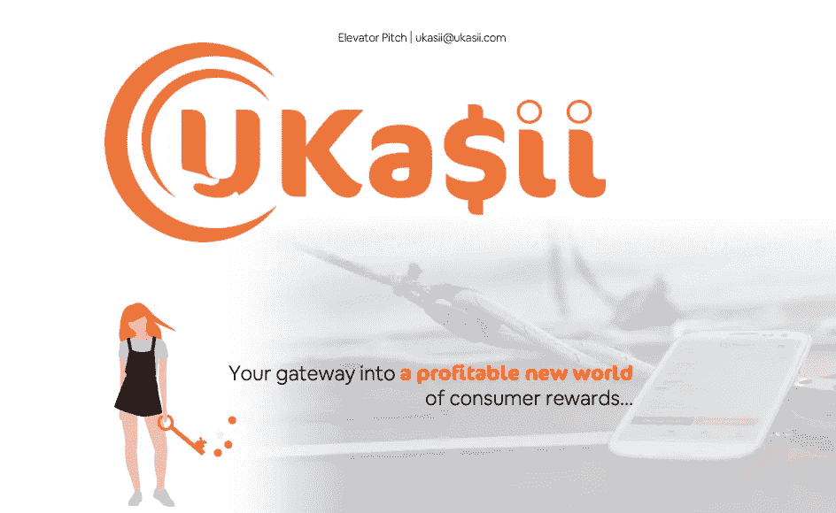

# 枪炮玫瑰和企业家有什么共同点

> 原文：<https://medium.com/swlh/what-guns-n-roses-and-entrepreneurs-have-in-common-d263e5cc73bc>

# 区块链奖励和电子商务平台的制作:创业之旅——第四部分

credit: Bob Friday/hipstertravelguide.com

在 80 年代中期，我在 MTV 上看了一部纪录片，讲述了洛杉矶那些雄心勃勃、闻所未闻的摇滚乐队。与他们交谈过的众多乐队成员中的每一个人都坚定不移地相信他们有一天一定会“成名”。他们心中绝对没有疑问。我记得当时觉得他们是多么天真。

2018 年 1 月，我们在 Slack 上收到消息的那天，我们将不会收到我们的[区块链奖励和电子商务平台](http://www.ukasii.com)项目初创公司的资金，我成为了这些乐队成员之一。我肯定会让它发生的…

> **当你开始创业时，不管你的项目是大是小，是简单还是复杂，总会有“力量”将你推离正轨。有些是有形的，比如竞争和官僚主义，而有些，比如在你开车去签第一份合同的那天，决定要撞上你的车的卡车，逻辑是无形的。**
> 
> **你必须时刻在精神上和商业上做好转移注意力的准备，但要尽可能快地回到正轨。永远不要为了妥协而妥协。你已经做了你认为正确的事。毕竟，你是那个将企业发展到辉煌高度的人。**

Casino

郑重声明，如果某件事是错的，无论是法律上还是道德上，不要去做，即使感觉是对的。或者很好。如果某样东西感觉很好或者很诱人，那么它很可能是“错误的”。就像有人曾经说过的那样，*“我们通常知道自己能做什么，但诱惑让我们看清了自己”* 。**但是我们有点偏离轨道了(明白我说的那些力是什么意思了)，所以让我们回到正轨……**

Slack 上一出现我们将不会获得非洲项目资金的消息，我就开始收到我为[区块链奖励和电子商务](https://www.ukasii.com)项目招募的团队发来的消息，询问这到底是怎么回事。我和他们一样蒙在鼓里，我说我会和小组项目发起人谈谈。在我给他们打电话之前，他们给我打了电话，说对航空公司和机场的资助“在可预见的将来会暂停”，但他们仍然想继续进行 UKa$ii。我感到如释重负。然而，当你管理自己的企业或试图给初创企业注入活力时，没有什么事情会一帆风顺很久。他们接下来的评论确保了这种缓解是非常短暂的。

“我们也许能够为项目启动提供资金，让一个核心团队在尼日利亚启动，但我们需要重新协商提供的一揽子方案。如果你能接受头几个月降价 50%……”

“站住！”我很生气。但是冷静。“这没什么好争论的。我不会接受的，我甚至不会向团队提出这个问题。这不仅关系到我的诚信，也关系到你的。为了降低将这个项目推向市场的成本，我们已经修改了六次商业案例。我们现在已经降到了最低要求……”

如果说他们之前的声明令人愤怒，那么他们的下一个声明就把我推到了悬崖边。

“好的，那你能和我们分享一下这个商业案例吗？你什么时候准备的？”

在我们为这个项目工作的五个月里，区块链奖励和电子商务平台的商业案例已经被准备、提炼和分享了至少 5 次。电话会议上提到过。他们在这里，问他们是否可以有一个副本！显而易见，他们并没有像他们让我们相信的那样给予这个项目关注。

"[你说这周要去注册公司](/swlh/when-your-start-up-becomes-a-mindf-a26cae10d127)。有没有做，有没有注册 UKa$ii？”我问。这是一个反问句。

再次，我叫[抢先知](https://www.linkedin.com/in/rprophet/)。他和我一样沮丧。事实上更是如此，因为他不仅负责监督航空项目，还负责包括私人直升机公司在内的许多其他业务部门，所有这些部门他都招募了一个庞大的团队，既有本地的，也有外籍的。他分享了自己的建议:

“你不需要它们，伙计。你已经尽力了。他们有一个飞行常客计划，你把它变成了一个[现金返还奖励和基于区块链](http://www.ukasii.com)的电子商务平台。他们带来的只是资金，而他们已经表明他们无法做到这一点。你不需要他们。”

我已经考虑过这些了。好吧，他们给了我这个角色，我很感激。他们让我走上了这条路。然而，五个月过去了，尽管做出了无数承诺，但没有一家公司注册。现在没有资金了。没有角色！更重要的是，我招募了那些相信我的话的人成为这个项目的一部分。我决定在那里，然后我会独自去做。我没有任何选择…除了放弃几乎半年的工作和计划。

那天晚上我上网在英国注册了 UKa$ii。包括对如何在网上建立一家公司做必要的、详细的研究——因为这是我第一次这么做——通过 www.gov.uk 网站，整个过程花了不到两个小时。只花了 12 英镑，我是用信用卡支付的。我刚刚为自己的创业投资了资金。

当确认信息和 [UKa$ii](http://www.ukasii.com) 的注册证书通过电子邮件传来后，我问 Rob 他是否还想留在船上。

“当然啦！你需要多少我就能参与多少”，这是他热情洋溢的回答。我们当时就达成一致，他将担任首席顾问，他的部分职责是向潜在投资者引荐。

剩下的队员。唯一的问题是，虽然我有能力支付公司注册费用，但我没有能力资助任何员工。通过我们的 Slack 小组向每个人传达了一个信息，即我们将努力为该项目寻找启动资金，如果我们成功了，我们将与他们联系，但他们应该继续目前的工作，因为我们何时或是否会成功并不确定。

既然我们要亲自去敲潜在投资者的门，首先需要做的是准备一份投资简报(这以前是集团项目发起人的职责)。再说一次，这是我以前从未做过的事情。但是这能有多难呢？多年来，我已经准备(并收到)了许多销售资料，用于向 C 级和 D 级高管介绍解决方案，这次也不例外。只是不同的观众期望看到不同的信息。

> **话虽如此，但解决方案演示和投资推介之间的关键区别在于，观众会对你进行评估，评估程度不亚于(如果不是超过的话)演示中的信息和你对项目的预期回报。这些都是高度调谐的商业人士，他们知道——在很大程度上——如何发现团队和项目的赢家。**
> 
> 如果你在网上搜索“理想的投资简报”，你会发现关于投资简报应该多长的各种建议。我的建议是不要超过 8 张幻灯片，包括标题幻灯片。七张幻灯片。如果你的最后一张幻灯片说，“谢谢”或“有问题吗？”，删除您的最后一张幻灯片。
> 
> **你的投资简报的内容至少应该包括这些:**
> 
> **-您的解决方案/项目描述**
> 
> **-简短的行业概述**
> 
> **-财务摘要(无需参考任何幻灯片，您就应该对其了如指掌)。**
> 
> 投资原理——为什么投资者想要投资。包括关键指标，如 TAM(目标市场总量)和实现目标的计划策略。
> 
> **——一种交易结构:投资者以何种水平的股份获得什么。**
> 
> **-你的团队。**
> 
> **根据您的业务，您可能希望/需要添加其他内容，如监管概述，但不要超过 7 张幻灯片。如果投资者感兴趣，他们会联系你，了解更多详细信息。**

所以，你可能想知道，“你和投资者的会议开得怎么样”？

我学到的是，我不想要任何外部投资。把我花了一周时间准备和完善的投资简报归档。我要去自举…

[**继续第五部分**](/swlh/4-key-questions-to-answer-when-valuing-your-start-up-a17f0a32b0c3) **。**

[**在 Twitter 上关注我们**](https://www.linkedin.com/company/ukasii/)

## 这篇文章发表在 [The Startup](https://medium.com/swlh) 上，这是 Medium 最大的创业刊物，拥有+388，268 名读者。

## 在这里订阅接收[我们的头条新闻](http://growthsupply.com/the-startup-newsletter/)。

