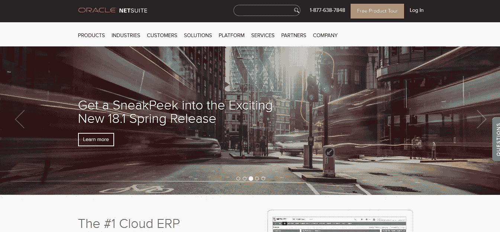

# 在我们实施 NetSuite 的一年中发生了什么

> 原文：<https://medium.com/swlh/what-happened-during-our-year-implementing-netsuite-cb4a29f7869b>

2017 年，我们公司开始了迄今为止最大的系统实施: [NetSuite](http://www.netsuite.com) ，一个企业资源规划(ERP)系统。它花了六个月的时间才开始运作，但是完整的实现持续了一年，因为我们有一些错误和问题需要解决。因为 NetSuite 与公司的所有部门交互，所以将系统上线会影响到每个人。

在实施 NetSuite 之前，我们有一个非常基本的会计系统；它只处理基本的交易，如账单和发票，并生成固定的客户报表、会计报告和财务报表。虽然这是一个很好的创业系统，但我们意识到我们已经超越了它。

我们现在需要一个 ERP，一个将公司的交易从起点到终点，从采购到会计再到销售连接起来的系统。我们希望有一个系统能够将采购订单从创建到审批流程再到计费功能。在 ERP 中，只有当基本的采购订单被批准时，账单才能被支付，允许我们进行更多的控制。

销售方面也是如此，因为客户关系管理系统集成在 NetSuite 的会计模块中。已完成的销售与发票相关联，而发票则直接与财务报表相关联。当系统执行整个过程时，各种步骤被连接并变得更加自动化。请参考 [Netsuite:如何选择最好的 ERP](http://www.growbusinessblog.com/blog/netsuite-how-to-select-the-best-erp) ，了解我们如何选择 Netsuite 的更多信息。

在实施过程中，我们面临许多挑战，也吸取了许多经验教训。这需要做很多工作，但最终还是值得的。然而，有些事情，我希望我事先知道，我们只能通过经验来学习。

[www.netsuite.com](http://www.netsuite.com)

# 监督实施团队

NetSuite 要求我们与外部顾问合作实施我们的 ERP。该团队以适合我们公司的方式设置了模块。首先，他们采访了我们，以了解我们是如何工作的，我们需要什么。然后，他们提出了如何实现每个领域的计划，并开始编程；最后，我们接受了训练。

在整个实施过程中，我们积极参与，并提出了许多问题。然而，我发现很难核实咨询团队正在规划公司需要和想要的东西。直到最后我们才能看到最终的产品，我们也没有太多的时间进行修改。

我意识到只有最终用户知道需要什么。根据我们的经验，我建议不断沟通和更新以获得批准。不要认为最终产品会像想象的那样，因为每个公司都是不同的。

Unsplash

# 准备支付更多

当我们实施系统时，我们发现我们需要增强功能，使系统个性化以满足我们的需求。这些改进花费更多。在我们的例子中，我们决定只完成最初的实现范围。我们想在这个水平上测试这个系统，看看它对我们的效果如何，然后再进行更多的开发。

在使用它几个月后，我们按优先级排列了我们想要的增强，包括自动开票和自动合同生成。因此，我们花了几个月的时间来开发它们。

# 如果可能的话，学习这个系统是如何工作的

在我们的例子中，实现团队让系统运行，但是我们有一个不同的标准，我们想要达到。幸运的是，NetSuite 有一个描述性很强的数据库，任何人都可以从中了解它是如何工作的。我们没有受过专门培训的员工，所以我默认成为了管理员/程序员。

那是非常忙碌的几个月。团队提出了很多要求，对我来说这是一次非常密集的学习经历。我们最终以我们认为对我们最有利的方式对系统进行了编程。学习这个系统是如何工作的有一个隐藏的好处:我看到了我不知道的事情是可能的，然后我能够把它们包含在程序中。顾问不可能像企业主或经理那样了解各自的业务。结果，我们最终得到了一个更好的工作产品，因为我被迫深入参与其中。

Unsplash

# 通过自动化减少错误

ERP 最大的好处之一就是一切都是可定制的。每个模块都有一个屏幕，在 NetSuite 中，我可以定制所有的屏幕，以确保它们满足我们的需求。如果我们需要获取一条信息，我们只需将该字段设置为必填字段，这意味着除非添加电话号码，否则屏幕无法保存。将字段设置为必填字段是自动化的一种形式。

我们还添加了工作流来减少手动步骤，因为它们会根据一组参数自动执行操作。我们公司销售公寓，因此我们的工作流程之一是，当我们选择公寓号时，屏幕的其余部分会显示公寓的大小、位置、会计中心和价格。这个工作流程节省了我们的时间，减少了错误。

# 以用户友好的方式进行设计

过渡到一个新系统可能会非常令人生畏，因此确保系统的界面尽可能对用户友好非常重要。对于系统本身的设计，我们无能为力，但某些调整可以带来很大的不同。一些例子包括:

1.  **使屏幕相似:**如果几个屏幕有重复出现的相同字段，这些字段每次都放在相同的位置。这样，眼睛就知道去哪里，每个屏幕看起来都很熟悉。
2.  **关于字段的帮助:**在 NetSuite 中，我们可以为我们创建的所有字段添加帮助选项。我们正在为所有这些字段添加帮助功能，以帮助新老用户。
3.  **整理报告:**我们公司目前有 80 多份定制报告。由于信息量巨大，我们先按部门，然后按职能对报告进行了分类。这样，他们很容易找到。

# 找管理员

运行 ERP 需要持续的关注，应该由专业人员来管理。我们很幸运地找到了一个伟大的管理员，他也一直在监督我们目前为系统开发的增强功能。这位版主处理团队的培训和需求，这比我们最初预期的更频繁。她还确保 ERP 的工作流程与公司的整体流程保持一致。

Unsplash

在一家公司实施 ERP 系统是一个很大的进步，但也可能是一个非常有益的进步，因为收益远远超过成本。然而，负面影响减少得越多越好。

你有在你的公司实施系统的经验吗？

**相关故事:**

[**为您的公司寻找合适的软件平台**](/swlh/finding-the-right-software-platform-for-your-company-5e9fc2a16c1b)

[**新软件:何时以及如何实施到您的业务中**](/swlh/new-software-when-and-how-to-implement-into-your-business-49e74025e60c)

[**你需要知道的全公司会议的好处**](/swlh/the-benefits-of-company-wide-meetings-you-need-to-know-8bbb4163fe52)

## 这个故事发表在 [The Startup](https://medium.com/swlh) 上，这是 Medium 最大的创业刊物，拥有 326，962+人关注。

## 在这里订阅接收[我们的头条新闻](http://growthsupply.com/the-startup-newsletter/)。

