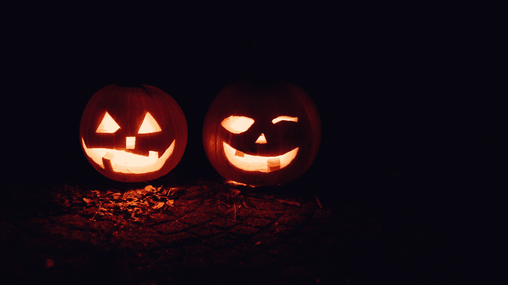

# 当你决定勇敢的时候会发生什么？

> 原文：<https://medium.com/swlh/what-happens-when-you-decide-to-be-brave-6546e6ede4>

## 《南瓜灯》给我们上的勇气课:当你放下恐惧时，伟大的事情就会发生

[Source](http://"two lighted jack-o-lanterns during night time" by Beth Teutschmann on Unsplash)

> “彼得，彼得，吃南瓜的人，
> 有一个妻子，却无法留住她；
> 把她放在南瓜壳里，
> 在那里，他把她养得很好。”