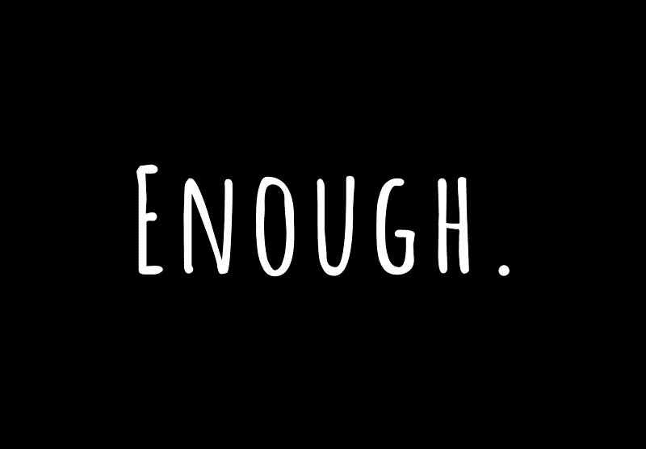
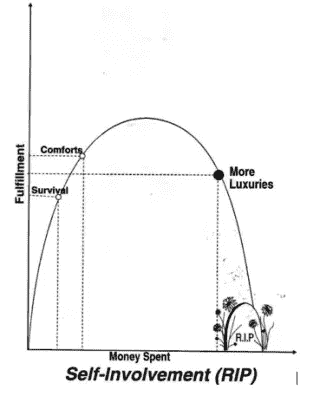
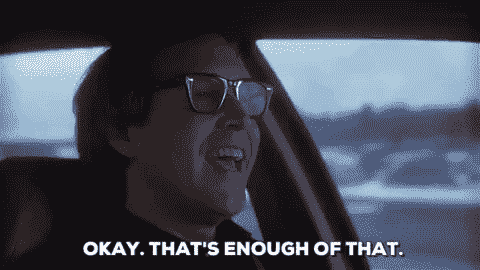

# 在这一生中找到你自己的足够的重要性

> 原文：<https://medium.com/swlh/what-happens-when-you-find-your-enough-in-this-lifetime-65fdc4844aa6>

## 当你认为极简主义是一种饮食时会发生什么

## 极简生活方式对你来说意味着什么？

## 你有没有花时间给自己的'*定义足够的*？

# 极简主义是秘密邪教吗？

近年来，极简主义已经成为一种日益增长的趋势。快速的网上搜索会发现数百个致力于极简主义的博客、视频、书籍和网站。**言之有理。** 在一个物欲横流的消费世界里，人们多少会期望有一种与之相反的生活方式。不幸的是，这正是一些极简主义者的问题所在。他们看不到什么是简约的生活方式。他们没有谈论极简主义的价值观，而是采取激进的方式反对消费主义。

我最近发现了这个 BuzzFeed 视频，标题是“我尝试了一周的极简主义”。仅仅是看了这个视频的标题，我就感到不安。制作视频的女士想尝试极简主义，就像是节食一样。
我决定看视频。开头是这样的:

> “极简主义是一种生活方式运动，用更少的物质物品生活……有整个社区的人都是这样生活的”

将极简主义描绘成一种运动，让它看起来像是一种崇拜。
就像纯素食主义一样，极简主义是一个人根据自己的价值观选择的生活方式。这不是什么很酷的趋势。话虽如此，提高意识并向他人介绍极简主义的概念是很重要的。然而，他们要做什么取决于他们自己。
幸运的是，该视频以一条重要信息结尾:*“我本周学到的是，没有正确的方式来过‘极简’生活。”*

# 极简主义的真正含义

> “极简主义不是剥夺。归根结底，是什么给一个人的生活增加了价值。对每个人来说都是不同的，而且总是在变化。”

这就是出现在上面视频中的极简主义者简单而准确地定义了极简主义。他们继续前进:

> “清理只是第一步。极简主义的真正目的是当我们处于混乱的另一边时，我们所体验到的好处。”

极简主义不是捐出你所有的财产，也不是把你的一生都装在一个袋子里。是的，对一些人来说，这可能是一种“到野外”的生活，但没有一个公式适用于所有人。
**过极简主义的生活方式就是活出自己足够的**。
这是关于支付和只拥有对你有价值的物品**。** 或者如一位极简主义者所说:*“弄清楚* ***你为什么要做*** *。我想我们都知道该怎么做。”*

了解我生活的人有时候会问我:“萨尔，你是极简主义者吗？”对此我的回答是:“不”。因为，老实说，定义并不重要。也许这就是最初让它看起来像一个潮流运动的原因。

# 你的钱还是你的命？

几年前，我读了一本乔·多明格斯和维基·罗宾写的书，书名是《你的钱还是你的生活》*'***'*。1992 年出版，这本书的目标是:*‘转变你与金钱的关系，实现财务独立’。这正是多明戈斯和罗宾要做的。在九个详细的步骤中，他们分享了自己的经历，以及遵循这些步骤的其他人的经历。**

**

*这是我读的第一本也是唯一一本关于金钱的书。我通常不喜欢“如何做”的书，但我喜欢这本书。当我读它的时候，我不禁觉得我已经独自完成了大部分步骤。你可能会问，为什么我一直在读它？首先，它给我提供了新的见解。有些步骤对我来说是新的。其次，阅读我自己已经完成的步骤给了我巨大的信心。知道还有其他人可以与我分享我的旅程，这是一种激励。*

*但是不要相信我的话。以下是你可能听说过的两个人对这本畅销书的评价:*

> *“关于货币时期的最佳书籍。”*-拨款，* [*千年钱*](https://www.cnbc.com/2018/03/07/millennial-millionaires-say-you-should-read-your-money-or-your-life.html)*
> 
> *“这是一本精彩的书。它真的可以改变你的生活。”*——奥普拉**

# *什么是足够的？*

> *需要多少就有多少*

*听起来相当模糊，不是吗？*

*这正是足够的美妙之处。很主观。由个人来决定自己的“所需”是什么。适可而止不一定意味着一无所有。**适可而止是一种微妙的平衡，你必须自己去寻找。***

*花点时间看看下面的图片:*

**

*Taken from the book ‘Your Money or Your Life’*

*在他们的书中，多明戈斯和罗宾用上述满足曲线定义了“足够”。我们看到我们的生存只需要很少的钱。只要多花一点钱，我们就能得到舒适。
现在，仔细看。你能找到曲线的顶点吗？**那峰就够*了。*** 这是曲线最关键的部分。在那之后，随着我们消费更多的奢侈品，满足曲线开始对我们不利。*

> **“如果你不在当下，你要么期待不确定，要么回到痛苦和遗憾。”~金凯瑞**

*我们的成就感远比金钱更有价值。我们都同意这一点，然而我们仍然追逐金钱而不是满足感。为什么？因为只有当我们允许自己去感受时，我们才能意识到自己的满足感。活在当下，与我们的内在联系起来。直面我们的情绪——快乐和悲伤，我们的兴奋和恐惧。我明白了，我越是练习觉知，我的价值观就越清晰。这种精确的清晰度是定义足够的必要条件。一旦我们知道了“为什么”,我们就可以从“如何”开始。*

# *找到你自己的就够了*

**

*下面是我如何找到我的*足够的*——
首先，我开始定义我的生存。我发现我生存所需要的唯一东西就是食物和住所。我开始计算:我能找到的最便宜的租金是多少？我需要哪些基本食物？知道我只需要很少的钱来维持生存，我感到放心了。有许多(简单的)方法来创造那笔钱，因此——我知道我的生存是有保障的。*

*接下来，我必须定义我的舒适是什么。赋予我意义的东西。
真不容易。我必须诚实，把同龄人的压力抛在脑后。首先想到的是有乐器和听音乐的方法。舒适是超越生存的额外一步。每个人都不一样，所以花点时间找到适合你的。计算你的舒适应该花费你多少。坦率地说，它不会比你的生存花费更多的钱。*

*终于，我开始深入挖掘我的*。*
这是个富有挑战性的任务。从我的经验来看，这需要练习。当你在生活中取得进步时，你也需要做一些小小的调整。我做的事情很简单。我一项一项地检查我的开销，并评估它们。
我问自己这个简单的问题:
**如果我增加或减少这个 X 费用，我的满足感会增加吗？**
还是那句话，诚实和清晰是必不可少的。记住**为什么**你要这么做。*

*你可能会发现你在租大房子上花了太多钱，但在艺术上花的钱不够。也许像我的朋友罗杰一样，你会意识到你经常在外面吃饭，但实际上并不喜欢。我决定增加花在音乐会员和现场音乐上的钱。我意识到我支付了太多的租金，住在一个没有给我提供任何满足感的地方，所以我实际上通过搬出去减少了我的租金。*

# *极简主义=够了*

> *“我生命中最喜欢的东西不花钱。很明显，我们所有人最宝贵的资源是时间。”~史蒂夫·乔布斯*

*找到并活出足够的自我是真正的极简主义。它是对“为什么”的信心和“如何”的实践。这是一种理解，任何超出我能力范围的事情都是浪费金钱，因此也是浪费我的时间。
追逐金钱而没有意识到[它只是一个工具](/swlh/why-having-0-is-much-better-than-having-1-15729410c2d1)，是有毒的。它让我们**消耗更多** [**工作更多**](/swlh/nine-to-five-more-like-seven-to-seven-580ebbae47a4) **在重复**。没有真正的原因。一旦你找到足够的钱，你就不再为钱而工作。你已经够努力了。只为了对你有价值的东西。*

*有了我的*足够清晰的照片，*我翻遍了我所有的东西。我把它按照对我的成就感有贡献和没有贡献的项目分类。对你来说，它可能是你再也不会穿的那双多余的鞋子。一条你根本不喜欢的裙子。一张你很少坐的沙发。你可能会得到很多可以捐赠或出售的物品，同样重要的是，找到你忘记的有价值的物品。*

*最后，**极简主义不是最终产品**。这是一种人生选择。一个帮助你关注自己的工具。给你找到满足自己的自由。*

*当我们重视自己的成就时，我们就足够重视自己的价值。那时，也只有那时，我们才真正重视自己。*

*好了，说够了！*

> *如果你觉得那是你想做的，就一起鼓掌👏*

# *感谢阅读！欢迎跟随我。*

* [## 你出生了——你活了下来。现在怎么办？

### 如果我告诉你你出生的那一刻就活下来了呢？此外，如果我说你已经活下来了，当你…

medium.com](/@saaroron/you-were-born-you-survived-now-what-fe277c75e3b9)  [## 朝九晚五？更像是七比七！

### 为什么你可能一天工作超过 12 个小时

medium.com](/swlh/nine-to-five-more-like-seven-to-seven-580ebbae47a4)  [## 有钱，其他都很穷

### 我为千万富翁工作时发生了什么

medium.com](/swlh/rich-in-money-poor-in-everything-else-b849beedbcb) 

## 这篇文章发表在《创业公司》杂志上，这是 Medium 最大的创业刊物，有 317，238 人关注。

## 订阅接收[我们的头条](http://growthsupply.com/the-startup-newsletter/)。

*