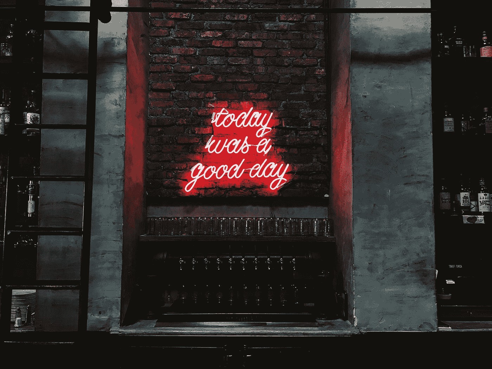

# 当你停止批评时会发生什么？

> 原文：<https://medium.com/swlh/what-happens-when-you-stop-criticizing-b67e70a8a730>

## 停止批评你的工作，你自己，以及其他一切…

[Source](http://"Today Was A Good Day LED signage" by Patrick Tomasso on Unsplash)

很高的要求，对吗？**停止批评**。

作为创意者，尤其是作为作家，我们被灌输了批判我们作品的思想。只允许最好的想法，最清晰，最深刻的报告，最翔实的文章，最好的和最令人回味的诗歌…