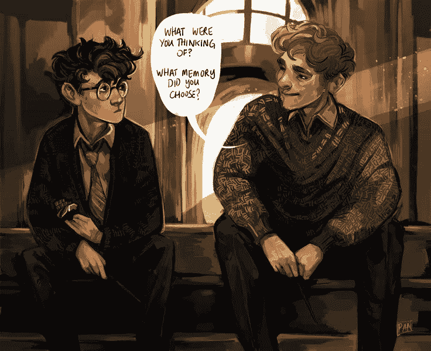

# 《哈利·波特》教会我们如何面对障碍

> 原文：<https://medium.com/swlh/what-harry-potter-has-to-teach-us-about-facing-obstacles-e959b5615bd7>

## 这只是观点的问题

Photo Credit: [Reddit](https://www.reddit.com/r/harrypotter/comments/735y40/not_long_until_the_illustrated_version_of/)

那是一个周日的下午，我放下了由**赖安·哈乐黛**写的《障碍是道路》这本书。经过一周的努力，我终于完成了它。

就在我完成这本书之后，我有了一个*的灵光一现的时刻。这正是著名作家 J.K .罗琳试图通过她的《哈利波特》系列告诉我们的。*

假设你读过《哈利·波特》,你就会知道什么是博格特，并且熟悉 Riddikulus 的魅力。对于那些不熟悉这些术语的人，这里有一个关于这些主题的快速入门。

博格特是一个变形人。它没有自己的身份或形状。当你面对一个幻形怪时，它会变成你最害怕的东西。如果你害怕蛇，那么祝你在面对一只幻形怪时好运，因为当它与你面对面时，它会变成你能想象到的最致命的蛇。

另一方面，Riddikulus 魔咒是一种魔法，可以将一个幻形怪从可怕的形态变成可笑的形态。简而言之，通过施展一个 Riddikulus 咒语，你可以把你的那条最致命的蛇变成一只穿着旱冰鞋的大象。

现在的问题是，所有这些和障碍有什么关系？

*其实很简单，*。

你的障碍就像一个博格特。如果你想从这个角度看，它们可能看起来很可怕。当你意识到他们不是你爬不上去的山，也不是牢不可破的墙时，他们就失去了力量，变成了你路上的一块石头，你可以轻松地跨过。

我们每天都被障碍物轰炸。如果你开始不停地抱怨它们，你实际上是在阻碍自己的进步。不要把你的障碍视为永久的路障，开始把它们视为仅仅是一条弯路。

生活会变得更加容易，目标也可以实现。

我的朋友，这就是你在现实生活中的魅力。可供你无限量使用。想用就用吧。

# 如果你觉得这个故事有帮助，请👏🏻👏🏻👏🏻表现出一些爱。😍

“如何避免‘委员会设计’以及为什么你应该不惜一切代价”作者[@ SimonMcCade](http://twitter.com/SimonMcCade)[https://medium . com/@ SimonMcCade/How-to-avoid-design-by-Committee 以及为什么你应该不惜一切代价-8e8ce78c1058](/@SimonMcCade/how-to-avoid-design-by-committee-and-why-you-should-at-all-costs-8e8ce78c1058)

## 这篇文章发表在 [The Startup](https://medium.com/swlh) 上，这是 Medium 最大的创业刊物，有+366，567 人关注。

## 订阅接收[我们的头条新闻](http://growthsupply.com/the-startup-newsletter/)。

