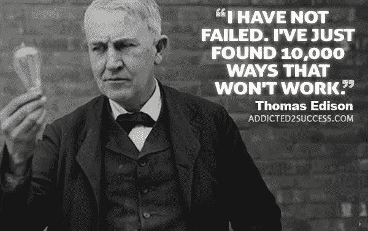

# 高可靠性组织可以教给企业家什么

> 原文：<https://medium.com/swlh/what-high-reliability-organizations-can-teach-entrepreneurs-d4da86d83695>

Photo by [Michael Shannon](https://unsplash.com/@mgshannon?utm_source=medium&utm_medium=referral) on [Unsplash](https://unsplash.com?utm_source=medium&utm_medium=referral)

我都想好了。当谈到创办和运营一家成功的初创企业时，我什么都见过，什么都做过。)。事实上，没有什么比这更偏离事实了。然而，虽然我可能不知道经营一家盈利企业的所有细节，但我知道可以从优秀的经营者身上学到很多东西。

我在医疗保健行业工作了 20 多年，我相信你可以想象，这是一个风险极高的行业。在我人生的这一阶段，我花了很多时间研究最佳实践，并确定如何在我的组织中有效地实施它们。我发现，有时看看医疗保健之外的其他人在不同领域所做的事情是有益的。除了这个概念，我认为企业家研究高可靠性组织(HRO 的)的实践是有价值的。

**什么是高可靠性组织？**

对 HRO 来说，失败是机构、医疗保健或其他职业的先决条件。它们是我们医疗保健行业所追求的理想。一个高可靠性的组织接受灾难无处不在的可能性，同时保持几乎无差错的绩效。他们的日常业务受系统思维方法的驱动和指导，该方法预测潜在的问题，并采取措施来缓解这些问题。

使用这种模式的其他类型的行业包括:荒地消防、空中交通管制和核研究设施。除了开展日常活动之外，他们的主要关注点是风险管理和不惜一切代价避免负面结果。这种超级关注风险的原因是显而易见的——避免生命损失。

尽管风险可能没有那么高，但这种规避风险的方法是有抱负的企业家明智的选择。在开始一项新的冒险时，不熟悉情况的企业家通常充满了大眼睛的乐观主义。虽然这种热情可能是一种必要和可爱的特征，但它不足以确保成功。采用 HRO 氏症所采用的方法和思维方式可以减少潜在的不良后果，并可能极大地提高我们成功的可能性。

**HRO 的特点**

1.  专注于失败:HRO 竭尽全力在风险发生前减轻风险。如果确实发生了负面的事情，他们会分析事件的方式和原因，以确保全面了解起作用的因素。
    同样，初创企业可以利用这种视角帮助他们从挫折中成长，并获得有价值的洞察力。例如，在你启动你的网站之前，明智的做法可能是采取措施确保:适当的搜索引擎优化到位，网站正常运行，免受病毒侵害，等等。如果你的网站出现故障，或者无法吸引流量，你可以像 HRO 一样进行根本原因分析，找出潜在的原因。
    (参见 https://www.process.st/checklist/website-launch-checklist/[的](https://www.process.st/checklist/website-launch-checklist/)伟大的网站清单)。有人可能会说，这种对失败的专注会导致一个紧张的企业家，每天晚上躺在床上睡不着，脑海中浮现出破产的景象。相反，我相信在潜在的问题发生之前主动地清除它们会让你变得更自信，更有准备。

2.**不愿简化**:如果事情没有按计划进行，好好看看事件周围的环境，检查所有可能影响结果的因素。HRO 不认为他们知道答案——他们彻底分析了现有的流程和失败的潜在原因。*系统*作为一个整体在某种程度上失败了；最明显的失败原因不一定是唯一的原因，甚至不是真正的原因。

3.**对运营的敏感性:**这需要全局思维和对所有部分如何组合的理解。你的企业的运作，无论模型多么简单，仍然是复杂的，受许多因素的影响。HRO 了解事件(好的或坏的)发生的背景，以及组织的一部分可能会无意中影响到另一部分。

4.遵从专业知识:我越来越意识到这一点的重要性。我不知道如何做好经营一家企业所需的所有事情，坦白地说，这将浪费我的时间和相当大的天赋(笑话！)去尝试和学习所有这些东西。输入专家。HRO 知道，每天在战壕和前线做这些事情的人能够最好地提供建议:a)哪里有地雷，b)哪里有机会。(顺便说一句，我正在寻找一个便宜但可靠的网站开发商……)

5.“系统”的不可预测性需要计划。HRO 的*假设*系统总是处于危险之中；他们不断地监控和评估。类似地，初创企业(以及已建立的企业)明智的做法是接受他们所处系统固有的不可预测性，并为预期结果的不可避免的差异准备好应急措施。不是“如果”而是“什么时候”某件事会发生。

这里的警告是要保持客观。HRO 模式是一种商业工具，而不是生活工具。我认为我们在生活中已经有足够多的焦虑，不需要用 HRO 的思维模式来构建我们的世界观。在我们的日常生活中，我们不能总是等着另一只鞋掉下来。如果我们这样做，我们最终可能会穿着泡沫塑料，住在破旧的避难所里。

高可靠性的创业并不是一种真实的状态，而是你不断努力的目标。每个企业都是不同的，没有适合所有人的成功秘诀。然而，我们可以利用这些 HRO 原则来帮助奠定成功的基础。预见到问题是有好处的，这样我们就可以为它们制定计划；但是我们不能计划所有的事情。如果事情发生了，它会发生的，那也没关系。我们将奋起应对，并因为这次经历而变得更加强大和明智。

**参考文献**

魏克和苏特克利夫(2007 年)。管理意外:不确定时代的弹性表现(第二版。).加利福尼亚州旧金山:乔西-巴斯。Rochlin，G.I. (1999)。作为社会建构的安全操作。人体工程学，1999 年，第 11 卷
[https://www . joint commission . org/high-reliability _ health _ care _ getting _ there _ from _ here/](https://www.jointcommission.org/high-reliability_health_care_getting_there_from_here/)

 [## 高可靠性| AHRQ 患者安全网络

### 高可靠性组织是在复杂、高风险领域长期运营的组织…

psnet.ahrq.gov](https://psnet.ahrq.gov/primers/primer/31/high-reliability) 

## 这篇文章发表在 [The Startup](https://medium.com/swlh) 上，这是 Medium 最大的创业刊物，有 309732+人关注。

## 在此订阅接收[我们的头条新闻](http://growthsupply.com/the-startup-newsletter/)。

