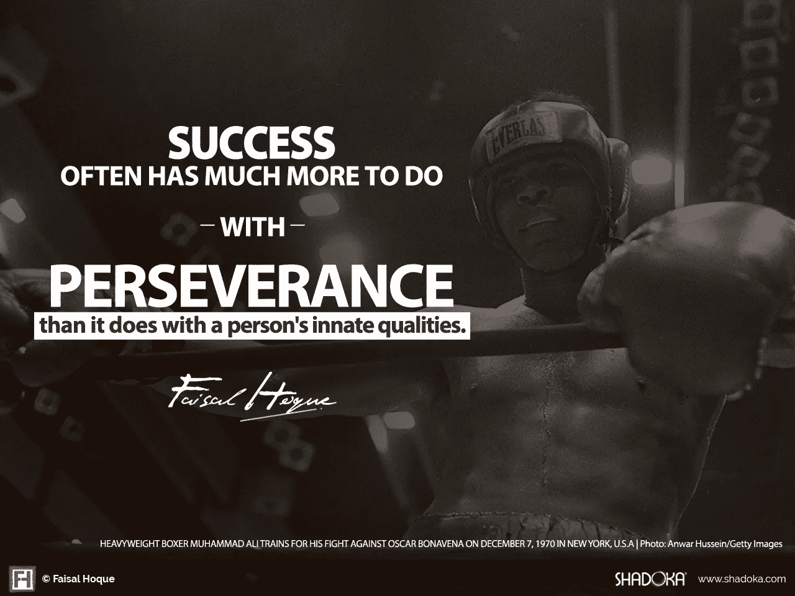

# 成功人士对毅力的理解是什么

> 原文：<https://medium.com/swlh/what-highly-successful-people-know-about-perseverance-f047b3e911de>

[Image: Shutterstock]

## 成功往往更多地取决于毅力，而不是一个人与生俱来的品质。

当穆罕默德·阿里被问及他是否喜欢训练时，他回答说:“我讨厌每一分钟的训练，但我对自己说，‘不要放弃，现在受苦，作为冠军度过你的余生。’“阿里通过推自己来准备比赛，不管有多疼。这是每个意志坚强的人在试图完成困难的事情时都会做的事情。他们奋力穿越障碍，并且不放弃。

成功往往更多地取决于毅力，而不是一个人的先天素质。这并不是说天赋不重要，只是说没有牺牲和努力，天赋也就到此为止了。

在他的书《船上的男孩》中，作者丹尼尔·詹姆斯·布朗讲述了 9 个斗志昂扬的西雅图工人阶级在 1936 年奥运会上赢得赛艇金牌的故事。回顾成为世界级船员团队的一员所付出的努力，Brown 引用了造船者 George Yeoman Pocock 的话:

> “很难让船跑得和你想的一样快。当然，敌人是水的阻力，因为你必须排出相当于人员和设备重量的水，但正是水支撑着你，而敌人是你的朋友。生活也是如此:你必须克服的问题也会支持你，让你在克服这些问题时变得更强大。”

阿里和 1936 年美国赛艇队并不孤单——他们的经历不仅仅在体育领域占据主导地位。历史上充满了在最终成功之前反复失败的人。即使是西奥多·盖泽尔(苏斯博士饰)，他最著名的书《戴帽子的猫》也被拒绝了 27 次，直到出版商终于给他一个机会。现在，他的书已经出版了超过 6 亿册，广受喜爱。

如果你在没有安全网的情况下独自出发，试图成就一番伟业，你需要准备好坚持不懈。

## 狩猎(最终)会有多好

当我在大学的时候，我对 1997 年的大片《心灵捕手》有一种特殊的亲近感。那是因为，就像马特·达蒙扮演的主角一样，我的工作是夜班看门人。

这部电影讲述了一群来自南波士顿的朋友艰难度日的故事。其中一个人，威尔·亨特，是个天才——一个给麻省理工学院的教员留下深刻印象、羞辱哈佛研究生、拒绝国家安全局工作邀请的家伙。虽然这部电影讲述的是杰出的头脑如何在传统系统和机构之外工作，但它是如何获得的故事也为局外人的成功提供了类似的教训——以及实现成功有多么困难。

达蒙 1993 年在哈佛上的一门戏剧写作课开始写剧本，后来寻求本·阿弗莱克的合作。当时，两人都是马萨诸塞州的剑桥人，都是在洛杉矶苦苦挣扎的演员。他们一起制作《心灵捕手》的主要目标之一是给自己突出的表演角色。“我们从来不在乎钱——我们想演电影。那是我们唯一的东西。这是我们的大问题，”马特·达蒙后来告诉《T2》杂志。

在他们的经纪人向镇上的每一家工作室兜售剧本后，他们发现自己陷入了一场不太可能的竞购战，然后才拿下了他们的首选工作室，电影巨头城堡石娱乐公司。但不久之后，达蒙和阿弗莱克开始就谁将执导这部电影与电影公司发生冲突。他们被告知，要么找一家不同的工作室购买版权，要么彻底失去在该工作室演出的机会。

离开他们的愿景根本不是一个选项。他们回到了之前表现出兴趣的工作室，却发现他们都成了贱民。早些时候为剧本拼了命的制作公司现在只是和他们见了面，告诉他们可以忘记曾经得到过协议。

当米拉麦克斯最终提出报价时，他们觉得这是一个奇迹。尽管如此，在接下来的四年里，达蒙和阿弗莱克继续努力，因为该项目一再停滞不前——最终就导演(格斯·范·桑特，当时相对不为人知)达成了协议，面临剧本重写、选角问题以及好莱坞制作中常见的其他一系列延迟。

1997 年，已故的一线喜剧演员罗宾·威廉姆斯(Robin Williams)出演了一个联合主演的角色，从而敲定了这部电影的制作。

1998 年上映后，《心灵捕手》一炮而红，获得了 9 项奥斯卡提名，全球票房达 2.26 亿美元。威廉姆斯获得奥斯卡最佳男配角，阿弗莱克和达蒙获得奥斯卡最佳原创剧本。年轻的剑桥人成就了他们的事业:《谍影重重》、《十一罗汉》、《逃离德黑兰》——所有这些后来的事业成就都是建立在付出了巨大努力才取得的最初成功的基础上的。

达蒙和阿弗莱克相信他们的梦想，尽管有如此多的障碍，他们仍然忠于最初驱使他们的激情。达蒙后来回忆道:

> “第一天，我记得我们开始哭了，因为这是罗宾(威廉姆斯)和斯特兰(斯卡加德)之间的一场戏。当格斯(范·桑特)喊开拍时，我们看着这些家伙——我是说，多才多艺的演员——一字不差地完成我们的场景，我们等这一刻已经等了很久了。我记得我坐在本旁边，眼泪顺着脸颊流下来，因为我太高兴了，因为这一切真的发生了。”

## 为了繁荣而生存

成功从来都不容易。但是无论发生什么，我们都有责任保持与我们核心意图的联系。阿弗莱克和达蒙就是这么做的。

障碍和挫折应被视为增长和发展的挑战或机遇。失败——以及我们应对失败的方式——是人生旅程的一个重要方面。它创造了无数的机会来重新思考我们的下一步，可能会导致一些比我们最初想象的更好的事情。

我们最大的成就很少与我们是谁有关。更重要的是我们克服了什么，以及如何克服。没有人会把我们的命运交给我们。我们必须每天早上起来创造它。

**原创文章@**[**【faislhoque.com】**](http://faisalhoque.com/2015/08/07/what-highly-successful-people-know-about-perseverance/)**和**[**@ fast company**](http://www.fastcompany.com/3049327/lessons-highly-successful-have-learned-about-perseverance)**。**

***版权 2018 作者费萨尔·霍克。保留所有权利。***

我是一名企业家和作家。沙多卡和其他公司的创始人。Shadoka 促进企业家精神、增长和社会影响。著有《万物互联——如何在创意、创新和可持续发展的时代进行变革和领导》、《生存与繁荣:弹性企业家、创新者和领导者的 27 种实践》等书籍。在推特上关注我 [@faisal_hoque](http://twitter.com/faisal_hoque) 。