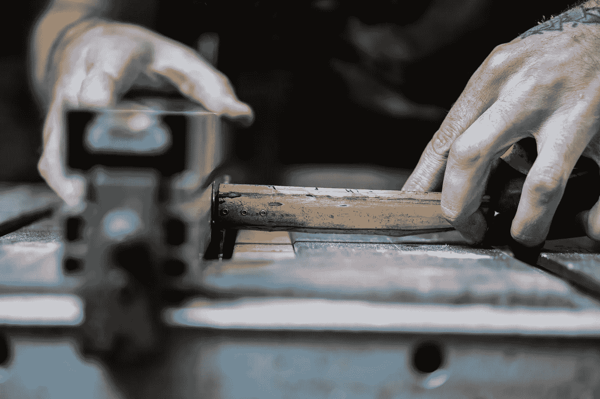

# 我从发现和痴迷地追随我的激情中学到了什么

> 原文：<https://medium.com/swlh/what-i-learned-by-discovering-and-obsessively-following-my-passion-3f454bc3d0fd>

## 你可以采取切实的步骤来揭示你的人生目标。

Photo by [Tim Marshall](https://unsplash.com/photos/cAtzHUz7Z8g?utm_source=unsplash&utm_medium=referral&utm_content=creditCopyText) on [Unsplash](https://unsplash.com/search/photos/passion?utm_source=unsplash&utm_medium=referral&utm_content=creditCopyText)

我一生中经历了许多起起落落。

**到目前为止:**

*   我见过许多我生命中的英雄——乔·罗根和戴夫·沙佩尔
*   我已经能够写我喜欢写的文章，甚至能够通过出售[我的第一本电子书](https://www.tribeloyal.com/take-whats-yours-store/)来补充我的一些收入。
*   我有一个很棒的女朋友，她对我很好，还鼓励我努力工作(当然是以好的方式)。
*   我有一个了不起的支持我的家庭，它激励我去追寻我的梦想。
*   由于饮食(生活方式)的改变和我的拳击教练的训练，我现在处于人生中最好的身体和精神状态。

**至于坏的方面:**

*   我被解雇了，失去了我曾经热爱的工作。
*   多次被恋人劈腿离开。
*   我已经无家可归一夜了。
*   我睡过朋友的地板和沙发。
*   我曾有过不确定自己是否有能力支付房租的时候。
*   我已经超重 30 磅，经常抽烟，一次喝几个月才能睡着。

在我成年后的大部分时间里，我都不知道自己在做什么。我在尝试不同的兴趣。当我了解到生活的一个新的方面时，我感到非常失望。我一次又一次地犯错误，这也许会让我从某种程度的“成功”中倒退。

大约两周前，我给我的订户名单发了一封电子邮件。

我很好奇我的追随者在做什么。我想知道他们经历了什么样的痛苦和挣扎。

Photo by [Sherman Yang](https://unsplash.com/photos/QoMzbNiTApY?utm_source=unsplash&utm_medium=referral&utm_content=creditCopyText) on [Unsplash](https://unsplash.com/search/photos/labor?utm_source=unsplash&utm_medium=referral&utm_content=creditCopyText)

*   如果他们在博客或项目上工作，他们面前有什么障碍？
*   如果他们致力于身体健康，他们会面临什么样的挑战？
*   如果他们致力于他们的精神健康，是什么样的恶魔在盯着他们？

我收到了一封来自我的一个追随者的电子邮件，他发给我一些让我思考的东西。

他面临着巨大的挑战。看完邮件回复后，我所能做的就是坐回到椅子上，静静地思考一会儿。下面是我们电子邮件交流的片段(希望他不会因此杀了我……)

> “……阅读像你这样有影响力的人，我发现最重要的一件事是追随你的激情(目标)，然后让饥饿接管一切。接下来是关于如何实现你的目标，你热爱的事情的内容。
> 
> 我面临的挑战是，我要快乐、满足、平和，与我的妻子分享爱的关系，我们一起旅行和享受… **但我找不到我的激情或目标。我意识到我没有那些远大的梦想，我一直是一个缺乏野心的简单的小家伙。过早退休后，我有时会觉得自己在享受一种近乎涅槃的生活，一种简单快乐的生活，尤其是当我看到周围的人都在紧张、挣扎和承受真正的痛苦时。**那么，我如何找到我的激情呢？**目前，我只是装装样子，通过大量锻炼来保持健康和快乐……”**

在写这篇文章之前，我思考了这个问题一个多星期。我想即使把它分解，我还是会反复思考如何完全找到你的激情，这将需要一生的时间来完全找到一个精炼的答案。

在分解这个问题时，我将通过我自己寻找**我的激情的经历来说很多——写关于如何改善他们的生活的文章，与他们交谈，向他们学习，并教他们如何成为一个设计好的生活的建筑师，这种生活是你喜欢的，并极大地激励了你。**

> 在每个部分之后，你会看到**行动点**你可以在生活中采取切实的步骤来发掘你潜在的激情。

# 注意你的兴趣。

> "一个人会为自己的利益而斗争，而不是为自己的权利而斗争。"
> 
> —拿破仑·波拿巴

这听起来可能是陈词滥调或者过于简单，但是，我真的相信这是发现你生活激情的基础。

我正试图和我的室友和最好的朋友一起剖析这个问题。我们谈论了很多关于生活和批判性的思考，关于主人公的旅程以及我们如何将它反映到我们自己的生活中。我们已经认识好几年了。

他告诉我一些最小的兴趣爱好，并回忆起大约 6 年前我们在波士顿做室友的时候。我会在当地的 Barnes & Noble 商店度过我所有的周末，并把它作为我的个人图书馆。我会去那里几个小时，只是阅读。我不会买这本书，我会在看完之后把它放回书架，并写下我读到哪一页了(见鬼，那时候时间很紧。我甚至买不起 15 美元的书。

Photo by [Thought Catalog](https://unsplash.com/photos/SqAcgMAWIaM?utm_source=unsplash&utm_medium=referral&utm_content=creditCopyText) on [Unsplash](https://unsplash.com/search/photos/reading?utm_source=unsplash&utm_medium=referral&utm_content=creditCopyText)

## 我当时没想太多我在做什么。

我还从巴诺书店买了一本个人日记。我记得我第一次参赛是在 2013 年的复活节周日。我仔细思考了我脑子里的想法。还是那句话，没多想。

我发现简单地阅读和写作是令人愉快的。

对我来说，阅读就像是与我们这个世界上有史以来最伟大的一些人边喝咖啡边私下交谈。

我喜欢过去的时光。

随着时间的推移，我开始尝试不同的东西。我找了份工作，然后被解雇了，我参加了即兴表演班，我认识了新的人，生活开始稳定下来。每当事情变得棘手时，我会翻开一本新书来获得灵感。

很明显，我想加入这个由作家、思想家、实干家和创造者组成的团体。这些年来，这开始成为我的激情。

从你行为的最细微层面来看，你喜欢如何度过你的时间？

我有一个朋友，他的爱好是骑自行车和赛车。我有一个朋友，他喜欢购买廉价服装，修改后转手获利。我最好的朋友喜欢与人深入交谈，找出他们的驱动力。

这里没有错误答案。

## 采取行动:

在一张纸上写下你的兴趣所在。

不要用这一步来审查自己——如果你的脑海中出现了什么，你可能在某种程度上喜欢这个活动。

写下大约 10-15 件事情。

在你拿到一份新的清单后，开始从最不喜欢的到最喜欢的。给你认为最喜欢参加的活动打 1 分。

把这个列表贴在你卧室的墙上或者冰箱上。

在接下来的一周里，每当你参与其中一项活动时，在表格上的活动旁边做一个计数标记。

**我们是我们一天中所做的行为和决定的产物。**通过这次活动，你将会看到你的兴趣所在。

# 后退一步才能前进两步

> “你必须为实现梦想而奋斗。你得为此牺牲和努力。”
> 
> —莱昂内尔·梅西

当我刚从大学毕业时，为了美元的诱惑，我放弃了自己的兴趣。

获得商学学位后，我接受了第一份工作，在一家刚刚度过创业阶段的公司工作，并开始赚大钱。

我向根本不关心我的人推销我不相信的产品。

我在我的团队中赚了最多的钱，并在做这笔交易，不管它是否能真正解决客户的问题——**我真的只是关心它是否能解决我的问题:增加我支票账户上那个永无止境的数字。**

现在回想起来，有趣的是我对这一切是多么的盲目。

我的优先顺序都乱了。

> 我追求的是权宜之计，而不是有意义的事情。

Photo by [Andre Hunter](https://unsplash.com/photos/5otlbgWJlLs?utm_source=unsplash&utm_medium=referral&utm_content=creditCopyText) on [Unsplash](https://unsplash.com/search/photos/frustrated?utm_source=unsplash&utm_medium=referral&utm_content=creditCopyText)

它最终找上了我，我突然被解雇了。我说“突然”是因为它发生得太快了，然而，这是显而易见的。我没有尽我所能表现好，因为我不相信我的工作，这最终影响了我。

我被解雇后，找到了一份服务员的工作。我在马萨诸塞州剑桥的一家高级餐厅工作。我爱上了食物和酒。我重新和人们联系上了。我与作为一名服务员的耻辱作斗争，而不是工作和促进我的职业生涯。

可笑的是——这种牺牲让我重拾了激情。在餐馆工作，遇见有趣的人和发现有趣的食物让我更接近真实的自己。当然，这不是写改变生活的书，但这比卖一个我毫不在乎的产品要好。这也给我的时间安排带来了更多的自由，所以我可以读更多的书，写更多的东西。

## 采取行动:

你现在能做出什么样的短期牺牲，让你有更多的资源去追求有意义的事情？

在他的书*中，4 小时工作周* [*蒂姆·费里斯*](https://medium.com/u/56d3bc91794f?source=post_page-----3f454bc3d0fd--------------------------------) 阐述了在给定时间内工资和赚钱的机会成本。如果你一年挣 10 万美元，而你一周要花 80 个小时才能挣到，那么如果你一周工作 40 个小时才能挣到 5 万美元，那么你在工作时间内的购买力是差不多的。

仅仅因为你挣了 10 万美元并不意味着你完全富有或富裕，甚至是“成功的”在赚钱的过程中，你在以什么方式自杀和浪费你的宝贵时间？

这可能是最可怕的行动之一，让你的生活向设计敞开，然后实现你的激情，以及你如何利用它来催化生活，然而我相信这是最重要的。

*   你能通过成为拼车司机来补贴你每月的一些开销吗？
*   你能在周末做一到两个轮班的服务员来帮助积累你的积蓄吗？
*   你能在诸如 Fiverr 或 Etsy 这样的网站上自由创作一些你的才华吗？

如果你真的想发掘并建立你的激情，你需要牺牲现在容易的东西，去做以后有意义的事情。

# 重建你的社区和环境

> “你是和你相处时间最长的五个人的平均值。”
> 
> ― **吉米·罗恩**

我清楚地记得在我回来聆听和跟随我脑海中的声音之前，我的生活是什么样的。

*   我在抽烟。
*   我在做一份我讨厌的工作。
*   我在和我不在乎的人约会和睡觉。
*   我和我不喜欢的人是“朋友”。
*   我喝得烂醉如泥。
*   我压力很大。
*   我漫无目的。

所有这一切都是因为我构建周围环境的方式。

如果太多的噪音淹没了激情，你怎么能听到它从你的灵魂中发出？

每天早上，在你打开卧室的门，把自己暴露给周围的世界之前，你的脑海中会有那个声音——那个尖叫着让你跟随它的声音。

如果你因为前一天晚上喝了酒而迷迷糊糊地醒来，你就听不到了。

如果你在一个你不在乎的人身边醒来，你就听不到了。

如果你吃的是垃圾食品，你的大脑会模糊不清，你听不到。

如果你的生活中有人总是抓着你帮他们，让你给他们东西，你不会听到的。

听着那个声音，你的头脑会变得非常平静。它需要清晰和敏锐的焦点。外面世界的繁文缛节通常过于喧闹，会抑制你的激情。

## 采取行动:

拿另一张纸，填写你生活中最亲密的 10 个人的名字——我指的“亲密”是指关系的深度，而不是接近程度。

填完这个列表后，在名字的右边再画两列。在一栏写下“这个人的优点”，在下一栏写下“这个人的缺点”，然后写下你觉得这个人在你的生活中给了你什么，无论是正面还是负面。

虽然这个练习可能非常困难，但它确实能让你大开眼界。

Photo by [Nina Strehl](https://unsplash.com/photos/Ds0ZIA5gzc4?utm_source=unsplash&utm_medium=referral&utm_content=creditCopyText) on [Unsplash](https://unsplash.com/search/photos/community?utm_source=unsplash&utm_medium=referral&utm_content=creditCopyText)

**记下这两栏后，你会开始清楚地看到哪些人在你的生活中做出了积极的贡献，哪些人可能在拖你的后腿。**

尽管这可能很难，但与消极的人保持距离将有助于消除你周围的静态噪音，让你专注于培养你潜在的激情。

**你也可以对你的周围环境这样做:**

*   你公寓/房子里的哪些房间对你的情绪有积极/消极的影响？
*   你的工作对你的进步有什么帮助，又是什么阻碍了你？
*   你觉得哪些食物会降低你的能量水平，哪些食物有助于积极地为你的大脑和身体补充能量？

虽然你要投入开发激情的大部分工作来自于你思想和灵魂的内部力量，但外部刺激也起着关键作用——确保你尽可能恰当地控制外部刺激。

# 关键要点

找到你的激情有时可能极其困难。

也许你在生活中追逐的是错误的“胡萝卜”。也许你还没有批判性地思考过，如果你听从那个召唤你的声音，你的生活会变得多好。有可能你甚至害怕告诉世界这个特定的活动是让你快乐的。

不管什么原因，有时你可能会感到绝望。

以我的经验来看，我发现我生活中有一些关键的方面需要考虑和改变，以培养和激发我的激情。

## 盘点我的兴趣:

如果我喜欢做某事——那可能是有充分的理由。

我不应该仅仅因为报酬不高或者社会认为我喜欢它是愚蠢的，就压制给我带来快乐的东西(讨厌的人会讨厌)。

如果我不知道我一定喜欢做什么，记下你一天做了什么，并在几周和几个月内复合。你将开始看到你从事什么行为，并构成你的大部分时间。

## 牺牲眼前的欲望来换取延迟的满足:

有时候你需要牺牲金钱来换取让你更快乐的东西。

如果你在一份工作中，你要么对自己重复这句话，要么在社交媒体上发布这句话:*“我讨厌星期一”*，你可能需要重新评估你在工作中做了什么。

金钱是用数字来衡量的——数字永无止境。快乐和成就感是可以感受和体验的——追随你的激情可以帮助你体验所说的快乐。

*   也许你需要辞掉工作，在经济上退一步，这样可以腾出时间来追随你的兴趣。
*   你可能需要接受一份不如传统职业道路上的工作那么光荣的工作。
*   为了额外的工作，你甚至需要牺牲周末的游戏。

最终这是值得的。

## 优化您的社区和环境:

你是周围环境的平均水平，也是你让进入你生活的人的平均水平。

这些人要么会帮助你，培养你的激情，要么会与你作对(一个对你的生活和激情漠不关心的人就是在与你作对)。

*   你周围都是优化的食物吗？
*   你在消费优化内容吗？
*   你在优化你的睡眠吗？
*   你在优化你的对话吗？

以上所有的总结最终形成一个公式，帮助你激发你的激情。

你最近在忙什么？

如果你能够实现它，你的激情是什么？

## 我很乐意就此展开讨论，并说出我完全错误的或者可能被忽视的想法。

# 还有谁想自己当老板？

## 我提供给你一个经过测试和验证的 6 部分指南，它包含了强大的概念，可以帮助你识别、规划、成长和完成你的创造性追求。

# [> > >在这里获得免费指南< < <](https://mailchi.mp/4b982beed325/free-6-step-course)

## 学到了什么？按住👏说“谢谢！”并帮助他人找到这篇文章。

## 还评论！你喜欢什么？你讨厌什么？你在做什么？

## 这篇文章发表在《T4》杂志《创业》(The Startup)上，这是 Medium 最大的创业刊物，拥有 337，320 多名读者。

## 在这里订阅接收[我们的头条新闻](http://growthsupply.com/the-startup-newsletter/)。

