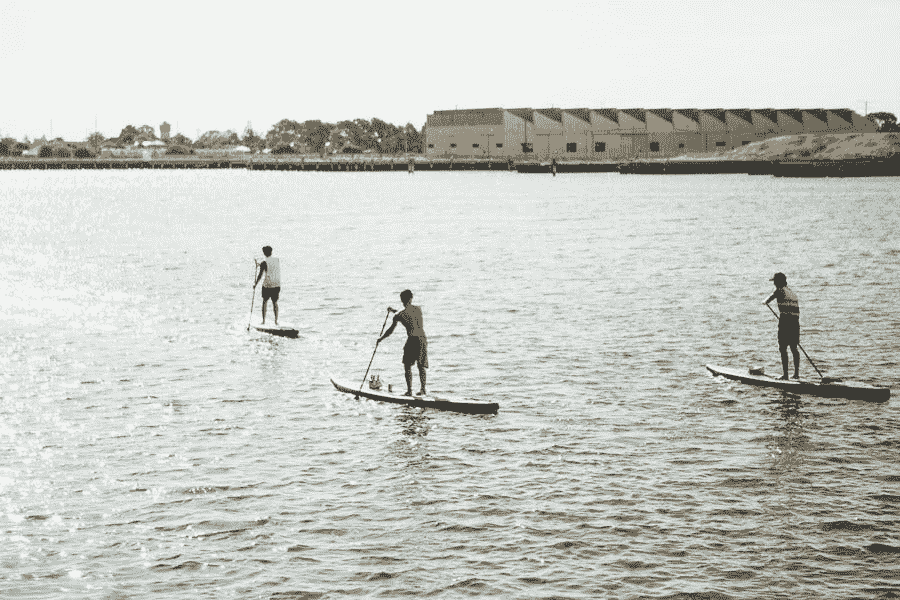

# 我从成立写作小组中学到了什么

> 原文：<https://medium.com/swlh/what-i-learned-by-starting-a-writing-group-8d3ef7abaf2f>

Photo by [Genevra Siciliano](http://siciliano.photo). Port River, Adelaide.

> *最简单的就是反应。第二简单的是回应。但最难的是发起。”*–塞思·戈丁**

*为了衡量我的家乡南澳大利亚阿德莱德的一个作家团体的兴趣，我在社交媒体上做了一些试探。我很高兴收到比预期更多的兴趣。在最初举手的人中，70%的人给我发了电子邮件。在这个范围内，一半人回答…*