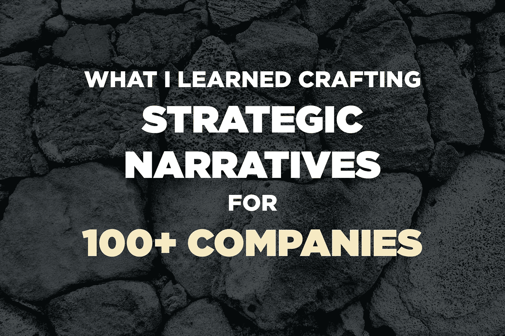
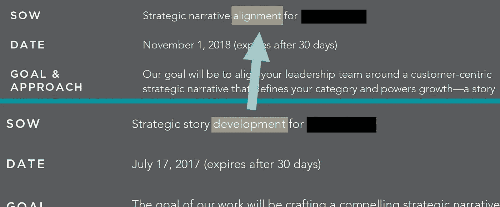

# 我从为 100 多家公司精心制作战略叙事中学到了什么

> 原文：<https://medium.com/swlh/what-i-learned-crafting-strategic-narratives-for-100-companies-67e1c94fba67>

## 帮助首席执行官围绕一个故事组建团队的 5 条经验

Photo by [Kristen Sturdivant](https://unsplash.com/photos/8Fer_szW-i4?utm_source=unsplash&utm_medium=referral&utm_content=creditCopyText) via [Unsplash](https://unsplash.com/search/photos/rock?utm_source=unsplash&utm_medium=referral&utm_content=creditCopyText)

The most Japanese of Japanese proverbs, to my mind, is “Three years, even on a rock” (石の上にも三年). The literal meaning is that even a stone is worth sitting on for a long time because it will eventually heat up. In other words, persistence begets rewards.

三年多前，我坐在一块名为“帮助首席执行官围绕一个战略故事调整团队”的岩石上，仍然有很多寒冷的时刻。每当我开始与首席执行官和领导团队的新合作时，我都会感到紧张:我真的能够让这些聪明、有动力的人围绕一个简单而有力的故事吗？

但总的来说，岩石变得更温暖了。现在，几乎每天都有一位首席执行官对我说，“我已经意识到，我们成功的一个重要因素将是我们如何讲述这个故事”或类似的话。我和全球的领导团队一起工作过，从他们身上学到了什么有效，什么无效。

几周前，我的咨询客户数据库(大多是风投支持的初创公司)收录了 100 家公司，所以我觉得现在是时候反思一下我迄今为止学到的东西了。以下是五大问题:

# #1.关于信息传递的对话实际上是关于战略的对话。

如果你从一开始就关注我，你可能还记得两年前我在[为 15 家初创公司](/firm-narrative/what-i-learned-crafting-messaging-for-15-startups-32222636b654)撰写信息时所学的完全相同的观点。但这仍然是我最大的学问，所以我又把它叫出来了。

想一想:战略是如何沟通的？你可以写下复杂的计划或画出波特著名的五种力量的示意图，但这些东西无法在一个大组织中传达。最终，获得战略一致性的唯一方法是用一个简单的故事。我仍然认为安德森·霍洛维茨基金的本·霍洛维茨说得好:

> “公司故事就是公司战略”
> 
> —本·霍洛维茨

# #2.销售叙事是核心叙事。

在我职业生涯的早期，我是许多信息和定位工作的接收端，一旦顾问离开大楼，这些工作就束之高阁。它通常以定位陈述(“对于有问题 X 的客户，我们的产品 Y 是……”或一般定位陈述的形式交付。这些定位资产本应引导信息传递的所有其他内容——首席执行官的主题演讲、销售资料、网站文案、内容等。—但它从来没有这样工作过:定位资产与我们必须构建的资产相差太大。

一年多以前，我决定放弃定位资产，将销售资料作为我的战略叙事活动的主要工具。这是一个冒险的举动:不是每个首席执行官都认为他或她应该为撰写销售演示文稿而烦恼。(当然，许多销售人员讨厌使用它们。)

但事实证明这是一个伟大的决定。销售叙事(正如我在[我见过的最伟大的销售套牌](/the-mission/the-greatest-sales-deck-ive-ever-seen-4f4ef3391ba0)中所定义的)包含了故事的所有“片段”。当你做对了(在实际的销售电话中测试和提炼之后)，你的网站信息、内容主题——甚至你的投资者资料——实际上就来自于此。即使是从不使用套牌的销售人员也可以学习其叙事流程，以更好地创造紧迫感和参与度。

当一个团队告诉我，他们的首席执行官没有时间牵头起草销售陈述时——即使有我的帮助和他们领导团队的支持——我也会礼貌地拒绝参与。

# #3.对齐是最难的部分。

三年前，我认为我最有价值的技能是把复杂的想法浓缩成简单的故事。虽然这很重要，但我知道首席执行官们更看重的是让他们的团队参与进来。一家旧金山科技公司的首席执行官上个月告诉我，这家公司已经获得了 5600 万美元的风险投资。

> 我意识到我们需要一个故事，所以我写了一个我认为很好的故事。但是我的销售副总不喜欢，我就给他改了一点。但是后来我的营销副总不喜欢，我只好给她换了。我意识到困难的部分是校准，而不是制作。这就是我打电话给你的原因。

在过去的一年里，我从许多首席执行官那里听到了这种观点，因此我改变了对自己参与提案的描述:

# #4.客户输入不是可有可无的。

我早期犯的一个最大的错误是让客户访谈变得可有可无。毕竟，我所在的团队拥有数百万美元的收入。他们的领导人难道不是客户足够可靠的代理人吗？

我知道答案通常是否定的。即使团队已经进行了客户访谈，他们通常也会询问客户对公司和/或其产品的看法。为了构建一个真正推动紧迫感的故事，我们必须将焦点转移到*客户生活中正在发生的事情*:什么样的变化会带来风险？

今年早些时候，在下面的帖子中，我分享了我为构建叙述而向客户提出的问题:

 [## 为什么伟大的推销来自客户

### 确定他们购买原因的 5 个问题

medium.com](/firm-narrative/why-great-pitches-come-from-customers-7fa822266631) 

# #5.战略叙事可以成为强有力的执行工具。

在过去的几个月里，几位首席执行官问我们是否可以将我们的合作扩展到*之外的*叙事技巧和协调。正如有人所说:

> 现在我们已经围绕这个故事达成一致，你能帮助我们实现它吗？

因此，如果“故事就是策略”，它应该是执行的指南。明年，我将与这些首席执行官一起工作，看看我如何支持他们实现这个故事，不仅是在销售和营销方面，还包括产品、招聘和筹资。当岩石在那周围升温时，我会回来报告，

***关于安迪·拉斯金:***
*我帮助首席执行官们围绕一个战略故事调整他们的领导团队——在销售、营销、筹款、产品和招聘方面取得成功。客户包括安德森·霍洛维茨、KPCB、GV 和其他顶级风险投资公司支持的团队。我还在 Salesforce、Square、优步、Yelp、VMware 和 General Assembly 领导过战略故事讲述培训。欲了解更多信息或取得联系，请访问*[*http://andyraskin.com*](http://andyraskin.com)*。*

## 这篇文章发表在 [The Startup](https://medium.com/swlh) 上，这是 Medium 最大的创业刊物，拥有+393，714 名读者。

## 在这里订阅接收[我们的头条新闻](http://growthsupply.com/the-startup-newsletter/)。

