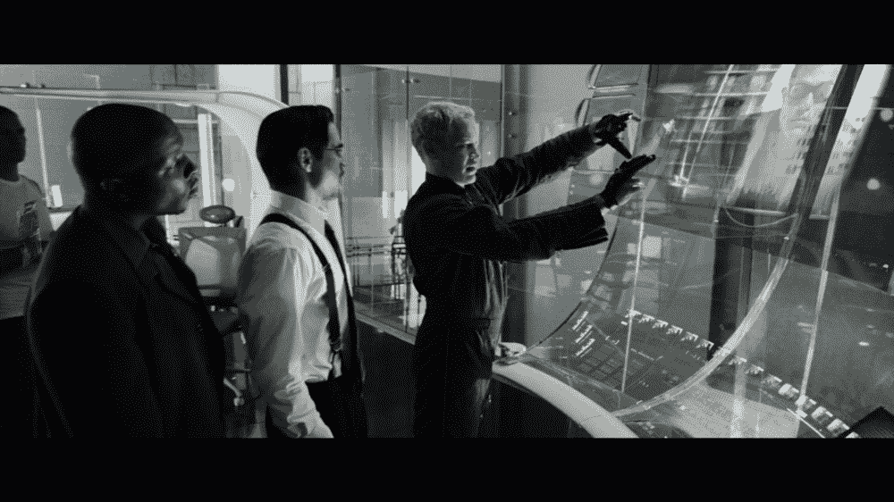

# 我从美国宇航局的混合现实设计中学到的

> 原文：<https://medium.com/swlh/what-i-learned-designing-for-mixed-reality-with-nasa-d6332965513a>

## 来自一个研究生项目的教训

Photo by [TechRepublic](https://www.techrepublic.com/article/nasa-shows-the-world-its-20-year-vr-experiment-to-train-astronauts/)

ASA 以创新的方式接近混合现实——让科学家[在他们的办公桌前](https://motherboard.vice.com/en_us/article/qkjjjm/nasa-mars-hololens)检查火星景观，让工程师[合作全尺寸航天器设计](https://www.engadget.com/2016/05/23/nasa-hololens-mars-rover-in-mixed-reality/)，让宇航员[修理国际空间站的部分部件](https://www.engadget.com/2015/06/25/nasa-microsoft-hololens-sidekick-iss/)。

*ProtoSpace* — P*hoto* by [Mike Senese](https://makezine.com/2016/07/19/rockets-rovers-mixed-reality/)

作为我研究生项目的一部分，我有机会与 NASA 喷气推进实验室的 [Ops 实验室](https://opslab.jpl.nasa.gov/)合作开发名为 [*ProtoSpace*](https://www.geekwire.com/2016/nasa-uses-microsoft-hololens-build-mars-rover-augmented-reality/) 的全息透镜应用。我为一个手持控制器设计了交互——作为语音和手势控制的替代——帮助工程师与 3D 对象进行交互。当语音和手势控制受到上下文限制时，替代界面就变得很有必要。例如，在协作小组环境中，语音命令会打断对话的流程，手势会使人疲劳，同样具有破坏性。

# 什么是混合现实？

与其他沉浸式技术相比，混合现实得到了最好的解释:

虚拟现实:虚拟现实用一个完全数字化的现实取代了你当前的现实，并使你与周围的环境脱离。

**增强现实:** AR 将数字信息覆盖在你的物理世界之上，但空间意识有限。

**混合现实:**通过 MR，数字对象被整合到你的物理环境中。它们与你的物质世界互动并锁定在其中。空间意识很高，因为你的环境是不断扫描的。

对于 MR，物理和数字的融合提出了一系列独特的设计挑战，最佳实践有待发现。出于这个原因，我想分享我在 NASA 设计混合现实时学到的经验:

Photo by [Interface Love](https://ilikeinterfaces.com/2015/05/26/spatial-gestural-ui-minority-report/)

# 1.考虑多模态交互的好处

当谈到结合不同的互动模式时，有发挥创造力的空间。多模式交互意味着用户可以从各种来源(例如，语音控制、手势和凝视)输入信息，并接收各种格式的输出(例如，语音合成、图形)。研究人员甚至试验了[机会控制](https://www.ncbi.nlm.nih.gov/pubmed/19910657)，将一个人环境中的物体转换成按钮和其他 UI 组件。

在开发*原型空间*时，输入模式对我的团队来说是一个有趣的挑战。我们发现现有的输入法在群体设置上有局限性。例如，语音命令会干扰谈话的流畅，手势会使人疲劳，同样会造成干扰。我们发现，控制器输入允许 NASA 的工程师在小组讨论期间以更不引人注目的方式与系统进行交互。

额外的模态在基于偏好和上下文的输入方法之间的切换上提供了更大的灵活性。

My teammates testing with a Wizard-of-Oz technique

# 2.使用纸质原型快速测试假设

由于几乎没有可依赖的最佳实践，我们的许多设计假设都来自类似的研究和直觉。用纸(和其他便宜的材料)做原型可以让我们快速而便宜地测试我们的设计。我们使用[绿野仙踪技术](https://en.m.wikipedia.org/wiki/Wizard_of_Oz_experiment)测试了这些假设，当人们与我们的系统交互时，如果有一致和即时的反馈，这种技术就非常有效。

通过邀请我们的目标用户与原型交互，我们可以收集关于交互逻辑的初步反馈。

[Mixed reality user flow](https://blog.prototypr.io/mixed-reality-user-flows-a-new-kind-of-template-27d59991de4a) by Lillian Warner

# 3.使用故事板来帮助你深入思考这个世界

为混合现实设计会变得相当复杂。对我的团队来说，它包括理解用户心理、周围空间的使用、信息访问、社会动态以及这些因素如何相互作用。

故事板是思考这些复杂场景的好方法。Lillian Warner 分享了混合现实故事板的宝贵资源:[第一人称用户流](https://docs.wixstatic.com/ugd/f06cb6_195a3170a7684c1f815667c96ac238e7.pdf)和[第三人称用户流](https://docs.wixstatic.com/ugd/f06cb6_16c5e82c5fc549aca0f7a251f75e4129.pdf)。

从第一人称和第三人称的角度来研究每一个场景是一个很好的方式来指导你的思考过程，并向他人传达你的设计。

# 4.永远不要停止问“为什么？”

混合现实是一项令人兴奋的技术，有大量的可能性，但设计师必须对该技术何时应该(和不应该)使用持批评态度。混合现实如何支持产品和业务目标？它是满足这些需求的最佳媒介吗？由于技术允许，构建一些东西往往很有诱惑力，但重要的是不断质疑这些假设并问“为什么？”

# 最后的想法

混合现实提出了许多有趣的设计挑战，年轻设计师有机会帮助塑造这个领域。我希望我在这里分享的经验可以帮助那些初次涉足这个领域的人。

感谢阅读！

## 这篇文章发表在 [The Startup](https://medium.com/swlh) 上，这是 Medium 最大的创业刊物，有+388，268 人关注。

## 订阅接收[我们的头条](http://growthsupply.com/the-startup-newsletter/)。

