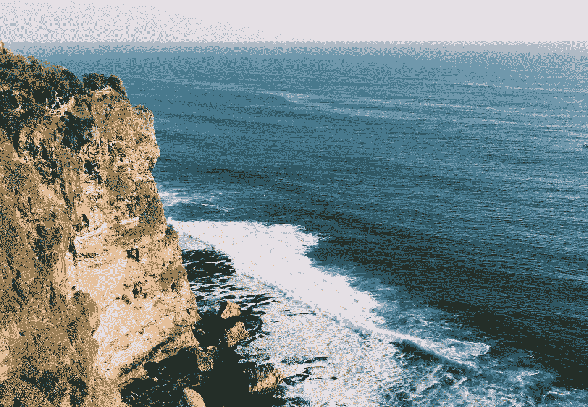
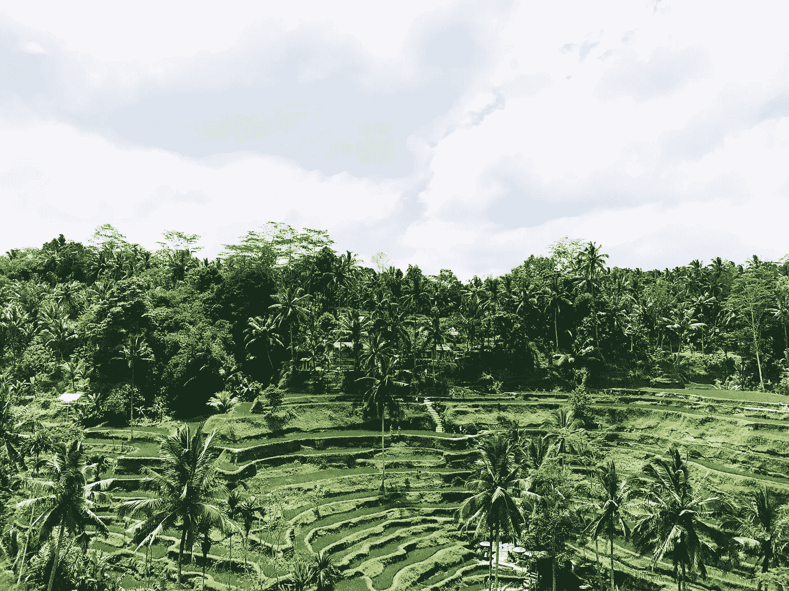
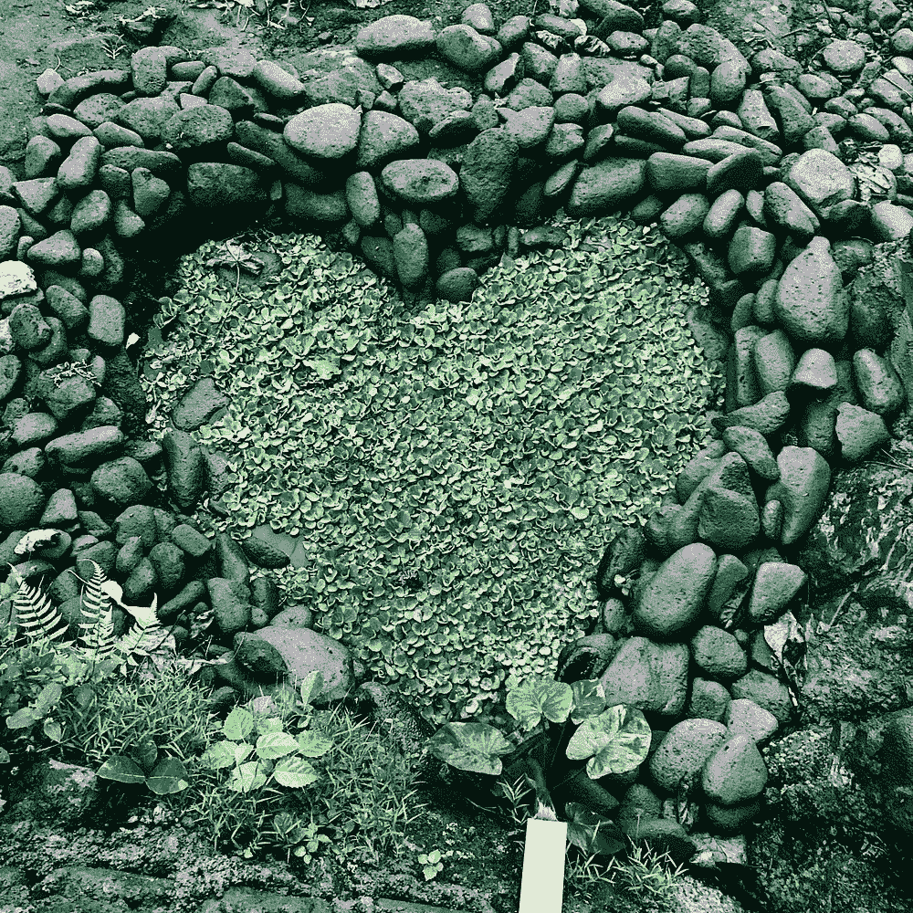
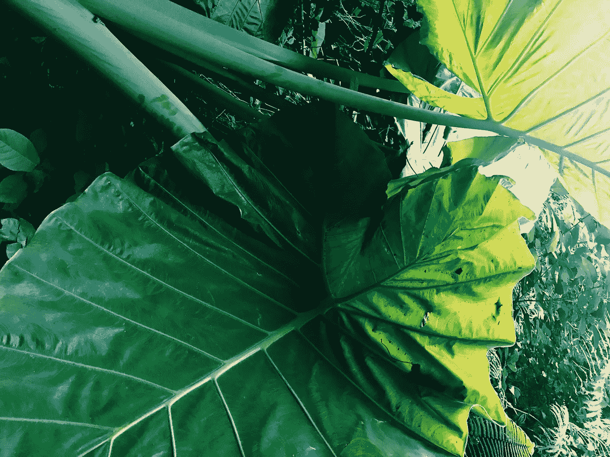

# 在巴厘岛的两周我学到了什么

> 原文：<https://medium.com/swlh/what-i-learned-from-2-weeks-in-bali-9c7d8a875217>

## 都是很俗套的。

Via Instagram: [@whatsarahlikes](https://www.instagram.com/whatsarahlikes/)

九月下旬，我收拾好行李，开了两个小时的车到机场，飞了 15，000 英里，通过一个名为[妻子游牧者](https://www.wiflynomads.com/)的项目与 10 个陌生人见面。我想过更充实的生活，做我喜欢的事情，环游世界，妻子答应教我如何去做。我们有 10 个人。我们都不同，但有一个共同点；我们想在生活中做更多的事情，而不是一直在做的事情。对我们来说，这是一个巨大的信念飞跃。这是公司的第一个项目，我们都知道我们是完全改变生活的体验的试验品，或者是去巴厘岛的非常昂贵的旅行。

这不仅仅是一次昂贵的巴厘岛之旅。这正是我需要的灵感。

# 投资自己。

在过去的 5 年里，我花费了大量的时间和精力去做那些我不在乎也不想做的事情。我以前从未做过这样的事情，也没有立场放弃这样的事情，但绝望的时刻需要绝望的措施，我拼命寻找一个[啊哈时刻](/@whatsarahlikes/consider-this-the-aha-moment-youve-been-waiting-for-a97820123f41)(我后来意识到这一时刻可能永远不会到来)。我需要一个信号来告诉我事情会得到解决，还需要一个计划来确保事情会得到解决。

我带着很低的期望去体验，但最终它是值得投资的。我遇到了一些不可思议的人，如果我们没有做出这个人生决定，我永远也不会遇到他们。我在自己身上投入了时间和金钱，为未来找到了一丝清晰。

*Image by* [*Sarah Aboulhosn*](http://www.sarahaboulhosn.com)

# 没有人会因为你做了一些让自己变得更好的事情而与你击掌。

我讨厌向别人解释我为什么要去印度尼西亚。

> “因为我想学习如何为自己工作，一边工作一边旅行。”

即使在我的脑海里，这听起来仍然很自命不凡，但我不再在乎了，因为我知道这是可能的。我意识到只有我自己知道我需要什么，别人不必去理解。我在巴厘岛遇到的每一个人都是为了改善自己而活着，你可以感受到积极的一面。我知道我需要做什么来继续茁壮成长。我从外部来源寻找保证，我做的决定是好的，但我最终意识到，为我自己做，只为我自己做，就足够了。

*Images by* [*Sarah Aboulhosn*](http://www.sarahaboulhosn.com)

# 让不舒服变得舒服。

完全改变心态和生活方式没什么舒服的，第一次到外国也没什么舒服的。它就在我脸上打了一巴掌。我非常努力地强迫自己舒服，避免不舒服的情况，直到我意识到我不能在这上面浪费更多的精力。最终，如果我继续做这些事情，我会停止不舒服。整个经历充满了网络、合作、分享想法和大量的社交活动。(如果有选择的话，我通常会避免这些事情。)但我做到了，我也因此变得更好。但是如果不克服这种不适，我就无法到达那一步。

*Image by* [*Sarah Aboulhosn*](http://www.sarahaboulhosn.com)

# 没有捷径可走

到达瀑布顶端没有捷径，创业也没有捷径。我以为某件事会突然发生，有一天我会带着所有的答案醒来，我所有的文章会像病毒一样传播，我所有的想法都会得到回应。没有“咔嚓”一声，也没有“啊哈”一声。有的只是努力和坚持。成功的人和失败的人之间的唯一区别不是一组人愿意不舒服，愿意累，愿意每天投入几个小时直到他们实现目标。

Sarah Aboulhosn 是一名作家和营销专家。她喜欢优秀的设计，喜欢飞越海洋，自称是流行文化专家(说真的，问她什么都行)。在[*【www.sarahaboulhosn.com】*](http://www.sarahaboulhosn.com)*了解更多关于她如何帮助你创造值得拥有的内容。*

## 这篇文章发表在 [The Startup](https://medium.com/swlh) 上，这是 Medium 最大的创业刊物，拥有 281，454+读者。

## 在这里订阅接收[我们的头条新闻](http://growthsupply.com/the-startup-newsletter/)。

