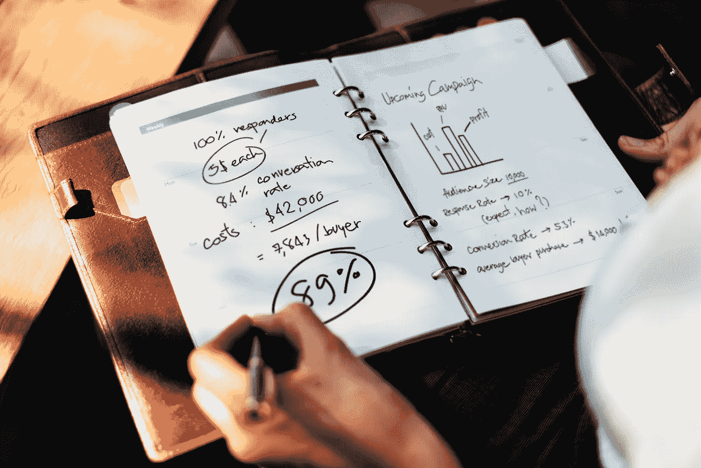

# 我在大学三年学到的东西(与我的专业无关)

> 原文：<https://medium.com/swlh/what-i-learned-from-3-years-at-university-that-has-nothing-to-do-with-my-major-81b5643f18ef>

Photo by [rawpixel](https://unsplash.com/photos/aOYA7D3fse8?utm_source=unsplash&utm_medium=referral&utm_content=creditCopyText) on [Unsplash](https://unsplash.com/?utm_source=unsplash&utm_medium=referral&utm_content=creditCopyText)

## 关于生活、正规教育和工作新时代的课程

我刚刚完成了大学的最后一次考试。我花了 3 年时间学习会计学位，今天它结束了。