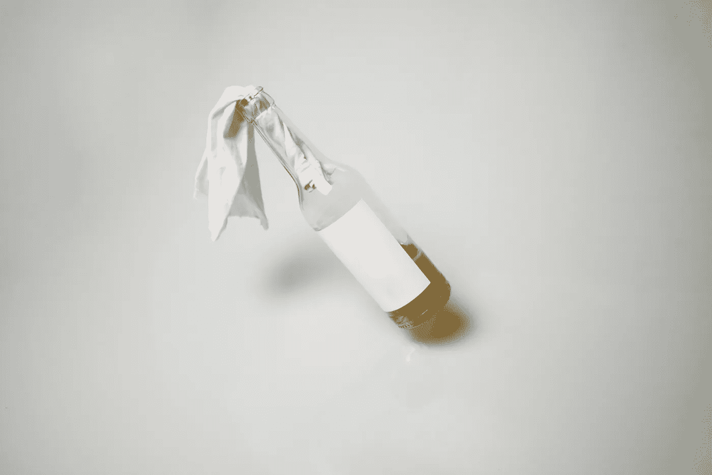

# 一个月不喝酒我学到了什么

> 原文：<https://medium.com/swlh/what-i-learned-from-a-month-without-alcohol-e85ea353629c>

## 首先，你喝一杯。然后，饮料喝了一口。然后，饮料带你。

> 斯科特·菲茨杰拉德

我第一次喝醉是在 17 岁。

当我回忆起它的时候，奇怪的记忆就出现了。我朋友的表弟养了两只仓鼠；木屑的味道和…