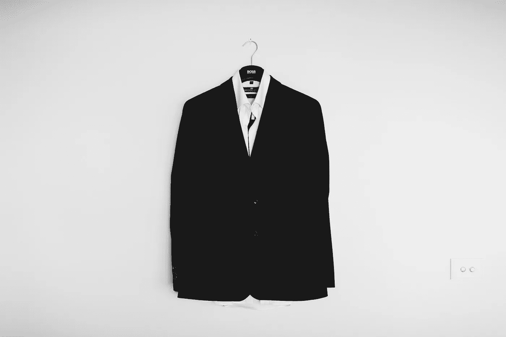

# 我从“放弃者”身上学到了什么

> 原文：<https://medium.com/swlh/what-i-learned-from-being-a-quitter-5f1944cb58ef>

## 以及为什么有时候这对成长是必要的

Photo by [Gez Xavier Mansfield](https://unsplash.com/photos/b34E1vh1tYU?utm_source=unsplash&utm_medium=referral&utm_content=creditCopyText) on [Unsplash](https://unsplash.com/search/photos/suit?utm_source=unsplash&utm_medium=referral&utm_content=creditCopyText)

我以前写过一篇文章，讲的是如何识别何时该挥动白旗。

有一个退出的好时机，我知道有时这是一个被污名化的话题。

我们总是听到“放弃者永远不会成功”和“放弃永远不会成功”这样的话