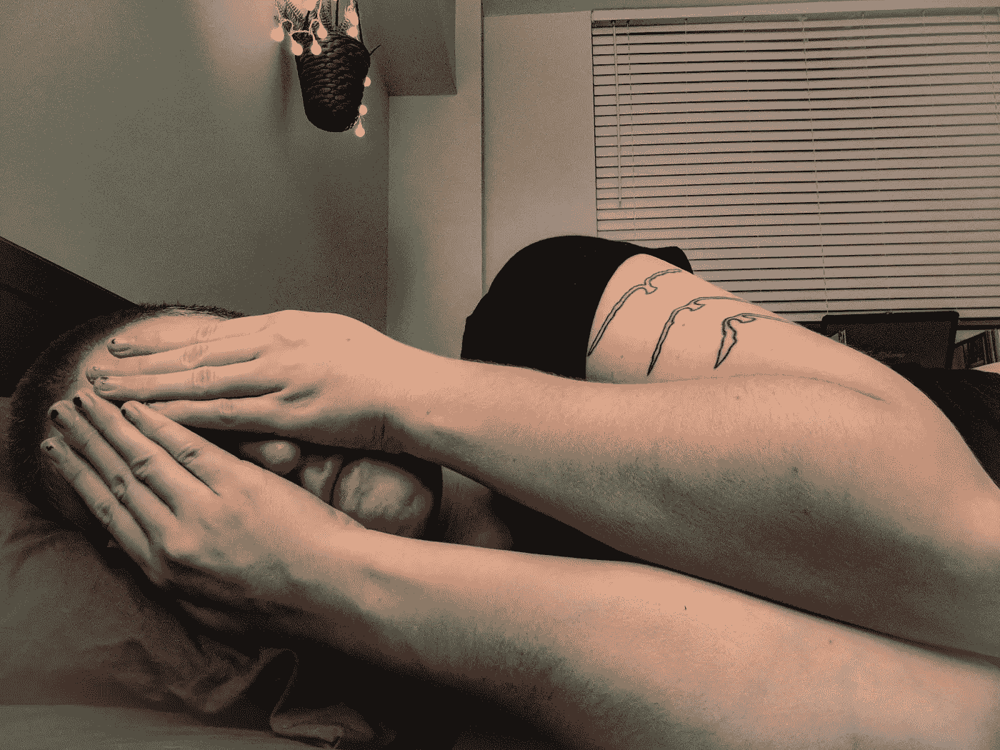

# 我从两个月不敢发表任何东西中学到了什么

> 原文：<https://medium.com/swlh/what-i-learned-from-being-too-afraid-to-post-anything-for-two-months-8906524e6069>

Hiding yourself from the world isn’t going to get you where you want to go.

我最喜欢的笑话是关于一个男人多年来每天都向一个圣人的雕像祈祷，乞求他让他赢得彩票。然后有一天，圣人的雕像活了过来，说:“我的儿子，请买一张票！”

在过去的几个月里，我是那个笑话里的男人。我非常想增加我在网上的存在。我想让我的插图和文章受欢迎。然而，我拒绝张贴任何东西。我创建了一个 Behance portfolio 来增加我找到新工作的机会，但是我从来没有为自己创造过工作，更不用说发布了。当我回到家时，我筋疲力尽，生气，感觉糟透了。和我一起工作的客户总是让我无所适从，这让我不仅质疑自己在公司的价值，也质疑自己在生活中的价值。我觉得自己一无是处。

通常，如果我感觉精神健康，我会通过强迫自己重新变得有效率来缓解自己的无用感。我会让自己健身、画画、写作、阅读等等。任何让我觉得自己完成了某件事的事情都会列在我的待办事项清单上。

我去年年底辞职的上一份工作让我丧失了自尊。我几乎不能让自己创作自己的作品。我几乎不能在工作中创造出高质量的作品。有些日子我几乎不能下床。我有这样一种感觉，每次我打东西，或者提笔，或者冒险进入 Photoshop，我创作的任何东西都必须是完美的。那使我瘫痪了。

我花了一段时间才能够清楚地告诉自己发生了什么。我并没有懒惰或者失去我的创造力，我只是给自己施加压力，让自己到了关闭的地步。虽然这不是我生命中积极的时期，但我从一直感觉糟糕中学到了一些有价值的经验。希望你能从我这里学到这些，而不会觉得自己像个废物。

没有人在网上是完美的，你也不必如此。

我在社交媒体上关注了数百名艺术家和创作者。当他们张贴他们的草图和正在进行的作品时，我会惊叹于如此未完成的东西如何能制作出如此惊人的帖子。回想一下我自己的草图，它们比不上我每天在 Instagram 上看到的那些。至少我是这么认为的。

事实上，发帖的人可能和我一样看到了他们正在进行的工作。不同的是，他们不害怕发布它。正因为如此，它们看起来更真实，更有关联，而且更有趣。

我不得不选择要么害怕，只展示我最自豪的作品，要么成为人类，与世界分享我的进步。我开始选择后者。

**一个糟糕的帖子不等于一个糟糕的账户。**

特别是在 Instagram 这样的基于照片的平台上，我发现自己盯着自己的图片或图纸或设计，正要按下分享按钮，然后将起草的帖子一起删除。我一直害怕发布任何看起来有点糟糕的东西。

我说的“坏”是什么意思？嗯，它可以有几种不同的意思。首先，这个图像可能只是一个垃圾图像。要么是灯光关了，要么是我的线条不够清晰，太粗糙了，等等。“不好”也可以指不符合我的账户审美。这很有趣，因为我甚至还没有真正定义我的审美是什么。

出于某种原因，我无法理解(有时仍然无法理解)一个糟糕的帖子、图画或文章不会让我的账户变得糟糕。尤其不会让我成为一个低劣的创意者。

**当你放手的时候更真实。**

我所关注的许多社交媒体影响者有一点令我钦佩，那就是他们看起来很真诚。不知何故，即使当他们在讨论他们的个人问题，或者只是在一个昏昏沉沉的早晨放松和写博客时，我也想和他们一起出去，成为他们的朋友。我对自己不够真实感到沮丧。我看着我的作品，只看到一个装腔作势的人。然后消极的自我对话开始流动，我无法让它停止。

现在，我意识到我最喜欢的影响者看起来如此真实的原因是因为他们刚刚放手。他们承认自己并不完美，他们知道一个糟糕的帖子并不会产生一个糟糕的账户，他们只是说让它见鬼去吧，然后按下了分享键。

他们为什么这样做？*因为他们在做自己喜欢的事情。*

所以，我的朋友们，让它见鬼去吧。我会在周日晚上 10:35 完成这篇文章，我会仔细阅读一遍，然后满怀信心地按下发布键。因为我很有创造力，这是我喜欢的。

Kira Bushman is the lead writer on [Style to Spare](https://www.styletospare.com/), a blog about fashion and finance.

## 这篇文章发表在 [The Startup](https://medium.com/swlh) 上，这是 Medium 最大的创业刊物，有 290，182+人关注。

## 订阅接收[我们的头条新闻](http://growthsupply.com/the-startup-newsletter/)。

