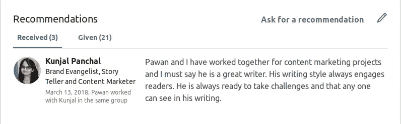

# 我从工作中学到了“给予的力量”

> 原文：<https://medium.com/swlh/what-i-learned-from-having-a-job-about-the-power-of-giving-4d7a6304b319>

你最近**做了**对你的同事或某人有价值的事情吗？

你感觉如何？

我相信这感觉很棒，对吧？而你知道给予的力量是什么吗:**它让自己和你的日子。**

我们大多数人都会抱怨，*“我想给予，但我没有什么可以给予的。”*

但是有一份工作教会了我，我们总是有所奉献。你的知识、技能、时间、爱、赞美、善良等等…

每个人都有可以给予的东西。

# 成为人们可以依靠的人

如果你有工作，试着专注于你擅长的一两个方面，给同事增加高价值。你不必成为特蕾莎修女或甘地。

试着花五分钟去帮助你工作场所的人。会是什么呢？

对我来说，就是写 LinkedIn 推荐。每次和一个人合作，我都会给他们写详细的推荐信。我收到了他们真诚的感谢。这让我们俩都感觉很好。

截至今天，在 [Linkedin](https://www.linkedin.com/in/prepawan/) 上，我已经为不同的人写了 21 条详细的推荐(是我得到的 7 倍)。

我还在我的社交网络中介绍了两个不同的人，他们可以从相互了解中受益。它帮助我扩大我的网络。

雷德·霍夫曼(LinkedIn 创始人)写道，

> “如果你开始帮助别人，你将迅速巩固自己的声誉，并扩大你的可能性。”

这一举动帮助我做了一些侧推。我从我的网络中得到了一些很棒的作品。我从来没有使用过像自由职业者和 Upwork 这样的网站(这些都是获得一些好工作的很好的资源)。

我不依赖招聘广告，我从我的关系网中的某个人那里获得机会。它让生活变得更容易。你和你的关系网一样强大。

我从父亲那里学到了建立关系网和给予的行为。我密切观察他，他是一个伟大的网络和给予者。他总是乐于帮助需要他的人。他是人们可以信赖的人。

他是一个非营利组织的积极成员。就在几年前，当当局不得不为某个特定地区选出一位总统时。所有成员都推荐了他的名字，因为他心地善良。他和每个成员的关系都很好。

兰迪·科米萨尔说得好:

> “如果每个人都希望你赢，那就更容易赢。如果你不在外面树敌，就更容易成功。”

在某人的生活中添加一些有价值的东西。

写推荐信或者介绍两个人。

给你的老板写一张便条，认可你的团队成员的工作。

采取额外的步骤来帮助同事或客户。

在你的社交媒体渠道上分享他们有价值的工作。

为团队成员付出的额外努力写一张便条。

找到自己的奉献方式，成为人们可以依靠的人。

# 行动起来！

谢谢你听了这个故事。如果你喜欢这个故事，点击👏按钮，并与他人分享！

## 你想从成功作家那里得到可操作的写作建议吗？[获取您的免费拷贝](https://mailchi.mp/d0442b655c31/get-your-ebook)。

## 这个故事发表在[的创业](https://medium.com/swlh)上，这是 Medium 最大的创业刊物，有 315，628+人关注。

## 订阅接收[我们的头条新闻](http://growthsupply.com/the-startup-newsletter/)。

