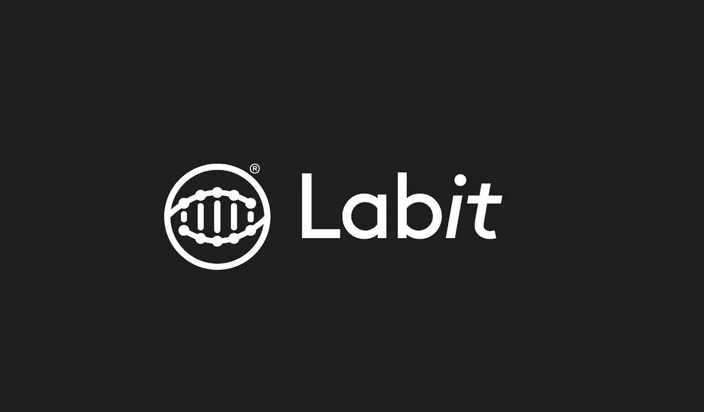
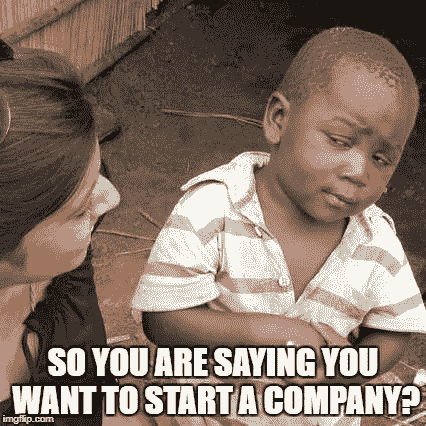
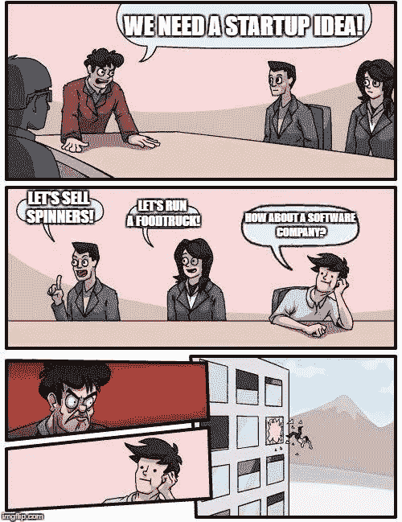
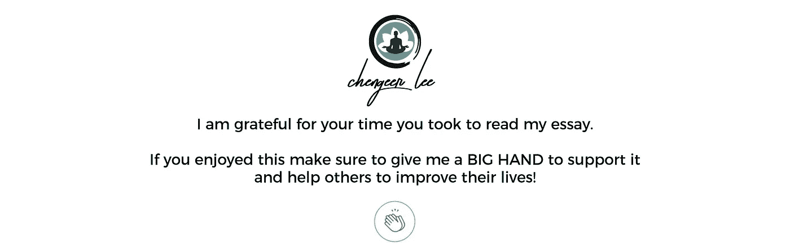

# 我从失败的创业中学到了什么

> 原文：<https://medium.com/swlh/what-i-learned-from-my-failed-startup-98e8ecf64ef3>

## 每个创业者都应该避免的 10 个错误

abit 是一个帮助研究人员为他们的实验室创建网页的网站。

不是。的确是。

12 月 5 日，我们关闭了服务器。我们的网站 *www.labit.io* 不再可用。

关闭你的创业公司有点像失去你所爱的人。当然，心爱的人去世的悲剧绝对无法与公司失败的感觉相提并论，我无意过分渲染，但损失的空虚是真实的。最糟糕的是，你知道创业过程中发生的所有糟糕的事情以及创业失败的原因都是你的责任。

以下是我作为 Labit 的创始人兼首席执行官所犯的错误和我从惨痛的经历中学到的教训。

如果你正在考虑开一家公司，或者你正处于旅程的最开始，我希望这篇文章能帮助你避免犯和我一样的错误。

# 1.选择你的联合创始人。

事后看来，我和我的联合创始人非常幸运。

我们做了很多错事，但我们一起做了。从构思阶段到结束那天，他都在我身边。

这些是你希望在联合创始人身上看到的东西:

## 他应该很凶。

凶猛是勇气、韧性、足智多谋和持续不断的渴望的结合。

这就是永不放弃的能力。

失败不应该使他气馁，而是应该让他充满愤怒。

当你情绪低落时，他应该支持你，鼓舞你，不是在危机中陪你一起消沉，而是振奋你。

## 你的联合创始人应该是“马拉松运动员”。

我自己就是一个“短跑运动员”。无论是在跑道上还是在商业上。我可以精力充沛地跑步和做事，并在短时间内完成很多事情，但之后我通常会筋疲力尽，需要时间来恢复呼吸。

另一方面，我的联合创始人是一个“马拉松主义者”。他是一个比我更慢和更深刻的思考者，在很多情况下，我会采取行动，他会三思而行，但这有助于他明智地运用他的精力。

当我需要花时间从另一场冲刺中恢复过来时，他给了我很多支持。

## 你的联合创始人必须比你聪明。

尤其是在你知道自己缺乏专业知识的领域。你的技能应该是互补的，而不是多余的。对我来说，作为一名非技术型的联合创始人，拥有一个能够与工程师对话的技术型人才至关重要。对于我的联合创始人来说，我想他看重的是我把事情做好的技能。

## 最后，你的联合创始人应该非常小心。

他应该拥有很高的情商，并有能力将感情与生意分开。

# 错误 1。选择合适的联合创始人

在我们开始后不久，我们邀请了第三个人作为联合创始人。他绝对是一个聪明的头脑，也是一个伟大的科学家，但他的情商非常低。很多时候，他非常情绪化，需要花时间冷静下来，但我认为我可以忍受他的智慧。

我不能。

他没能完成几项分配给自己的任务。我们开了个会讨论这个问题，但是当我们开始的时候，他生气了，站起来，摔门走了。

那一刻一切都结束了。我们都知道我们不能和他一起工作。这家伙不成熟，不承认自己的错误，也不接受建设性的批评。

他在最轻微的压力下都会崩溃，而压力是创业公司运作的媒介。

在危急情况下，他会损害所有的业务，我不能让这种情况发生，有人依赖我和创业的成功。我不得不让他走。

我失去了一个朋友，但我拯救了一家公司。至少在一段时间内。

> 一定要确保你不是在和一个装着火药的定时炸弹一起工作。

# 2.想出这个主意。

头脑风暴至关重要。选择最聪明的人来实现你的想法。创建一个想法池，并努力实现它们，直到你的大脑出血。

这是起点。做正确的事。

详细阐述你所有的想法。评估利弊、潜在风险和威胁。

不要对任何人隐瞒秘密。把你的想法告诉每个人，并获得即时反馈。

不要害怕有人会窃取你的想法。没有人会。

人们忙于自己的生活，创业不是一个人可以自发完成的事情。

# 错误二。从 0 到 1 的创新。

[《零比一》作者彼得·泰尔](https://www.amazon.com/Zero-One-Notes-Startups-Future/dp/0804139296)。必读。

信息很简单。所有伟大的公司都是纵向创新，而不是横向创新。他们从一个水平到另一个水平。

这就是我们失败的地方。我们想成为研究实验室的脸书。

有太多的机会去创造克隆。宠物的优步，孩子的脸书，停车场的 Airbnb。首先，当你像这样推销你的想法时，听起来像是抄袭，这真的很糟糕。第二，如果没有从零到一的创新，你的公司仅仅因为你的执行非常出色而变得伟大的可能性非常小。

> 理念和执行力哪个更重要？
> 
> 答案是——两者都有。

# 错误三。选择合适的受众。

有几个 B2C(企业对消费者)或 B2B(企业对企业)的选项，我们选择了最差的选项——B2A(企业对学术界)。

从创新的角度思考学术界是非常反直觉的。局外人可能会认为科学家是创新者，他们站在技术和创新的最前沿。对吗？

不对。

学术界的人极不情愿。研究人员把他们的头藏在科学里，看不到他们周围的任何东西。大多数决策性的行政职位由教授担任，他们往往是老派、保守的人。他们对现有的系统感到满意，不关心是否可以通过提供的技术提高效率。

我们自己也是科学家，所以我们被对我们的社区做出贡献的崇高目标所驱使。但我们未能承认学术界明显的惰性，并为此付出了代价。

## 确保你在正确的地方

开始创业的决定已经是一个质疑你理智的理由。作为一个外国人在韩国创业的决定是纯粹的疯狂。

文化和语言定义了很多。我震惊地发现，和我生活在同一个星球上的人，心态会有多么不同。韩国人是外星人。或者我应该说——我们在这里是外星人？他们做生意的方式令人难以理解。毫无意义的官僚主义和规则令人痛苦不堪。韩国的学术文化是一个完全不同的故事，我想值得单独分析。斗争是真实的。

地理位置至关重要。居住在距离首尔 268 公里的光州让我们远离了创业现场和首尔所能提供的所有潜在人脉。

如果我们在美国或者至少是在人们能说流利英语的地方开一家公司，很多事情都会走上正轨。

当然，这可能不是你的情况，但我想强调把自己放在正确的位置是多么重要。

> 以硅谷或世界上任何其他主要的创业中心为目标。

呆在远离商业世界的小城市无异于搬起石头砸自己的脚。

# 错误四。证实这个想法

> 这是事情最初出错的地方。

我犯的错误是最常见的:

> 我把渴望的现实当成了客观的现实。

我认为这个问题比实际情况更令人痛苦。事实上，这与其说是个问题，不如说是个不便。但是我说服自己和其他人，科学界需要我们的解决方案。我被如何做事情的愿景所驱使，它把我带到了错误的地方。

> 确保问题是真正的痛苦，而不仅仅是不便。

不要陷入自己想相信的事情。彻底验证你的想法。阅读[**精益创业由埃里克里斯**](https://www.amazon.com/Lean-Startup-Entrepreneurs-Continuous-Innovation/dp/0307887898) 。

*   使用 [**验证板**](https://www.leanstartupmachine.com/validationboard) 。
*   调查可以给你一些信息，但在大多数情况下，它们并不那么有价值。它们并不代表真实的情况。
*   对你的用户进行真正的采访。不要试图推销，我说的推销是指不要试图创造一种观点。呈现并观察。
*   当你谈论你的想法时，不要把它私人化。观察人们的反应，询问他们会如何与产品互动。他们会买吗？如果有，他们愿意出多少钱？

这一步的唯一指导方针是 Y-combinator 的座右铭:

> 建造人们想要的东西。

他们的意思是，在构建任何东西或编写第一行代码之前，你应该确保你能找到潜在客户并推销你的想法。

> 确保你找到了愿意为你的产品付钱的人。

或者用 Airbnb 首席执行官布莱恩·切斯基的话说:

> 拥有 100 个爱你的人比拥有 100 万个喜欢你的人要好。

# MVP——最小可行产品

> 如果没有正确验证，就不要开始构建 MVP。
> 
> 只有在证明概念绝对必要的情况下才构建它。

您的 MVP 应该足以充当概念验证，并具有解决目标问题的基本功能。不多不少。否则，你会浪费你的时间和金钱。

在许多情况下，它可以是一个简单的**登陆页面**，作为解释问题是什么、为什么重要、解决方案是什么，以及推销一个更美好世界的愿景的推介。

有了这个，你可以看看是否能建立一个对此感兴趣的人的邮件列表。

Dropbox 提供了著名而出色的 MVP 示例。他们制作了一个**视频演示**，剩下的就是历史了。

# 错误五。发射！

所以我们打造了 MVP。

我的团队在不到 2 个月的时间里构建了初始版本，而且还不错。我应该马上发射的。我等得太久了。如果我能回到过去，我会告诉自己:

> 只是他妈的发射！

我花钱重新设计，标志设计，增加额外的功能。我想让它对第一批顾客来说看起来很完美。从基本准备好发布的 alpha 版本到更好看起来更好但没有必要的 beta 版本花了好几个月的时间。我浪费时间打磨我不确定人们是否需要的产品。

这是最常见的错误之一。创始人犹豫要不要推出。他们总是试图迭代一个未发布的产品。

我们的目标是把它发布出去，并开始向真正的用户学习。让它丑陋、有缺陷、有故障但真实。把痛苦的出生交给你的“孩子”，让它随后进化。

# 错误 6。保护好钱。

CEO 最重要的工作就是确保公司有钱。

事实上，在最初阶段，这可能是你唯一的工作。

> 确保你在银行里总是有钱。

我从韩国政府那里筹集了一些资金。我们使用这笔钱的方式有严重的限制，但我们设法建立了 MVP，设计了标志和界面，并投资了一些营销和公司。

这是创始人不应该关心竞争的另一个原因。正如保罗·格拉厄姆所说，创业公司死亡最常见的原因不是竞争，而是自杀。

> 没钱肯定会杀了你。

# 错误 7。选择正确的团队

首席执行官第二重要的工作是招聘。

我遇到的每一位 CEO 都说，让合适的人加入团队是工作中最难的部分。

首先，我在与我的联合创始人的合作中失败了，然后我在招聘上又失败了。

我们在 GIST 遇到了另一个人，他是一个优秀的程序员和数据库工程师。一个真正的专家，我被说服了。对我和一个非技术型的创始人来说，他的专业水平令人生畏。我想相信他最终会解决在自由开发者身上花费过多的问题。

我开始付给他很少的钱来管理两个自由开发者。但是他们不需要监督。他们工作得天衣无缝，所以这个人最终什么也没做，却从中获得了金钱。如果他能像他承诺的那样学习产品的框架就好了。他什么也没做。

他是一个没有执行力的大嘴巴。

> 我犯了两次同样的错误。

我的问题是，我总是把人们想得比他们应得的要高。我相信人是会变的。他们经常证明我是错的。

这家伙一团糟。他在一夜之间从一个终生的无神论者(和一个科学家)变成了一个基督徒，在和一个韩国女孩约会两个月后，他爱上了她并和她结婚。

如果他糟糕的职业素养和缺乏诚信没有危及业务和团队，他的个人生活就与这个话题无关。

我想说的是:

> 慎重选人。

即使你的潜在雇员是一名出色的工程师，如果他没有诚信，他也会让你失望。

> 团队里的人一开始都不应该拿工资。

如果你团队中的人为了钱而工作，他们就不会有和你一样的动力。一旦你开始下沉，他们就会逃跑。

第一批员工和创始人本身一样重要。他们将为公司的 DNA 做出贡献，所有未来的雇佣都将以第一批为条件。如果你第一次招聘做得不好，你将会在创业的整个过程中承担后果。

关于这个话题，我读过的最好的书是叶夫根尼·布里克曼的[《你好，创业》。第 11 章是关于招聘和必读的，整本书都很珍贵。](https://www.hello-startup.net/)

# 也有好人。

很难找到有技能的体面人。但有时你会发现真正的钻石。

最初以工资为基础工作的自由职业者最终同意加入这个团队，为了这个想法和将其发展成业务的潜力而牺牲工资。

这些家伙简直太棒了。

我从未见过他们本人，我们也没有在网上聊过很多，但他们的专业和正直从未让我怀疑过他们。

有一条我们都遵守的潜规则:

> 一个男人说——一个男人做。

我认为这是唯一正确的做事方式。

开发人员总是按时执行，非常高效和负责任。这里有另一条关于创业团队的规则:

> 坚持和对的人在一起。

# 错误 8。不要组合工作。

如果你有一份全职工作，创业是极其困难的。在一天结束时，你从白天的工作中累了，自然想休息一下。

> 你的精力不是无限的，每个人一天只有 24 小时。有些东西会遭殃。

还有什么比全职工作更糟糕的呢？研究生学习。

当你是一名硕士或博士生时，你没有生活。当你试图在学习的基础上整合一家创业公司时，它会变成一个人间地狱。这是给所有考虑创业和打算退学的学生的一条建议:

> 不要。先完成你的学业。我是认真的。

拿到学位。完成一件事。不管你以后在生活中做什么，无论你什么时候展示自己，你的教育状况将决定人们对你的看法有多认真。拥有一个学位打开了许多大门，也改变了你在别人眼中的形象。初创公司可以等待。说真的。

> 好吧，你没听。你还是创业了。

欢迎来到地狱，这里有一些关于运行它的初始阶段你必须知道的事情。

# 错误 9。小心烧伤！

有几点需要特别注意:

## 不要合并。

有一个很美的知名服务叫[条纹图集](https://stripe.com/atlas)。

只要 500 美元，他们就会帮你开公司。它可以很快完成，所以不要着急。

> 在初始阶段，你不需要成立公司。

只有在你的企业盈利或者你找到了投资者并且他们要求成立公司后，才这么做。

如果你这么做了，**将其注册为特拉华州的 C-Corp** 。这里不需要有创意，随大流就好。

Stripe Atlas 会自动为你在硅谷银行开一个银行账户，这里是另一个 burn。

## 银行账户维护烧钱。

硅谷银行每月向你收取 25 美元的维护费。在早期，这是不必要的烧伤。

## 服务器烧毁。

维护你的网站，即使花费最少，每月也要花费 20 美元。确保你有足够的钱支付服务器费用。

## 薪水在燃烧。

如果可以避免，就不要给人任何钱。找到和你有共同激情并愿意为公司的理念和百分比工作的人。

不要太贪百分比。对帮助你建立你的帝国的人要慷慨。

> 0$公司的 100%为 0
> 
> 十亿美元公司的 1.5%是一大笔钱。

# 错误 10。准备好失败。

我没准备好。我以为我是，但我不是。我在这方面投入了很多，看你的船沉得多惨。

> 10 个创业公司中有 9 个会失败。

这是 YC 的人们一直在说的，我相信这非常接近事实。经营一家初创公司极其困难，几乎不可能从一开始就做好。

> 经营一家创业公司就像嚼玻璃一样。
> 
> 埃隆·马斯克

谢谢你，伊隆找到了合适的词。

这是一个苦涩的事实:

> 如果你正在创业，你将会失败。

也许不是最终，但总有一天你会希望这一切结束。

我们同时申请了 Y Combinator 和 TechStars，但都被拒绝了。我投了很多次，都筹不到钱。我试图向学术界推销我的产品，但没人感兴趣。感觉很糟糕。

相信我，当你在梦中飞得太多的时候，现实的冲击会很快让你清醒过来。

> 我分享我的经历不是为了打击你。一点也不。
> 
> 相反，我想激励你去创业。

但是要用聪明的方法去做，尽量避免我犯的错误。

这个世界缺少好东西，因为许多聪明有才华的男人没有胆量去冒险。冒这个险！

不管发生什么事

> 不要放弃。
> 
> 但是也不要坚持愚蠢的道路。
> 
> 承认你的错误。

我搞砸了。

可能会有很多甜言蜜语，告诉我们没有失败这回事，我们要么胜利，要么学习。

扯淡。

> 当我搞砸了，我需要承认。

我需要拥抱我的失败，因为它们成就了我。

我没有任何遗憾，因为在经营公司的一年中，我比之前的三年更了解自己。

我仍然不知道如何以正确的方式做事，但我肯定走过许多错误的路。

我相信这些知识可以帮助你在自己的创业之旅中认识到它们。

无论我做什么，我都会牢记史蒂夫·乔布斯的至理名言:

> 旅程就是回报。

我做了笔记。我吸取了教训。我变得坚强了。

是时候向前看了。

❓，你有问题吗？问我！我每天都在 Quora 上回答问题。

## 这篇文章发表在[《创业](https://medium.com/swlh)》上，这是 Medium 最大的创业刊物，有 277，994+人关注。

## 订阅接收[我们的头条新闻](http://growthsupply.com/the-startup-newsletter/)。

