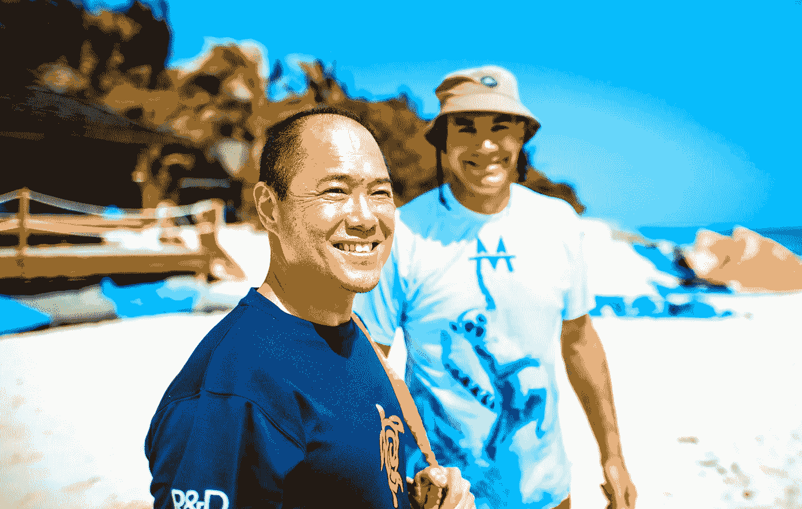

# 我从世界上最伟大的风险投资家那里学到了什么

> 原文：<https://medium.com/swlh/what-i-learned-from-the-worlds-greatest-venture-capitalist-15c1849be953>

## Bill Tai 将他对风筝冲浪的热情与对美好未来的渴望结合在一起。

Image Credit: [Owen Buggy](https://www.facebook.com/owenbuggyphotography/)

我最近和一个人呆了一段时间，很多人认为他是地球上有史以来最伟大的风险投资家，比尔·泰。