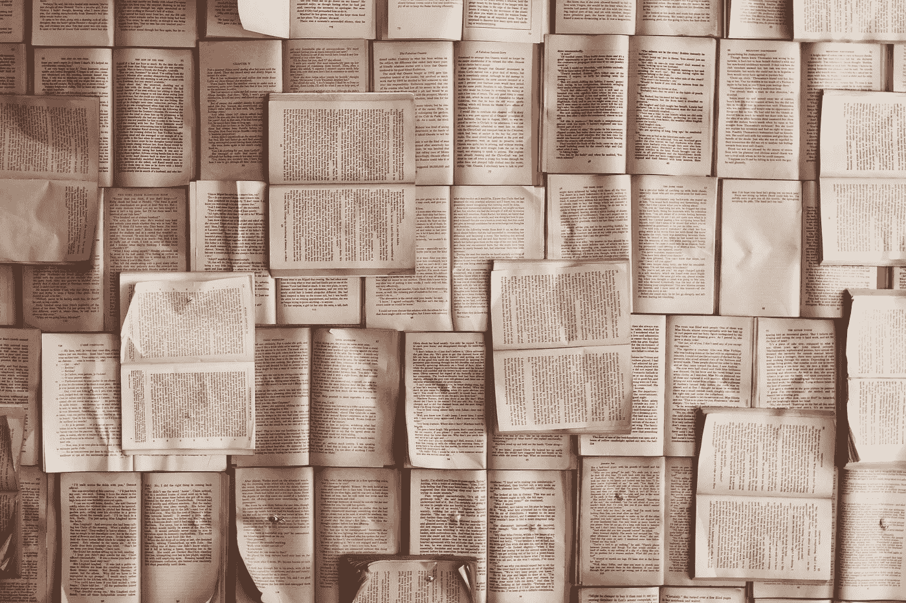

# 14 天写 4 万字我学到了什么

> 原文：<https://medium.com/swlh/what-i-learned-from-writing-40-000-words-in-14-days-6639afc16c4f>

Photo by [Patrick Tomasso](https://unsplash.com/photos/Oaqk7qqNh_c?utm_source=unsplash&utm_medium=referral&utm_content=creditCopyText)

今年 7 月，我开始了可能是最具挑战性和最耗时的经历，开始写我的第一部完整的书。[领导或午餐:获得影响力的力量](http://leadorbelunch.com/)是我在担任领导者和培训师期间获得的交易工具。我觉得我有很多知识和经验，并觉得有必要与他人分享，是时候动笔了(嗯，手指对键盘)，我觉得这将是一个相当简单的过程。我的最后期限快到了，我确信我会按时完成。

问题。

**我以前从未写过书。**当然，我写过文章，写过各种主题演讲，在各种会议上发表过。我每周召开销售会议，需要创建内容与我的团队分享。但是写一本整整一百多页的书对我来说是全新的。我需要为这本书想出一个标题，每一章的标题，章节的数量，每一章的页数，以及我想如何让读者理解。我应该以清晰专业的方式说话吗？我是不是应该随便说，不用太担心语法或者俚语？我喜欢读书，看各种销售和领导力的书。对于一个可能读过这本书的陌生人来说，我该如何面对这一百页呢？

这些是我没有真正考虑过的事情。信不信由你，我在高中的时候并不喜欢英语课。我不是那种喜欢上学的人。我没有学位，也不热衷于每一个标点符号规则。(这一块我可能有些语法问题。)但我知道我想写一本书，并让它出版。

最后，我决定将这本书完全围绕领导力展开。大大小小的领导力。我想听起来真实，在纸上表现出来，就像我和别人交谈时表现出来的一样。我想让人们知道我是一个上帝的人，一个普通的、平凡的人，没有人指望我会成功，但我却成功了。我希望人们能从我的语气、我的措辞、我使用的引语和参考文献以及每一章的标题中听到这一点。当我写作时，我一直把它放在脑海的最前面。这让我想到了这两周我学到的另一件事。

写作很难。

处理你想说的话并以一种你的读者能够认同并容易理解的方式打出来是极其困难的。我有时有点啰嗦，简洁可能是个问题。我必须积极地研究那些在这方面出了名的著名作家，并形成我自己的风格。

写我的故事也需要我做很多自我反省。我坐下来，回想我的过去，回想二十年前我是如何在卧室里创办自己的公司的。我回忆起我去过的地方，我去过的地方，我遇到的人，然后我开始思考我要去哪里。

你看，我开始写一本书，希望它能帮助别人，但随着我的继续，我意识到写一本书也帮助了我。**它迫使我在参考外部资源时研究我不完全理解的主题**。它教会我如何通过起床去散步或听音乐来打破写作的瓶颈。它教会了我成为一个更强的作家，并且比以前读得更多。写作是一项艰苦的工作，有时会让你精疲力尽，但却充满乐趣。

当我花时间坐下来开始打字时，这是从销售世界中一个很好的休息。在那两个星期里，我忙得不可开交，我尽可能快地预订(没有双关语的意思)，赶在最后期限前完成。但我完成了它，到目前为止，我收到了很好的评论。我非常喜欢在这个项目上工作，并期待着未来几年的书籍！

**我鼓励并挑战你写作。写任何东西，任何你想到和想到的东西。把它放在某个地方。写一个对你来说很重要的话题，你可能会惊讶于你在这个过程中学到的东西。**

> 我带着要到达的特定目的地出发，并了解到旅程是最美好的部分。

## 这篇文章发表在 [The Startup](https://medium.com/swlh) 上，这是 Medium 最大的创业刊物，有 282，454+人关注。

## 订阅接收[我们的头条新闻](http://growthsupply.com/the-startup-newsletter/)。

