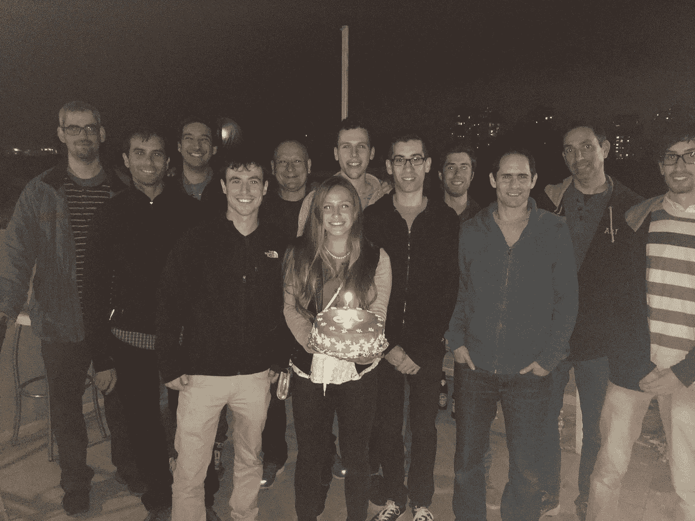
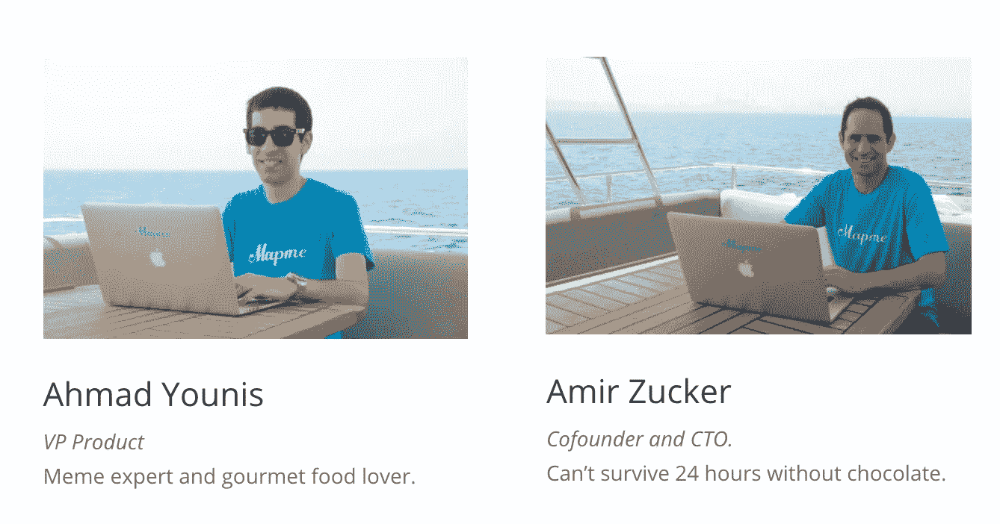
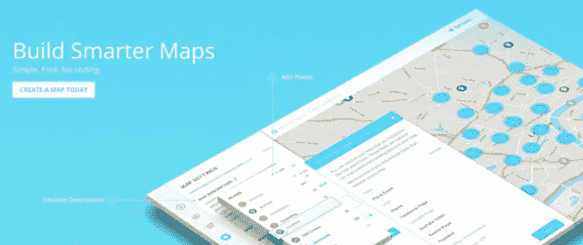

# 我作为创始人第一年的反思

> 原文：<https://medium.com/swlh/what-i-learned-in-my-first-year-as-a-founder-6921293e790f>

在过去的几年里，我为几家初创公司和一家风投公司工作过，在以色列军队服役过，在易贝为他们卖过东西，建立过客户网站，组织过各种活动等等。毫无疑问，在过去的一年里，我学到的东西比那些年加起来还多。

在创办 Mapme 之前，我从未当过“经理”，筹集过资金，也没有推广过产品。一开始，随着我们取得进展，我变得越来越害怕。我们雇佣了第一批员工。我和他们的关系会是怎样的？我们发行了可转换票据。接下来是什么？我们需要表现出持续的增长。我们如何做到这一点？

幸运的是，我周围都是比我经验丰富 10 倍的共同创始人、顾问、员工和朋友。没有他们，我敢肯定我们早就内爆了。他们帮助我对自己和 Mapme 更加自信。

Mapme team and friends

自从创办公司以来，我一直试图从我的经历中记下教训、错误和想法。那是唯一改进的方法。在公开了我们的[仪表盘](/@benln/dashboard-version-two-8733274fc608#.ryo42u807)、[投资者更新](/swlh/the-deck-we-used-to-raise-1m-c001eb08f35a#.9rq4g9xub)之后，我决定也分享一下我个人的想法。所以开始了。

是的，这个清单上的项目对一些人来说可能是非常明显的。但作为第一次创业者，我花了很多时间来学习这些东西。希望这个列表能为像我一样的其他“noob”创始人提供价值。

## **管理**

*   创始人应该为他们的团队服务，而不是相反。他们有责任确保每个人都快乐和有动力。
*   对工作时间的严格要求是动力杀手。懈怠、干劲等。你可以随时随地工作。沟通技巧是🔑。
*   微观管理扼杀动力。尽你所能去阻止它。有一个清晰的路线图会有所帮助。
*   尽你所能为你的员工服务。削减你的薪水，开 200 英里，显示你的关心。即使是最小的事情也会有所不同。向你表示关心，他们就会回报你。
*   听着。你的团队可能有不可思议的想法要分享，不要让它们白白浪费掉。今天在 Mapme 发生的大量好事完全来自团队的创意。
*   鼓励学习，新技术，信息聚会，阅读。你的团队的知识应该和公司一起成长。

## **首席执行官的角色**

*   关键在于执行。把这写在你的墙上，永远不要忘记。
*   首席执行官的工作是随时推动公司向前发展。这主要包括建立一个有才能的、以使命为导向的团队，并确保银行里有钱。但在公司生命的每个阶段，角色都可能发生变化，它可能涉及更多的产品工作、业务开发和营销。
*   做决定。不管对错，总比不做好。
*   这是马拉松，不是马拉松冲刺。拥有户外生活、朋友、爱好、旅行时间是如此重要。如果你不开心，它会影响你的团队和你的创业。同时“你尽可能快地开始，然后慢慢增加速度。”
*   尽可能多的自我批评，即使感觉很糟糕。要诚实。如果它不起作用，你不知道如何让它起作用，那就继续前进。
*   变得擅长营销。人们通常不会自己找到你的产品。
*   尽可能多呆在办公室。如果时间允许，创始人应该是第一个进来，最后一个出去。
*   找个顾问。找另一个顾问。

## **募捐**

*   尽可能久地等待筹集种子资金。但是考虑到这可能是一个六个月的过程。
*   99%的加速器都是浪费时间。如果你要申请，就去争取那 1%的人。
*   在你要钱之前，与投资者建立关系，向他们学习，获得反馈。
*   向你的投资者和你的团队发送每月的[投资者更新](/swlh/sharing-our-latest-investor-update-in-public-b1ba046089f8#.9rq4g9xub)。把你见过的潜在投资者也加入到名单中。

## **支持**

*   全天候与您的用户交流。[对讲机](http://www.intercom.io)，[脸书组](https://www.facebook.com/groups/1050448964968436/)， [Chatlio](https://chatlio.com/) ，那里有足够的工具。
*   创始人要尽可能做支持。
*   让每个新员工学习你的产品，并在办公室的头几天支持他们。

## **招聘**

*   招聘是一场持续的斗争。
*   你会惊讶好人是从哪里来的。我们的第一个开发者通过[黑客新闻](http://news.ycombinator.com)评论加入。(黑客新闻在以色列科技界并不受欢迎。)
*   有创意，脱颖而出。在我们把照片贴在一艘游艇上之后，我们开始收到比以前多两倍的简历。发布我们的仪表盘、面板和投资者更新信息，使得在 Mapme 寻求工作的人数增加了两倍。
*   “当你考虑解雇某人时，已经晚了，你应该这么做:只有当情况真的很糟糕时，你的大脑才允许你想到这样一个艰难的选择。”
*   平庸的外包人才弊大于利。
*   实习生很牛逼。找到有前途的，并把它变成一个双赢的局面。

## **通信**

*   使用[松弛](http://www.slack.com)。每个人都已经知道了。但如果你没有，就用它。
*   尽可能让团队了解情况。不要害怕分享 KPI、交易和其他消息。
*   分享 Slack 的每一个里程碑。(旁注:这可能是 Slack 的一个很酷的[应用](https://slack.com/apps)

## **联网**

*   有太多的会议、聚会、创业竞赛。三思而后行。你打算学点什么吗？遇见对你重要的人？如果你是一个演讲者，而听众与你的产品相关，这是一个明显的胜利。
*   如果你需要休息时间去聚会，去参加 SXSW、Web Summit 之类的活动，但不要假装这是“工作”。
*   关注几个亲密的、工作相关的朋友。支持他们，他们也会支持你。确保是你尊敬和敬仰的人。每隔几个月，在活动中与你交谈两分钟的人，并不是真正的朋友。

## **成长**

*   产品发布只是图表中的一个尖峰，并不能解决增长问题。打造一款人们喜爱并愿意分享的产品。
*   定义你的关键绩效指标，随时检查。如果你公司的方向改变了，更新 KPI。
*   发展应该以 KPI 为导向。小心技术债。

## **总体**

*   在你建造它之前，确保人们确实想要你正在建造的东西。
*   Idea 是公司 1%的股份。执行力 99%。
*   创建一家创业公司就像坐过山车一样。
*   尽可能玩得开心。
*   永远和比你优秀的人在一起。
*   **少看这些帖子，多建。**😂

[Mapme](http://www.mapme.com) 是一家年轻的 7 人初创公司，还没有达到收入水平，还没有进入 A 轮融资，未来的路还很长。还有很多东西需要学习和添加到这个列表中。希望一年后再出版。

[www.mapme.com](http://www.mapme.com)

很乐意在下面或私下听到你的想法。请随意推荐这篇文章👌。

*想聊天？ben@mapme.com/@*[*benln*](http://www.twitter.com/benln)