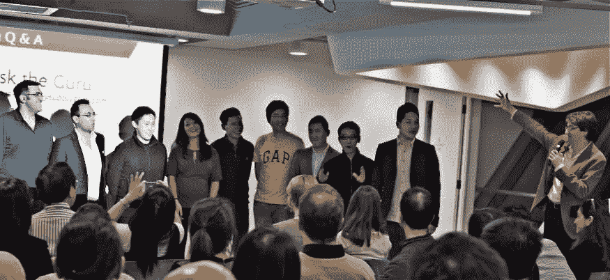
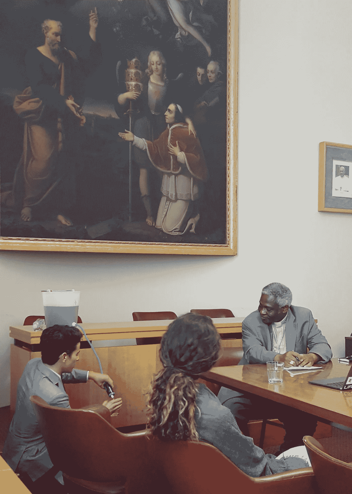

# 五年来，我在世界各地管理创业项目时学到了什么

> 原文：<https://medium.com/swlh/what-i-learned-running-startup-programs-on-three-continents-2bda8e8a6ed4>

## 多种程序格式，100 多家公司，数千万的资金，大量的客户，出口，所有跨越三大洲。

去年七月标志着我“正式”领导创业项目五周年。

以下是这五年的概要，以及我一路走来所学到的东西。

## **开头。香港创业训练营。第 1、2 和 3 组。2012 — 2013.13 家公司。**

2011 年，我住在纽约，所以你可能会问自己，为什么我的第一个创业项目会在香港。这不是随机的选择。

那时候，我在纽约主持了一个创始人圆桌会议系列，这个系列非常受欢迎。每隔几周，我都会召集 8 到 10 名初创公司的创始人，分享他们的奋斗历程，并获得反馈和相互支持。我花了将近一年的时间和六组创业者一起做这件事。人们喜欢它，我想把它变得更大。这是一种仁慈的“[卖铲子](http://startupsunplugged.com/startup-data/selling-shovels-in-the-new-gold-rush/)”的价值创造方式。

但早在 2011 年，纽约市已经有 10 家创业加速器。我不想开始第 11 个。

相反，我开始寻找一个新的市场。为此，香港不是一个随机的选择。几年前我在那里生活和工作，我说的粤语会话(我喜欢语言)帮了我很多。我知道香港是一个扁平化的社会，在这里我可以很快建立联系，至少在与初创公司相关的部分是如此。

我的下一步是给最近当地创业周末的评委发邮件，然后去市里考察市场。我遇到的每个人都把我介绍给另外两个人，我的三周时间很快就被会议填满了。

在那些会议上，我问了类似的问题:“对初创公司来说，这里的情况怎么样？”“你希望你在这里有什么？”“你看到了哪些机会？”“您希望能够解决哪些错过的机会？”

回到纽约后，我一直保持着这种对话。但经过几个月的讨论，在资助创业加速器方面没有任何进展。我在纽约遇到的人没有一个对资助世界范围内的项目有丝毫兴趣，尤其是在一个非常小的科技场所。

一切看起来都失去了。在这个项目上工作了这么长时间之后，我也产生了一种强烈的愿望去完成它。我不想加入其他国际组织，他们最近访问了香港，承诺经营一个创业加速器，但却无所事事地退出。

除了翻转模型，别无选择。我会从收取学费开始，不持有股权，而不是投资创业公司和持有股权。部分学费将包括公司的工作空间。问题是，会有人申请并加入吗？

我发出了申请通知，并做了最坏的打算。为了支付我的机票、在昂贵的香港的临时住房以及共同工作空间的费用，我需要接受三家好公司。我有四个。我本来会略有盈利的！付款来了！

然后我看到了新闻。第四家创业公司——说服我预订一切去香港的那家——撤回了申请。两名来自香港的计算机科学毕业生最终还是没有创业，因为他们的父母让他们去找公司工作。

所以这三个月我从略有盈利变成了亏损。

这是一个很好的时间来解释为什么上述(“我们的父母让我们得到企业工作”)发生在香港。在香港过去几代人的时间里，以下历史和经济因素结合在一起:

> 1.大学将编程和设计等科目放在较低的位置，这意味着高分学生反而被鼓励学习医学、法律和商业。
> 
> 2.年轻人在结婚前和工作期间，继续与父母住在一起。更重要的是，他们要向父母支付租金，否则就要养家糊口。你需要一份稳定的工作来做到这一点。
> 
> 3.有一种预期，打算结婚的夫妇会买一套房子。香港是一个极其昂贵的房地产市场。
> 
> 4.在“正常”社会中，初创企业创始人的地位是不存在的。正如一位创始人告诉我的，“如果我们遇到一个潜在的约会对象，我们绝不会说我们是初创公司的创始人。人们会听到的是“这个家伙没有工作，也没有钱。”"
> 
> 5.虽然香港资金雄厚，但香港有一个**非常**小的早期投资社区。

**不理解这些原因就是为什么其他国际组织认为他们可以突然出现并启动加速器。香港不是南海边的纽约。**

但是剩下的三家申请参加训练营的公司中，有一家有点不寻常。他们来自硅谷，对我试图做的事情很感兴趣。

这第一批人给了我一个机会，让我可以对他们的成长产生影响，同时发展一个创业导师网络，这个网络将继续提供帮助。我们于 2012 年 9 月举办了首届香港展示日(#demodayhk)。

这时，我们有了媒体，更重要的是，有了口碑。口碑很好。我把七个公司带进了第二个训练营，这是我在第一个训练营结束后马上开始的。这些公司中也有一些不寻常的地方。除了香港公司，更多的国际创业公司听说了这个项目，也想加入进来。

## 延续。AcceleratorHK 第 1 和第 2 组。2012 — 2013.12 家公司。

[AcceleratorHK](https://techcrunch.com/2012/09/17/meet-acceleratorhk-hong-kongs-very-first-startup-accelerator-program/) 是香港第一家受资助的创业加速器。专注于移动应用程序开发(移动是香港的强项)，加速器是训练营后的自然下一步。

我为训练营带来的大部分导师都在新的加速器继续工作。另外，两个证明自己的训练营团队在加速器中获得了资助。

除了在香港成立的公司，我们**还吸引了来自亚洲、美国、欧洲和拉丁美洲的创始人。**

我还进行了很多其他项目和产品实验，包括在香港建立第一个创业公司名单。

在最后一批毕业生毕业一年后，我们有了第一次退出。今天，香港有 10 家创业加速器。

## 转变。在南加州大学建立孵化器。1 至 10 组。2014 年末至今。80 家公司。教授和创造新的企业家课程。

A day at USC’s Incubator

因为家庭原因，我搬到了洛杉矶。我花了一些时间反思我过去的一年，写了 [**创业亵渎**](http://startupsunplugged.com/book) 。

我很快被南加州大学马歇尔商学院聘用，建立一个大学孵化器。南加州大学是一所很棒的大学。和一所很大的大学。

这个项目是我最大的(无论从哪方面来看)也是最困难的。原因如下。

1.  刚开始的时候没有本地网络。与香港不同，在香港很容易快速连接，洛杉矶需要“标准”时间。
2.  大学里的事情进展缓慢。
3.  大学和大公司一样，都有领地。校园里已经有了其他孵化器类型的项目。并不是所有的人都有兴趣和新来的人交谈。人们以零和心态运作。
4.  适度的预算，没有其他工作人员。我习惯了让别人和我一起工作。

尽管如此，在一年半的时间里，这是南加州大学最大的孵化器项目。

**孵化器发展成为南加州大学服务的最多的公司，比任何其他公司都有更多的年度队列——每年三个队列(很疯狂，对吧？)，筹集的公司资金总额最多，每家公司获得的资金最多，Kickstarters/Indiegogo 众筹活动最多，比赛获胜，初创公司继续获得资金加速器，退出，公司类型的组合，创始人类型的组合。看到它真令人惊讶。**

## 我是这样做的。

1.  在最初的几个月里，我在南加州大学和尽可能多的人交谈。我采访了近 100 人，其中大部分是学生创业者，询问他们的创业工作，什么对他们有利，需要什么。基本上，我重复了在香港开始第一个项目时对我有效的过程。
2.  向更广泛的申请人开放该项目，因此该项目成为南加州大学整体的代表，许多创始人来自商学院、工程学院、通信学院、医学院、艺术学院和电影学院，远远超出了商学院的范围。
3.  向所有校友开放该项目。其他项目仅限于现在的学生或刚毕业的学生。为什么？引入有工作和行业经验的校友不是有很多收获吗？今天，校友代表了我们公司创始人的 50%多一点。虽然创始人的平均年龄在 29 岁左右，但我遇到过年龄在 19 岁到 60 岁以上的创始人。
4.  摆脱了最常见的失败点。创始人问题是创业公司失败的常见原因。因此，我开始要求孵化器里的初创公司创始人讨论并起草一份创始人协议。仅这一项改变就将故障率降低了 10% — 20%。
5.  带来了相关资源。我们定期请律师事务所和会计师。从一个校友那里带来了设计帮助。有选择地引入主题专家，例如定价、营销、在线广告、投资等领域的专家。
6.  过渡小组会议。当我开始的时候，整个团队每周五都会聚会两个小时。当我们扩大团队规模时，这些会议变得难以处理。与此同时，创始人群体发生了变化。有更多的校友和教职员工——那些不住在校园附近的人。更多的个人会议和更少的小组会议效果更好。
7.  拥抱竞争。我听到过各种各样的信息，说一所大学应该只有一个孵化器，应该只由商业/工程/etc 学校管理，多个项目会造成混乱。老实说，当我第一次被雇用时，我不知道南加州大学(和大多数其他大学)有多个项目。**但是难道我们没有教导竞争的好处吗？**竞争对能竞争的人有好处。

在此期间，我还作为创业学的兼职教授授课，这让我在加速器工作方面做得更好，同时与众不同。这是一篇我下次再发表的文章。

## 罗马的创业加速器，群组 1。2017 年夏天。9 家公司。

The difference of pitching in the Vatican: better artwork.

今年早些时候**梵佑**[美称斯‘启动加速器](https://www.fastcompany.com/40424655/inside-the-vaticans-tech-accelerator-thats-targeting-climate-change) 问世了。我不得不承认，当我第一次听到这个想法时，我觉得这听起来不寻常，但是我很荣幸成为来自世界各地的环境技术企业在罗马的项目主管。这个项目还处于早期阶段，请继续关注它的发展。如果世界上另外 100 个组织采用这种混合模式，我会很高兴。

# 对我有用的共同主题

1.  **改变是学习的一部分。在小实验中尝试很多东西。**把你的加速器或孵化器当成一家初创公司。随着时间的推移，基于地点和创始人组合，可行的方法总会有些不同。就我而言，我将我的项目从以教育为重点转向以增长为重点，从以资金为重点转向以自助为重点，从以可扩展业务为重点转向以混合业务模式为重点。
2.  **悄悄地建立一个获得结果的名声。**就像那些从世界各地来到香港的公司，以及那些在南加州大学寻找孵化器的非商学院创始人一样，他们来到香港是因为他们从其他创始人那里听到了什么。我们花了很大的努力去理解如何为创业公司移动指针。
3.  **建立一个强大的导师团队。他们帮助你的创业，也让你专注于做到最好。**
4.  如果“有经验”的人不是好的导师，就不要邀请他们。我带来的一位知名导师经常会让创始人在离开会议时感到沮丧。我列席了会议。这是他的问题，不是创始人的问题。我没有邀请他回来。事实证明，人们可能会成功，但也会给出糟糕的指导。
5.  如果可以的话，超越风投支持的科技初创公司。南加州大学孵化器的不同之处在于，75%的公司是高度可扩展的科技创业公司，另外 25%不是。这些其他公司包括食品公司、服装公司和低技术产品。在 Laudato Si，我们寻找潜在影响的大小以及好的业务。
6.  **避开名人。名人评委和演讲者吸引人群，但他们可能不是你应该花时间去接触的人群。对于那些说激励年轻人是他们的目标的人来说:他们的目标往往也是建立自己的个人品牌。我在关注那些已经获得灵感并且不需要“创业娱乐”的创业者方面取得了很好的结果。**
7.  **关注基本面。**业务可持续发展最终胜出。
8.  **消除最常见的失败根源。查理·芒格称之为[反转原理](https://www.farnamstreetblog.com/2013/10/inversion/)。我估计，仅仅通过要求我的创始人讨论并准备好一份书面的创始人协议，我们就将他们的失败率降低了 10%-20%。**
9.  **创建一个社区，在这里人们可以舒服地分享困难并获得支持。我不邀请外部观察员参加会议的原因是，我希望初创公司感到舒服。你在闭门会议中听到的故事比公开分享的故事真实得多。**
10.  **为了你的创始人好，愿意让别人不爽。这些年来，我一直在无意中这样做。不要去想那些不能让你改变现状的人。**

## 现在，我正在讨论为企业、政府和其他大型机构建立创业加速器模式。我迫不及待地想知道事情的发展方向。当然，在香港、洛杉矶和罗马的创业加速器经历开阔了我的视野，给了我工作的工具。

如果你正在世界各地经营一家创业加速器或孵化器，我希望这篇文章对你有所帮助。如果你想开一家，[我们来谈谈](http://startupsunplugged.com/about-paul)。

## 一路上许多人帮助了我，但特别要感谢

苏珊·琼·莫里耶洛、史蒂夫·福特、让-马克·李、特朗·林、查尔斯·吴、凯文·德瓦尔特、乔纳森·洛文哈尔、特里斯坦·克罗默、西蒙·于、克里斯·埃克曼、大卫·布兰德、凯文·德布雷、吴瑞、特雷弗·拉丁、埃德·李、史蒂文·科佩克斯、迈克·米凯利尼。谢谢大家！

## 这篇文章发表在 [The Startup](https://medium.com/swlh) 上，这是 Medium 最大的创业刊物，拥有+436，678 名读者。

## 在这里订阅接收[我们的头条新闻](https://growthsupply.com/the-startup-newsletter/)。

