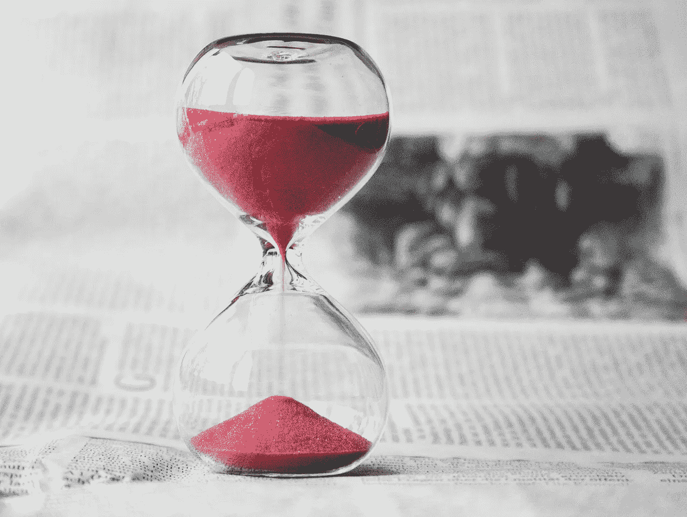

# 我从与时间管理大师的交谈中学到了什么

> 原文：<https://medium.com/swlh/what-i-learned-speaking-with-a-time-management-guru-dd0b24782f4>

作为企业家，我们的时间管理技能显然非常重要。无论是团队成员、客户还是供应商，我们每天都被拉向许多方向。这甚至没有承认对我们个人生活的要求——尤其是如果我们有伴侣或孩子的话。

> 这可能会让人不知所措。

我们的日历经常呈现出自己的生活，用我们不一定喜欢的承诺来填满我们的时间。任何个人时间或激情项目的时间经常被放在底部或我们的列表中——或者干脆被搁置一旁。

也就是说，我们如何提高我们的时间管理技能，收回我们的时间表？

一次性管理专家可能有答案。

在最新一集的 [*大胆的力量*](https://itunes.apple.com/us/podcast/the-power-of-bold/id1240586023?mt=2) 中，我采访了[劳拉·凡德卡姆](https://lauravanderkam.com/)，她是一位生产力和时间管理专家，写过几本关于时间管理的著名书籍，包括 [*《下班后:完成更多工作的同时感觉不那么忙*](https://www.amazon.com/Off-Clock-Feel-While-Getting-ebook/dp/B076NSZ27X/) 。

> 你可以在 [iTunes](https://itunes.apple.com/us/podcast/time-management-guru-laura-vanderkam/id1240586023?i=1000415048561&mt=2) 、 [Google Play](https://play.google.com/music/m/Dbct2jct7d2twshrslmsz4qp5rm?t=Episode_25_Time_Management_Guru_Laura_Vanderkam-The_Power_of_Bold) 、 [Spotify](https://open.spotify.com/episode/74glYjL9Hi0XXz4eptTPTH?si=e2itakd5QDKCac_zZT3B2g) 或 [Stitcher](http://www.stitcher.com/s?eid=55151406) 上找到我对劳拉的完整采访。

劳拉也因其 2016 年关于时间管理的 TED 演讲而闻名，该演讲获得了数百万次观看。

我们都试图为我们喜欢的事情找到更多的时间，但通常，这个任务更多的是渴望而不是现实。

劳拉明白这一点。

她研究生产力和时间管理已经很多年了。她知道我们许多人感到不知所措，我们想更好地控制我们的日历。

在采访中，我的目标是提取劳拉对时间管理的见解，以及我们如何在创造将持续一生的记忆的同时释放我们的时间表。

考虑到这一点，以下是我从与劳拉的交谈中收集到的一些顶级时间管理见解。

## 追踪你一周的时间

如果你曾经做过律师、会计师或顾问，仅仅提到一个短语就可能让你不寒而栗。

> 计费时间。

计费小时背后的想法是，单个员工跟踪他们在每个项目上花费的时间。在记录他们的时间后，他们的公司或组织可以向客户收取一定的工作费用。

例如，许多律师发现跟踪他们的时间是法律实践中最费力的部分之一。也就是说，他们(和他们的上级)会收集关于律师工作日的有趣见解，包括律师分配给某些任务的时间是多于还是少于必要时间。

作为一个对时间管理感兴趣的人，劳拉决定开始自己的“计费小时”实验。她花了 ***一年*** 追踪自己是如何度过时间的。

> 劳拉与*纽约时报*分享了她的想法，你可以在这里找到[。](https://www.nytimes.com/2016/05/15/opinion/sunday/the-busy-persons-lies.html)

通过进行这项实验，劳拉发现了如何腾出一些时间。举个简单的例子，她发现在一年中，她花了 327 个小时阅读杂志和在线文章。有了这些知识，她在下一年花了同样的 327 个小时读她一直想读的书。

通过完成这个实验，劳拉也能够在一年中回忆起更多的记忆。

> 通过跟踪她的时间，她基本上创建了一个告诉她一切的日志，而不是讨论她一天的亮点或她对一天的感受的书面日志。

然后，她会反思她在这一年中创造的美好回忆，这让她基本上重温了这些时刻，并恢复了与这些时刻相关的快乐。

那么这对我们意味着什么呢？

> 通过跟踪你的时间，你会发现你的时间表中可以改变的部分。你可以减少效率低下的问题，腾出时间做其他事情。在你追踪的这段时间里，你可以回忆起更多的记忆。

现在，你不必花一整年的时间去追踪你生命中的每一个小时。那可能要求太多了。相反，考虑记录你一周(可能两周)的时间。一周通常足以让你对自己的时间去向有一个整体的了解。

你也不需要对你的跟踪非常严格。你不需要使用时间管理应用程序，也不需要计算十分之一小时的时间。相反，试着回头看看，记录下你在午餐和晚上的时间。你可以在电子表格、笔记本甚至手机上记录你的时间。

通过这样做，你将收集到原始数据，这些数据将为你未来的日程安排提供信息。

## “忙”的危险

我们喜欢告诉人们我们“很忙”

> 直觉上，它让我们觉得自己很重要。它向世界表明我们是被需要的，我们有责任。说明对我们这个时代的需求很高。

然而，告诉别人我们很忙有一个问题。

> 问题是我们开始相信它，即使它不一定是真的。

当我们相信它时，我们开始相信我们没有时间去做对我们真正重要的事情。

我们会想，“哦，我想和朋友去喝一杯，但是我工作太忙了。”

很容易默认为*忙。*说到这里，我们可以改变自己的行为。

首先，我们可以改变我们的对话。当我们被问到“你好吗？”时，我们可以不再说“忙”通过减少对我们“忙碌”的强调，而不是我们一天中实际做了什么，我们也开始意识到(1)我们是否真的很忙,( 2)如果是的话，我们可以做些什么来减轻压力。

也许你会受到启发，去记录你的时间，并找到哪里可以省去耗费时间的任务。另一方面，你可能对你的日程安排感到满意，可以庆祝它，而不是纠结于你的“忙碌”

最后，在用“忙”这个词来形容你的一天时要小心。日复一日地说这句话可能会让你对你的日程表感到更大的压力——即使你的时间可能比你想象的要多。

## 掌控所有权

通常，遵循我们的常规太容易了。

有道理。

> 惯例提供了安慰。他们很熟悉。他们帮助我们度过一天。

然而，从长远来看，你的日常生活可能并不适合你。如果你追踪一周的时间，你可能会发现你一天中有些时间是无所事事的。或者有时候你会觉得自己在拖后腿。

> 对我来说，这是下午 2:30 最难熬的时候，我感到疲劳和沮丧。

最终，惯性让我们保持在同一个循环中。我们感觉自己总是时间紧迫，然而我们又恢复了一些习惯，比如不断查看我们的 Instagram 订阅，或者点击网飞队列中的“下一个”。

正如劳拉在 2016 年 TED 演讲中所说:

> 最成功的人建立他们想要的生活，然后时间会自己节省下来。

底线是我们 ***需要掌控我们的时间表*** 。对此我们不能消极。我们需要积极主动，确保在我们想花的事情上花尽可能多的时间。

幸运的是，我们可以通过采取积极的态度，分析我们的时间表，并制定行动计划来取得重大进展。

那么我们如何做到这一点呢？劳拉有一些有用的建议:

1.  利用周五下午做计划:劳拉发现周五下午最适合计划她即将到来的一周。通过在下班前计划好你的下周，你会在周末减少焦虑。此外，通过在周五下午采取行动，如果你需要重新安排会议，你更有可能联系到同事。
2.  拥抱三类清单:在计划你的一周时，创建一个三类清单会有所帮助。将一张纸分成职业、关系和自我优先。通过创建三个类别，你下意识地推动自己为每个类别安排活动。例如，很难忽略和朋友在一起的时间，或者把自我关心放在一边。
3.  **先支付自己**:虽然这是个人理财中的[常用语，劳拉说它适用于时间管理。例如，如果你希望做一个充满激情的项目，但你似乎永远没有足够的时间开始，你应该考虑“首先支付自己”，划出一个时间，比如说，周一早上的一个小时。如果你不得不早起，那就这样吧。通过在周一早上为你的创造性任务留出时间，你增加了你的激情项目不被忽视的机会。](https://www.investopedia.com/terms/p/payyourselffirst.asp)

这只是几个小技巧，但它们可以大有帮助。你只需要看看你是如何度过时间的，制定一个行动计划，然后执行。

## 当心技术

技术是一个伟大的东西。它把我们和我们爱的人联系在一起。它允许我们走出办公室，远程工作。一些应用程序甚至帮助我们[拥抱正念](https://www.headspace.com/headspace-meditation-app)。

也就是说，技术可能会耗费大量时间。看起来脸书或 Instagram 检查只需要一两分钟，但如果你在一天中添加它，这个数字会变得很大。电子邮件检查也是如此，尤其是对创始人和那些工作要求高的人来说。

不仅如此，科技会让我们觉得自己的时间越来越少。根据劳拉组织的一项时间感知研究，时间感知得分高的受访者查看手机的频率大约是时间感知得分最低者的一半。其他研究表明，当人们被告知他们可以一天查看三次电子邮件时，他们会比随时查看更放松。

最终，根据劳拉的研究，看着手机会让你觉得与和朋友在一起或者看星星相比，你的空闲时间更少。

> 如果我们可以花更多的时间在情感上满足的事情上(比如和一个亲密的朋友一起吃饭)，而不是查看 Twitter，我们会觉得我们有更多的时间。我们还会在这个过程中建立更快乐的记忆。

但是如果我们*让*经常检查我们的电子邮件会发生什么呢？尤其是作为创始人，我们总是有需求的，无论是来自员工、客户还是投资者。

劳拉建议，我们最好还是每小时有意识地查看邮件 15 到 20 分钟，其余时间做其他事情。授权也是一种有用的技能。也许你团队中的其他人可以处理你收件箱中的某些邮件。

无论你做什么决定，在你的设备上花更少的时间都有明显的好处。

采取行动。你可能会对结果感到惊讶。

## 冒险的重要性

我们每个人都有自己的责任。

我们都有人依赖我们。

然而时光飞逝。

> 2018 年已经过半。过去一年你有多少清晰的记忆？

这就是为什么劳拉建议我们试着将*融入我们的生活。*

*我们的大脑更容易记住第一件事或新事件，而不是我们每天完成的正常任务。*

> *我们处于自动驾驶状态。当我们思考工作日或者我们需要做什么的时候，世界就在我们的脑海中流逝。*

*虽然我们不能让每一天都成为假期，但我们可以让自己在日常生活中拥有更多难忘的时刻。*

*通过这样做，时间看起来更广阔了。你期待着冒险，做一些你通常不会做的事情，然后有一个故事告诉你的朋友和家人。*

*例如，如果你住在大城市，把每个周末去不同的社区旅游作为个人目标。或者你可以计划在周一晚上做一些不寻常的事情，而不是清空你的收件箱。*

*你所要做的就是抵制住呆在自己舒适的家里或公寓里的诱惑。是的，抵制这种诱惑是很难的，但是一旦你出门，你会感谢你自己。*

# *控制*

*当你审视现实时，*企业家*本质上是*忙碌*的同义词。我们所有的时间表都排满了，我们几乎没有时间做我们想做的事情。*

*也就是说，我们不能找借口。我们不能被动。*

*在我们的时间表中，有时间去做我们想做的事情。我们只需要积极主动。*

*无论是跟踪我们自己的时间，放下电话，在我们的生活中建立冒险(或者三者结合)，我们不仅可以找到更多的时间来做我们想要的事情，而且可以扩展我们对时间的感知，以包括我们喜欢重温的记忆。*

*可以说，我们不能放弃这项工作。现在就做出改变(不管有多痛苦)比后悔浪费时间要好。*

**感谢阅读！再次，您可以通过访问我们在*[*iTunes*](https://itunes.apple.com/us/podcast/the-power-of-bold/id1240586023?mt=2)*[*Google Play*](https://play.google.com/music/m/I5h6jsa4t7k3molnci4xkqgbuhu?t=The_Power_of_Bold)*[*Spotify*](https://open.spotify.com/show/6BbvqYtISbUFDaoj3NjoJc?si=KPcpm6uXRzKxB9_5O2r4NA)*或*[*Stitcher*](https://www.stitcher.com/podcast/the-power-of-bold)*上的页面，访问劳拉在*[上的采访。如果你想阅读这一集的完整文本，你可以在这里访问这一集的节目笔记。](http://www.thepowerofbold.com)***

****

## **这篇文章发表在 [The Startup](https://medium.com/swlh) 上，这是 Medium 最大的创业刊物，拥有 340，876+的读者。**

## **在这里订阅接收[我们的头条新闻](http://growthsupply.com/the-startup-newsletter/)。**

****