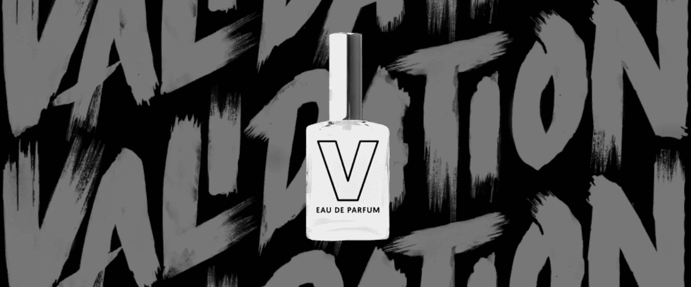
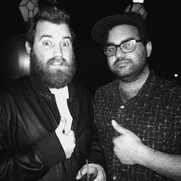

# 我从白手起家创立品牌中学到了什么

> 原文：<https://medium.com/swlh/what-i-learned-starting-a-brand-from-scratch-438476eacb99>

最近，我给自己定了一个挑战:创造一个产品，创立一个品牌。

我在广告业工作，我喜欢这个行业(不要误会我的意思)。但我一直在为其他品牌创作作品。我想为自己做点什么。我的*自有*品牌。在这个过程中，学习从零开始推出产品。(另外，我可能已经听了太多的[我是如何建立这个](http://www.npr.org/podcasts/510313/how-i-built-this)集的，哈。)

出于你可以在这里阅读[的原因](/@hassanisms/validation-a-new-fragrance-for-the-overworked-underappreciated-759164437fb1)，我认为专门为我在广告、创意和创业行业的同行制作一款叫做[验证](http://needvalidation.com)的滑稽香水会很有趣。我们都会乐在其中的事情。

我和我的朋友兼艺术总监约翰·罗斯邮报合作，我们花了很多晚上和周末来修改它。

从那以后，我们已经结束了这个项目，开始着手其他事情。*(剧透提醒:我们终究没有成为香氛大亨。)*

# 以下是我学到的:

## 1.你需要一个出色的搭档。

当我第一次有这个想法的时候，我试着自己去做。从网站设计到香水制造再到文案，无所不包。

两个星期后，我已经做了太多的任务，以至于我实际上没有完成任何一项任务。另外，我做的每件事的质量都糟透了。尤其是那些不是我专长的东西(设计和艺术指导)。

但当我联系我的超级天才好友 Johnross 一起承担这一任务时，一切都变了。我们根据各自擅长的事情来分配任务。这加快了我们的进度，大大提高了我们每个人的工作质量，并从整体上改善了局势。

约翰·罗斯 1)在他的领域非常有才华，2)全力以赴完成这个项目，这也很有帮助。当我说“找个伴侣”时，他们必须同时满足这两个要求。否则，你只会得到一个无论何时都愿意帮助你的伴侣，除此之外，他并不擅长于此。这可不好。

## 2.知道自己擅长什么，不擅长什么。

认识到你擅长什么并去做是非常重要的。此外，要认识到你不擅长什么，然后找人帮忙。

试图一个人做所有的事情会导致精疲力竭、注意力不集中等。

我擅长:品牌、创意方向、营销、写作和公关。我不擅长:艺术指导、网页设计、插图、视觉识别和让品牌看起来漂亮。当约翰·罗斯突然出现做我不擅长的事情时，我们都开足了马力，开始取得更大的进步。

## 3.你什么都得做。

你知道我刚才说你不应该什么都做吗？嗯…

任何一个企业家都会告诉你，你必须什么都做。

从小到大，我看着父母经营自己的事业。在任何一天，他们都是老板、接待员、律师、客户服务代表和清洁工。

我发现自己涉足了这项事业的方方面面。从学习如何建立我们的 Squarespace 网站，到学习销售税，再到学习如何制造一种该死的香水，无所不包！

我学到了你必须参与每一件事。但是这并不意味着你必须在每一件事情上完全*消耗*自己。就像我说的，在某些时候，你需要把事情委派出去，这样他们才能真正做好。

## 4.最好能解决他妈的问题

尽管这个产品很傻，但我很快就明白了:人们不需要*它。人们对我们发送的样品及其背后的想法很感兴趣，但他们对把自己的血汗钱花在这上面不感兴趣。*

为什么？因为它并没有真正解决一个紧迫的问题，或者满足一个市场需求。

当然，有许多产品不能解决尖锐的问题。只是很酷或者提供娱乐的产品。是的，这些产品中有许多卖得非常好。(例证: [Skymall](https://skymall.com/) ，WTF？！？！)

我只知道，对我来说，我计划确保我的下一次冒险涉及解决一个问题。不是很好拥有，而是*需要*拥有。

(有一个[非常好的帖子](https://crew.co/how-to-build-an-online-business/mvp-minimum-viable-product-example/)来自[剧组](https://medium.com/u/37f5b1379a32?source=post_page-----438476eacb99--------------------------------)也是关于这个的)。

 [## 最低可行产品示例-机组人员

### 如果你刚开始有一个想法，但什么都还没做，你的第一个目标应该是证明你想要的产品…

crew.co](https://crew.co/how-to-build-an-online-business/mvp-minimum-viable-product-example/) 

## 5.良好的媒体和营销并不能保证销售

我们得到了巨大的压力，并与一位有影响力的朋友合作，创造了一些令人敬畏的营销。你会认为销售会滚滚而来，对不对？

不完全是。

我了解到媒体和营销并不能保证销售。是的，他们让更多的人浏览你的网站或 Instagram。但是要将这些人转化为付费客户，你仍然需要一个足够吸引人的产品来让人们打开他们的钱包。就像我之前说的，我们没有。

如果你是一家初创公司，在把钱花在电视广告或大量营销或其他事情上之前，先专注于产品。确保产品是可靠的，并且解决了人们的市场需求。营销可以稍后进行。

如果东西足够好，顾客甚至会通过传播信息为你做营销。这种营销是免费的。

## 6.你必须对这件事有热情。

有很多天，我醒来时会想，“我真的在乎一种香水吗？”老实说，没有。我只是为了开玩笑，因为它看起来有点好笑，仅此而已。

这就是为什么:你必须对你正在做的事情有热情。那会让你度过难关。开始一项产品或风险投资，你可能会忍不住认输。对你正在做的事情有真正的热情将会决定你做还是不做。

我未来所做的任何努力都将受到我真正热爱的事情的推动。正是这种激情会让你长期投资。

## **7。所有的广告商都应该开创某种产品/品牌**

这个实验教会了我很多关于我在广告业工作的品牌和客户的事情。这让我对他们产生了共鸣。这让我很欣赏他们与自己产品的关系。

这让我明白了为什么我向客户推销这个或那个奇怪想法时，他们会犹豫不决；因为在创造了自己的产品后，我也不愿意把有限的预算花在可能没有回报的奇怪想法上。

我真的认为广告行业的每个人都应该开创自己的产品或某种品牌。这是一个很好的实践练习，从我们通常看不到的一面来理解一个品牌:客户的一面。

## 8.去试试吧。看看什么有用，什么没用，然后再做一遍！

所以…我们最终没有成为香水百万富翁。但是，我喜欢这个小实验的每一点。首先，这是超级愚蠢和有趣的，我和一个朋友一起工作。

我可以把我学到的一切应用到我正在做的下一件事上(你很快就可以了解到更多[这里](http://twitter.com/hassanisms)！！)如果我没有尝试这一点，我就会错过所有这些课程。我很高兴我能在一个小的副业项目中学习它，而不是一个需要大量投资的冒险项目。

所以是的:尝试狗屎了。可能会失败。没关系。了解什么可行，什么不可行，然后再去尝试。

# ***感谢阅读！更多请关注我的*** [***推特***](http://twitter.com/hassanisms) ***。***