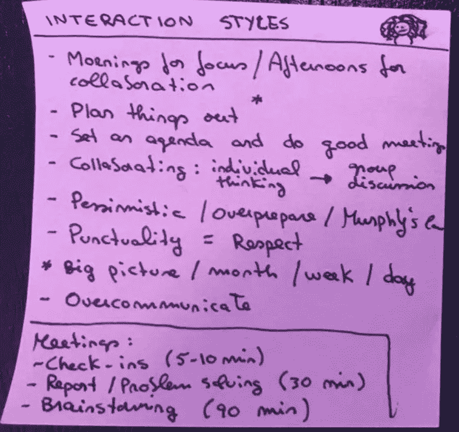
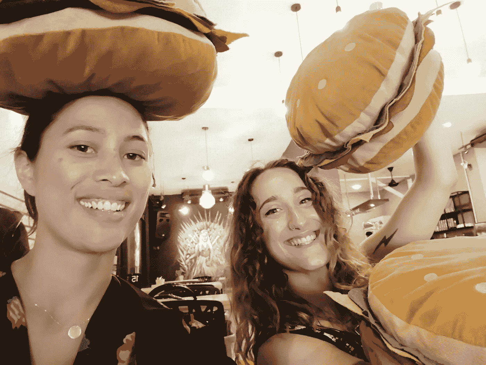

# 作为一名项目负责人，我在远程年学到了什么

> 原文：<https://medium.com/swlh/what-i-learned-working-as-a-program-leader-at-remote-year-7e40757fd97b>

## 世界最佳工作一年后的客户支持课程

“woman watching hot air balloons” by [Mesut Kaya](https://unsplash.com/@directormesut?utm_source=medium&utm_medium=referral) on [Unsplash](https://unsplash.com?utm_source=medium&utm_medium=referral)

在 2017 年 10 月至 2018 年 9 月期间，我带领了一个由大约 40 名数字游牧民组成的团队，以[遥远的年份](https://medium.com/u/c9c651b2355d?source=post_page-----7e40757fd97b--------------------------------)在世界各地开展工作和旅行计划。

与我的副驾驶[乔兰达](https://www.linkedin.com/in/jolandabrandt/)一起，我们处理了各种各样的客户支持问题，在斯普利特、布拉格、里斯本、京都、清迈、吉隆坡、布宜诺斯艾利斯、科尔多瓦、利马、麦德林、波哥大和墨西哥城组织了社区活动和文化沉浸活动。

从很多方面来说，这是一份理想的工作。理想的工作。我们获得了去所有这些不可思议的国家旅行的报酬，与一群来自各行各业的令人难以置信的鼓舞人心的人一起，并得到了一个令人难以置信的关心，牛逼，有趣，和毫不费力的令人印象深刻的团队的支持。

这也是一项复杂的工作。对于一份你的客户同时也是你的旅伴和朋友的工作，你有一种 24/7 的感觉，你需要每个月在一个全新的城市投入工作，在新的语言、文化和队友中导航。尽管有这些挑战，也因为有这些挑战，我深深热爱这份工作，不会用任何东西来交换这个机会。我感觉自己完全像一个新人，一个更好的人。

# 🙅‍不要试图成为正确的

我为今年的生活方式感到骄傲。接受这份工作是一个看世界和学习新事物的绝佳机会，也是一次不可思议的信仰飞跃。一份好工作和一套我喜欢的公寓，在一个感觉像家一样的国家，我知道我可能不会回去了——为了一个伟大的未知，我把这一切都抛到了窗外。在很多方面，我很害怕。在接受这份工作之前，我想了很久，一千种恐惧在我眼前跳动。

事实证明，这些担心都没有成为现实。在我接受这份工作的前几个月，任何看起来像是挑战的事情都很快变成了我的第二天性。

然而，这一年的结束确实带来了一些遗憾。无论大事小事，回想起来，我都会有不同的做法。

但我唯一真正深深后悔的是我试图做对的每一个时刻。

为数不多的几个时刻，我允许自己屈服于压力、时差或对不太礼貌的请求的愤怒，并给出了鲁莽或草率的回应。我错了。我大错特错了。我的工作不是做正确的事。我的工作不是回应我自己的感觉。我的工作是在一年中支持我的客户的生活方式，这一年对他们来说是紧张和苛刻的。

当我不够冷静和礼貌的时候，我深深地后悔。

与此同时，我非常感激，在每一个这样的场合，我都能够后退一步，做出补偿。这是最难也是最重要的一课。

我无法控制会发生什么。我只能控制自己对它的反应。

 [## 满满一杯

### 偏远年份的经验教训

medium.com](/go-remote/a-mug-full-1b203fef2b65) 

# ✉️写了一封愤怒的信，但从未寄出

我是个情绪化的人。我早就学会了不假装，并利用它为我所用。

在这一年中，每当我感到愤怒或沮丧时，我就会通过写电子邮件来发泄，我永远不会发送电子邮件，在那里我会让我心烦意乱、被动攻击和遮阴的自己自由支配。

这给了我一个发泄情绪的出口，并让我能正确看待这个情况。不管我的信有多离谱，我都会把信的另一端的人视为我关心的人，而不是我可以帮助解决问题的人，而不是一个可以攻击的目标。

写完愤怒的信后，我可以写一封可以接受的信，最终解决问题。

最近，我发现林肯本人也有类似的习惯，他称之为“热信”。

 [## 观点|未寄出的愤怒信的失传艺术

### 每当亚伯拉罕·林肯有责备某人的冲动时，他就会写一封他称之为“热情洋溢的信”…

www.nytimes.com](https://www.nytimes.com/2014/03/23/opinion/sunday/the-lost-art-of-the-unsent-angry-letter.html) 

# 🙏用仁慈杀死他们

每次我写一封愤怒的邮件，也让我思考如果我真的发了会发生什么。

发送一个消极攻击性的回复可能会让我暂时感到被报复了，但它也会引发一场口水战，同时可能会破坏我和那个人的关系。

*“用善意杀死他们”*，同事们经常互相提醒。或者，在比利·考根凄美的声音中，“ [*用微笑解除你的武装*](https://www.youtube.com/watch?v=d1acEVmnVhI) *”。*

无情的礼貌化解了紧张。在最坏的情况下，它让我们保持对局势的控制。最好的情况是，这给了对方一个机会，承认他们可能说得有点过了，并收回他们更严厉的话。

哪天我都会带着善意去。

# 😖人们在压力下会崩溃；别往心里去

我有幸和我见过的一些最优秀的人一起旅行。工作一年后，我很自豪地说，我对客户的尊重、钦佩和友谊与日俱增。

这并不是说一切都一帆风顺。在客户支持部门工作意味着在出现问题的地方工作，在客户不满意、不方便提出问题或投诉的地方工作。

作为一家生活方式企业，在 Remote Year，这个数字要乘以 10——我们要回答客户生活中的许多关键方面，包括他们的公寓、他们连接互联网的能力、他们参加的许多活动、他们的大部分旅行，甚至他们居住的国家。

再加上文化冲击、时差、个人和职业问题、想家和旅行疲劳。这些会让任何人疲惫不堪，作为生活方式的提供者，我们经常是这种压力的目标。

即使在学会让更多的事情从我的背上滑落后，有人抨击我总是会有点刺痛。但是和我的顾客一起经历这种紧张的生活方式给了我一份礼物，那就是我不会陷入“我们对他们”的心态。这让我清楚地看到，每个人在压力下都需要一个出口。在压力下站在错误的一边并不意味着我们无能，或者其他人很糟糕。

# 🚑在受伤的地方行动

在某些时候，我必须做出一个决定，这个决定要么会给整个团队带来不便，要么只会给少数人带来不便。因为我不想让事情发展到不可收拾的地步，也不想让整个团队都为此喋喋不休，所以我决定，最好的行动方案是做出一个只会给最少的人带来不便的决定。

我算错了这一步。

我试图将整个团队的不适最小化，但事实上，那一小撮人的痛点要紧迫得多。由于只考虑到不便的人数，我没有在伤害最大的地方采取行动。

不幸的是，有时没有完美的解决方案。我们需要发布人们不想听到的消息的时候。但是，当面临看似两败俱伤的局面时，首先考虑最紧迫的痛点，而不仅仅是数字，是一个很好的经验法则。

# 👯‍在你和你的团队的关系上投入时间

我已经提到过，远程年团队是我有幸合作过的团队中最令人难以置信的关怀、最棒、最有趣、最令人印象深刻的团队之一。

但是这一年也带来了不同以往的关系。在最初的构想中，每个远程年社区都有两名工作人员全年随团旅行。

当我最初被雇用时，这让我感到忧虑。接受这份工作意味着接受和一个当时不为人知的伴侣一起生活和工作整整一年，日复一日。

然后我遇到了乔兰达，大约在我们开始训练的一个月前。我们很快就合得来——作为内向的人，我们在彼此面前都感觉很舒服，没有疲惫，我们猜测这将是全年的主要优势。我们没有错。

这是一种强大的纽带。我们是彼此最亲密的同事，更多的时候我们住在一起，而且我们是唯一一个全年都完全了解对方背景的人。Jolanda 的姐姐和姐夫来拜访的时候，他们的一个观察是:*“你们居然互称*‘老婆’*？?"*

这种关系是今年最好的方面之一。这也很好地提醒了我们，无论是个人关系还是工作关系，正念对建立和培养良好的人际关系都大有帮助。

## 保持真实:我们的蓝图

我们通过聚在一起绘制我们的[‘我们的蓝图’](http://www.clsolutionsinc.com/documents/BoWEShortConceptPapervCLS.pdf)开始了我们的关系。这是一个非常有用的方法来互相了解，并迅速开始合作。它不仅给了我们关于我们的性情和工作方式的非常具体的答案，而且还让我们分享了一些背景故事——这很重要，因为那时我们已经认识了大约两周。这也带来了一些自我发现的时刻，一些我们以前从未外化的见解。

We 的蓝图有 5 个主要组成部分:

> **1。我们的故事:**分享一下这些人和这种情况是什么吸引了你。
> 
> **2。互动风格和警告标志:**“我的蓝图”，我如何最好地工作，我在好的一天/坏的一天看起来是什么样的，以及我可能需要什么，但我当时不能要求什么。
> 
> **3。期望:**核心价值观和不可协商性，你需要建立和维持这种关系的结构。
> 
> **4。回归和平的问题:**一个在需要的时候回归和平的工具，让困难时期变得更短更容易。
> 
> **5。短期和长期协议:**在达成和平之前，你愿意坚持多久。一份没有直接伤害的协议，一份在不可想象的事情发生时保持敞开的窗口的意愿。

我们花了整整一个上午不间断地做这件事，首先通读整个文档，然后按照步骤操作。

对于前两步(个人内部)，我们首先花时间自己思考答案，然后一起讨论。对于下面的步骤(人际交往)，我们先讨论，然后记下来。

我们使用了便利贴(我们保存了便利贴)，但我建议人们使用他们想要的/可用的任何工具，只要最终结果是他们可以在任何时候回去参考的文档。

One of the post-its of our Blueprint of We exercise, outlining my interaction styles

## 保持怪异

乔兰达和我今年保持真实。我们在彼此的肩膀上哭泣，诉说着个人和职业上的不幸，进行了长谈，让彼此承担责任。

但是，这么长时间如此紧密地生活和工作，给彼此安全感也是我们变得尽可能怪异的关键。那是一种逃避压力的方式，让我们更加亲密。怪异因素包括:

*   全球共享汉堡排名:在每个城市，我们至少吃了一个汉堡，并被评为世界一流。
*   抚摸流浪动物。
*   关于所有事情的激烈辩论喝咖啡喝茶，鸡蛋的最佳烹饪点，裸猫的审美，等等。

这样的例子不胜枚举。和你的同事一起变得古怪不仅仅是好事，它会改变你的生活。在所有事情似乎都不顺利的日子里，能够与一个既理解我正在经历的事情，又戏剧性地告诉我“我对她来说已经死了”因为我忘了喝茶的人交流想法，是非常重要的。

A burger party in Kuala Lumpur

# 💆‍毫不留情地照顾自己

在与我的完全分散的团队通话期间(这意味着从墨西哥城的早上 7 点通话到京都的凌晨 1 点通话)，在工作量较大、社交和各种突发情况的时期，在最好的日子里保持常规是很难的。

很容易让工作溜进来。为了让自己*【太忙】*，放弃锻炼、烹饪、冥想、写作、与朋友叙旧。

正如黛比·米尔曼所说，

> 忙是一个决定

我们很少会忙到什么都不做。大多数时候，我们只是想做些别的事情。这是拒绝的借口。我一直为此感到内疚，一次又一次。

随着时间的推移，健康债务逐渐增加。我经历了体重增加，痤疮，和倦怠。如果我没有以太忙为借口，照顾好自己，锻炼身体，吃好，和家里的老朋友叙旧，这些事情都是可以避免的。

对我来说，努力工作很重要。然而，从长远来看，留意一天中的时间去了哪里，分清轻重缓急，为重要的非工作的事情留出时间，被证明是更好的。毕竟，只有当我们处于最佳状态时，我们才能做到最好。

如果你读到这里，感谢你的时间！总而言之，这些是我今年学到的关键东西:

*   不要试图正确
*   写愤怒的信(不要寄出)
*   任何时候都要友善
*   人们在压力下会崩溃，别往心里去
*   关注最大的痛点
*   有意与你的团队建立关系
*   无情地照顾好自己。

如果您有任何问题、想法或反馈，我希望收到您的来信！

## 这篇文章发表在[《创业](https://medium.com/swlh)》上，这是 Medium 最大的创业刊物，拥有+ 372，390 名读者。

## 在这里订阅接收[我们的头条新闻](http://growthsupply.com/the-startup-newsletter/)。

